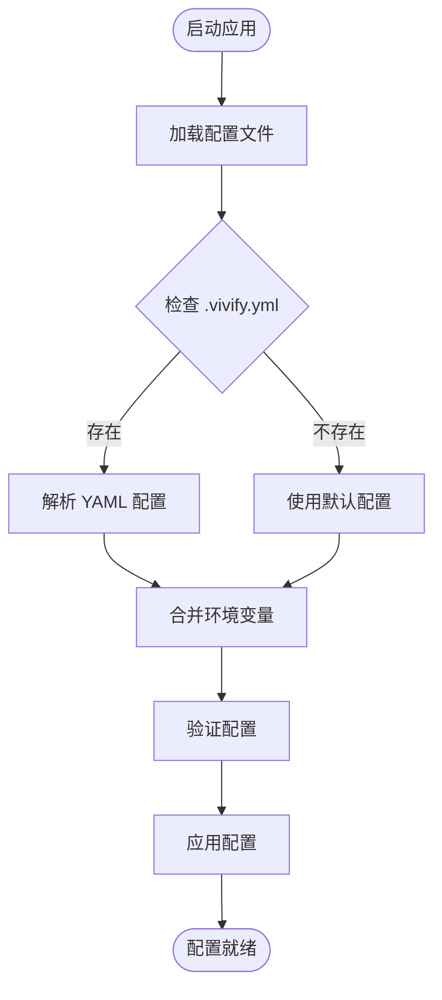
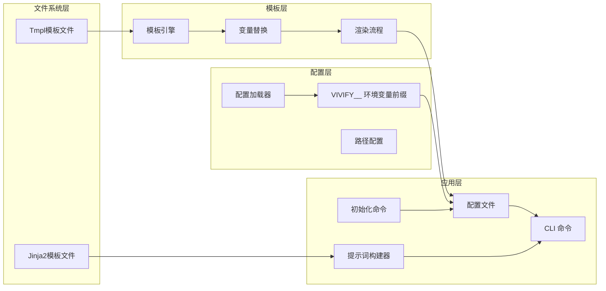
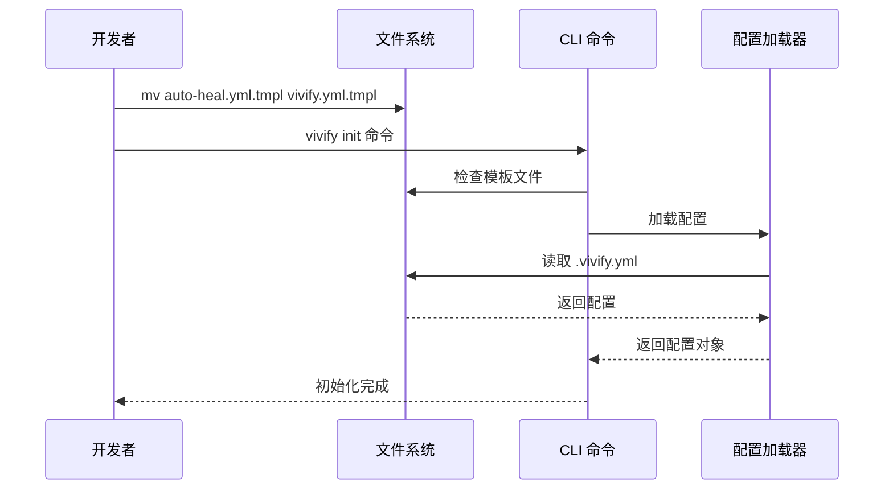
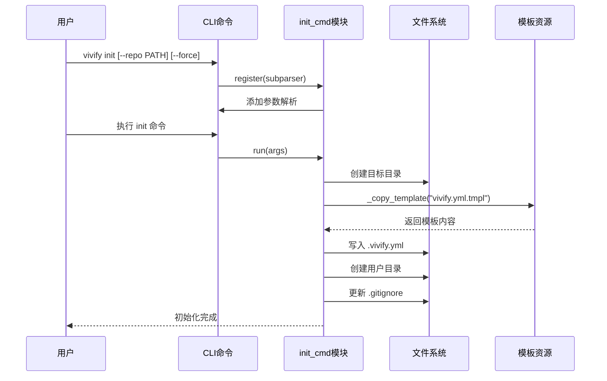
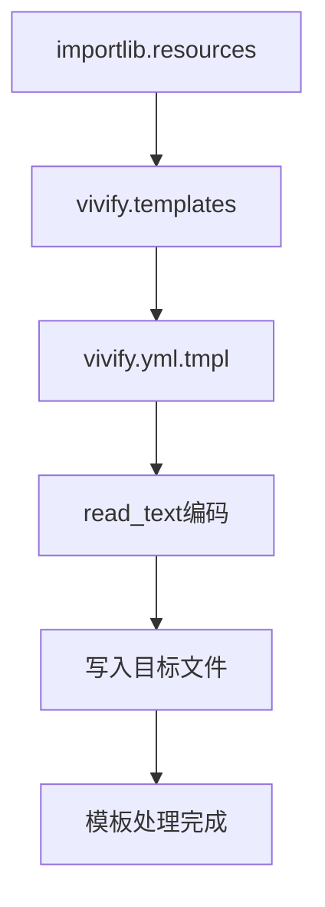
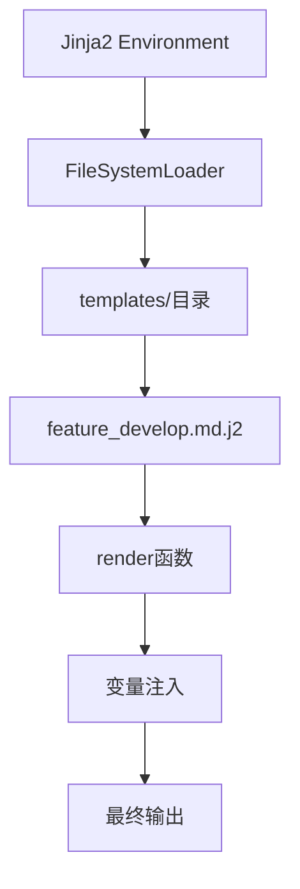
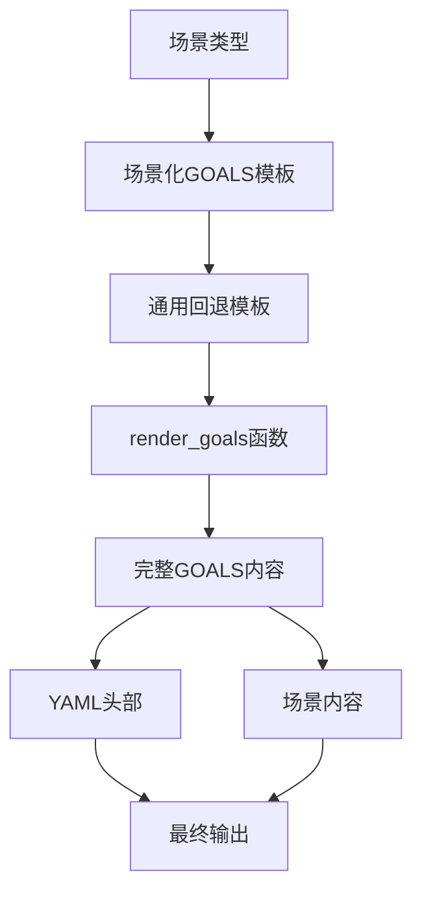
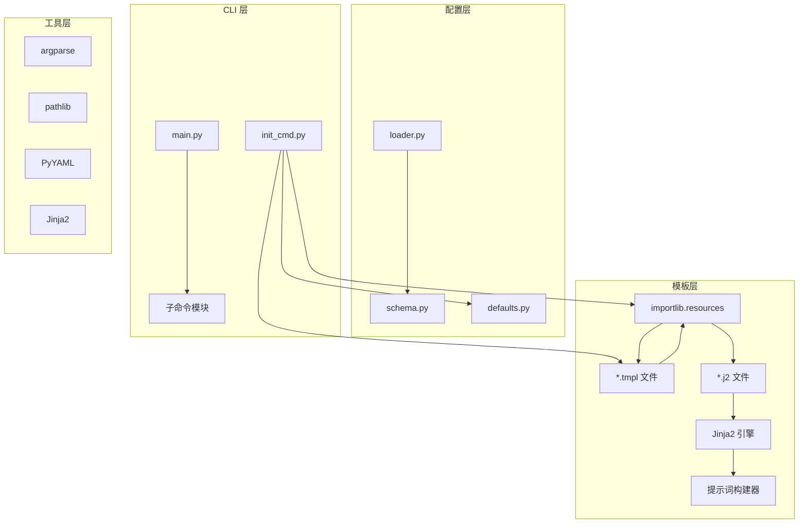

# 模板文件迁移

<cite>
**本文档引用的文件**
- [vivify/templates/GOALS.md.tmpl](file://vivify/templates/GOALS.md.tmpl)
- [vivify/templates/pr_template.md.tmpl](file://vivify/templates/pr_template.md.tmpl)
- [vivify/templates/vivify.yml.tmpl](file://vivify/templates/vivify.yml.tmpl)
- [vivify/cli/init_cmd.py](file://vivify/cli/init_cmd.py)
- [vivify/config/loader.py](file://vivify/config/loader.py)
- [vivify/intelligence/goals_templates.py](file://vivify/intelligence/goals_templates.py)
- [pyproject.toml](file://pyproject.toml)
- [vivify/agents/prompts/templates/feature_develop.md.j2](file://vivify/agents/prompts/templates/feature_develop.md.j2)
</cite>

## 更新摘要
**所做更改**
- 新增了完整的模板系统架构分析，包括Tmpl模板和Jinja2模板两种类型
- 更新了模板文件结构和加载机制的详细说明
- 增加了Jinja2模板渲染机制的专门章节
- 补充了模板验证和自定义开发的最佳实践
- 更新了项目结构图以反映新的模板组织方式

## 目录
1. [简介](#简介)
2. [项目结构](#项目结构)
3. [核心组件](#核心组件)
4. [架构概览](#架构概览)
5. [详细组件分析](#详细组件分析)
6. [模板系统详解](#模板系统详解)
7. [依赖关系分析](#依赖关系分析)
8. [性能考虑](#性能考虑)
9. [故障排除指南](#故障排除指南)
10. [结论](#结论)
11. [附录](#附录)

## 简介

本文档详细说明了配置模板文件从 `auto-heal.yml.tmpl` 到 `vivify.yml.tmpl` 的重命名和内容更新方法。这是项目品牌重塑（auto-heal → vivify）过程中的关键步骤，涉及模板文件结构、变量替换和路径配置的具体改动位置。

项目品牌重塑是一个系统性的重构过程，涉及文件/目录重命名、代码引用替换、配置更新等多个方面。本次迁移重点关注模板文件的处理机制和配置渲染流程。

**更新** 本版本增加了对全新模板系统的全面分析，包括Tmpl模板文件和Jinja2模板文件的双重模板架构。

## 项目结构

基于调研报告，项目采用模块化的包结构，其中模板文件位于两个主要目录下：

```mermaid
graph TB
subgraph "项目根目录"
Root[vivify/ 包目录]
Config[配置文件]
Templates[模板文件]
Jinja2Templates[Jinja2模板]
end
subgraph "vivify 包结构"
Root --> CLI[cli/ 子模块]
Root --> Config[config/ 配置模块]
Root --> Agents[agents/ 代理模块]
Root --> Kernel[kernel/ 内核模块]
Root --> PRMode[pr_mode/ PR模式模块]
Root --> Reporter[reporter/ 报告模块]
Root --> Fixers[fixers/ 修复器模块]
Root --> Probes[probes/ 探针模块]
Templates --> Tmpl1[vivify.yml.tmpl]
Templates --> Tmpl2[GOALS.md.tmpl]
Templates --> Tmpl3[pr_template.md.tmpl]
Jinja2Templates --> J2Template1[feature_develop.md.j2]
Jinja2Templates --> J2Template2[feature_evaluate.md.j2]
Jinja2Templates --> J2Template3[feature_verify.md.j2]
Jinja2Templates --> J2Template4[fix_issue.md.j2]
Jinja2Templates --> J2Template5[goal_decompose.md.j2]
end
```



**图表来源**
- [vivify/templates/GOALS.md.tmpl:1-25](file://vivify/templates/GOALS.md.tmpl#L1-L25)
- [vivify/templates/pr_template.md.tmpl:1-23](file://vivify/templates/pr_template.md.tmpl#L1-L23)
- [vivify/agents/prompts/templates/feature_develop.md.j2:1-45](file://vivify/agents/prompts/templates/feature_develop.md.j2#L1-L45)

**章节来源**
- [vivify/cli/init_cmd.py:50-56](file://vivify/cli/init_cmd.py#L50-L56)
- [pyproject.toml:50-57](file://pyproject.toml#L50-L57)

## 核心组件

### 模板文件系统

项目包含三种主要的模板文件，分为两大类：

#### Tmpl模板文件（静态模板）
1. **配置模板** (`vivify.yml.tmpl`) - 主要配置文件模板
2. **目标模板** (`GOALS.md.tmpl`) - 项目目标和KPI模板  
3. **PR模板** (`pr_template.md.tmpl`) - GitHub PR模板

#### Jinja2模板文件（动态模板）
1. **功能开发模板** (`feature_develop.md.j2`) - 功能开发提示词
2. **功能评估模板** (`feature_evaluate.md.j2`) - 功能评估提示词
3. **功能验证模板** (`feature_verify.md.j2`) - 功能验证提示词
4. **问题修复模板** (`fix_issue.md.j2`) - 问题修复提示词
5. **目标分解模板** (`goal_decompose.md.j2`) - 目标分解提示词

### 配置加载机制

配置系统采用分层设计，支持多种配置源：



**图表来源**
- [vivify/config/loader.py:44-61](file://vivify/config/loader.py#L44-L61)

**章节来源**
- [vivify/templates/GOALS.md.tmpl:1-25](file://vivify/templates/GOALS.md.tmpl#L1-L25)
- [vivify/templates/pr_template.md.tmpl:1-23](file://vivify/templates/pr_template.md.tmpl#L1-L23)
- [vivify/templates/vivify.yml.tmpl:1-96](file://vivify/templates/vivify.yml.tmpl#L1-L96)

## 架构概览

模板文件迁移涉及多个层面的变更：



**图表来源**
- [vivify/cli/init_cmd.py:50-56](file://vivify/cli/init_cmd.py#L50-L56)
- [vivify/agents/prompts/builders.py:22-36](file://vivify/agents/prompts/builders.py#L22-L36)

## 详细组件分析

### 配置模板文件迁移

#### 文件重命名流程

配置模板文件的重命名遵循严格的步骤顺序：



**图表来源**
- [vivify/cli/init_cmd.py:208-390](file://vivify/cli/init_cmd.py#L208-L390)

#### 配置文件结构对比

| 字段 | auto-heal.yml | vivify.yml |
|------|---------------|------------|
| 文件头注释 | `# .auto-heal.yml` | `# .vivify.yml` |
| 文档链接 | `auto-heal/auto-heal` | `vivify/vivify` |
| state_dir | `.auto-heal` | `.vivify` |
| log_dir | `.auto-heal/logs` | `.vivify/logs` |
| branch_prefix | `auto-heal/` | `vivify/` |
| labels | `["auto-heal"]` | `["vivify"]` |
| sqlite 路径 | `.auto-heal/state.db` | `.vivify/state.db` |
| 用户探针目录 | `.auto-heal/probes` | `.vivify/probes` |
| 用户修复器目录 | `.auto-heal/fixers` | `.vivify/fixers` |

**章节来源**
- [vivify/templates/vivify.yml.tmpl:1-96](file://vivify/templates/vivify.yml.tmpl#L1-L96)

### 模板渲染机制

#### 模板加载流程

```mermaid
flowchart TD
InitCmd[init_cmd.run] --> CopyTemplate[_copy_template函数]
CopyTemplate --> GetTemplate[files("vivify.templates")]
GetTemplate --> JoinPath[joinpath("vivify.yml.tmpl")]
JoinPath --> ReadText[read_text编码]
ReadText --> WriteFile[写入目标文件]
WriteFile --> Success[模板复制成功]
subgraph "模板文件结构"
Header[文件头注释]
Version[版本声明]
Mode[运行模式]
PRConfig[PR配置]
AgentConfig[代理配置]
StorageConfig[存储配置]
GitHubConfig[GitHub配置]
ProbesConfig[探针配置]
FixersConfig[修复器配置]
GoalsConfig[目标配置]
EscalationConfig[升级配置]
KPIMonitor[KPI监控]
SelfGrowth[自增长配置]
end
WriteFile --> Header
Header --> Version
Version --> Mode
Mode --> PRConfig
PRConfig --> AgentConfig
AgentConfig --> StorageConfig
StorageConfig --> GitHubConfig
GitHubConfig --> ProbesConfig
ProbesConfig --> FixersConfig
FixersConfig --> GoalsConfig
GoalsConfig --> EscalationConfig
EscalationConfig --> KPIMonitor
KPIMonitor --> SelfGrowth
```

**图表来源**
- [vivify/cli/init_cmd.py:50-56](file://vivify/cli/init_cmd.py#L50-L56)

#### 环境变量处理

配置系统支持通过环境变量覆盖配置值，使用 `VIVIFY__` 前缀：

| 环境变量 | 作用 | 默认值 |
|----------|------|--------|
| `VIVIFY__` | 配置项前缀 | `VIVIFY__` |
| `VIVIFY_AGENT` | 代理配置 | `VIVIFY_AGENT` |
| `VIVIFY_SECRET` | 秘密配置 | `VIVIFY_SECRET` |
| `VIVIFY_MODE` | 运行模式 | `daemon` |
| `VIVIFY_INTERVAL_SECONDS` | 检查间隔 | `300` |

**章节来源**
- [vivify/config/loader.py:23-41](file://vivify/config/loader.py#L23-L41)

### CLI 初始化命令

#### 初始化流程



**图表来源**
- [vivify/cli/init_cmd.py:208-390](file://vivify/cli/init_cmd.py#L208-L390)

**章节来源**
- [vivify/cli/init_cmd.py:208-390](file://vivify/cli/init_cmd.py#L208-L390)

## 模板系统详解

### Tmpl模板系统

#### 模板文件类型

Tmpl模板文件是静态模板，主要用于配置文件和文档生成：

1. **vivify.yml.tmpl** - 主配置模板，包含完整的配置结构
2. **GOALS.md.tmpl** - 项目目标模板，定义目标和KPI
3. **pr_template.md.tmpl** - PR模板，用于自动化PR描述

#### 模板加载机制



**图表来源**
- [vivify/cli/init_cmd.py:50-56](file://vivify/cli/init_cmd.py#L50-L56)

#### 模板内容结构

**vivify.yml.tmpl 结构**：
- 版本声明和元数据
- 运行模式配置（daemon/once/dry-run）
- PR模式配置（分支前缀、标签、自动合并）
- 代理配置（qodercli设置）
- 存储配置（sqlite路径）
- GitHub集成配置
- 探针和修复器配置
- 目标分解配置
- 升级和KPI监控配置
- 自我增长配置
- 守护进程配置

**GOALS.md.tmpl 结构**：
- YAML头部（版本、所有者、审查周期）
- 项目目标标题
- 目标描述和KPI定义
- 截止日期和备注

**pr_template.md.tmpl 结构**：
- PR标题和触发信息
- 执行摘要和动机
- 质量检查摘要
- 审查者注意事项

### Jinja2模板系统

#### 模板文件类型

Jinja2模板文件是动态模板，主要用于AI代理的提示词构建：

1. **feature_develop.md.j2** - 功能开发提示词
2. **feature_evaluate.md.j2** - 功能评估提示词  
3. **feature_verify.md.j2** - 功能验证提示词
4. **fix_issue.md.j2** - 问题修复提示词
5. **goal_decompose.md.j2** - 目标分解提示词

#### 模板渲染机制



**图表来源**
- [vivify/agents/prompts/builders.py:22-36](file://vivify/agents/prompts/builders.py#L22-L36)

#### 模板变量系统

Jinja2模板支持丰富的变量和过滤器：

**基础变量**：
- `feature.id` - 功能ID
- `feature.type` - 功能类型
- `feature.priority` - 优先级
- `feature.parent_goal` - 父目标
- `feature.title` - 标题
- `feature.description` - 描述
- `feature.implementation_approach` - 实施方法

**上下文变量**：
- `recent_history` - 最近历史
- `related_knowledge` - 相关知识
- `workspace` - 工作空间路径
- `git_pr_snippet` - Git PR片段
- `next_steps_snippet` - 下一步片段

**章节来源**
- [vivify/agents/prompts/templates/feature_develop.md.j2:1-45](file://vivify/agents/prompts/templates/feature_develop.md.j2#L1-L45)
- [vivify/agents/prompts/builders.py:22-36](file://vivify/agents/prompts/builders.py#L22-L36)

### 目标模板生成系统

#### 场景化模板生成

项目实现了场景化的GOALS模板生成系统：



**图表来源**
- [vivify/intelligence/goals_templates.py:182-189](file://vivify/intelligence/goals_templates.py#L182-L189)

#### 支持的场景类型

系统支持以下场景类型的模板生成：

- **docs-only** - 仅文档场景
- **static-site** - 静态站点场景  
- **web-app** - Web应用场景
- **api-service** - API服务场景
- **python-package** - Python包场景
- **cli-tool** - CLI工具场景
- **mobile-app** - 移动应用场景
- **monorepo** - 单体仓库场景
- **infra** - 基础设施场景
- **generic** - 通用场景（默认）

**章节来源**
- [vivify/intelligence/goals_templates.py:18-179](file://vivify/intelligence/goals_templates.py#L18-L179)

## 依赖关系分析

### 模块间依赖



**图表来源**
- [vivify/cli/init_cmd.py:50-56](file://vivify/cli/init_cmd.py#L50-L56)
- [vivify/agents/prompts/builders.py:22-36](file://vivify/agents/prompts/builders.py#L22-L36)

### 关键依赖关系

1. **init_cmd 依赖 importlib.resources** 来访问模板资源
2. **配置加载器依赖 PyYAML** 来解析配置文件
3. **Jinja2模板系统依赖 Jinja2** 来处理变量替换
4. **CLI 命令依赖 argparse** 来解析命令行参数
5. **提示词构建器依赖 pathlib** 来管理模板路径

**章节来源**
- [pyproject.toml:22-27](file://pyproject.toml#L22-L27)
- [vivify/agents/prompts/builders.py:13](file://vivify/agents/prompts/builders.py#L13)

## 性能考虑

### 模板渲染性能

模板文件迁移对性能的影响主要体现在以下几个方面：

1. **文件I/O操作**：模板复制和配置文件写入
2. **内存使用**：模板内容加载和配置解析
3. **渲染时间**：Jinja2模板渲染过程
4. **缓存机制**：Jinja2环境的LRU缓存

### 优化建议

1. **批量操作**：使用 `find` 命令批量处理文件重命名
2. **缓存机制**：利用 Python import 缓存减少重复导入
3. **增量更新**：只在必要时重新生成配置文件
4. **模板预编译**：Jinja2环境使用LRU缓存提高渲染效率

## 故障排除指南

### 常见问题及解决方案

| 问题 | 症状 | 解决方案 |
|------|------|----------|
| 模板文件找不到 | `FileNotFoundError` | 确认模板文件已重命名为 `vivify.yml.tmpl` |
| 配置加载失败 | `ValueError` | 检查 `.vivify.yml` 格式和路径 |
| 环境变量无效 | 配置未生效 | 确认使用 `VIVIFY__` 前缀而非 `AUTO_HEAL__` |
| CLI 命令错误 | `Command not found` | 检查 `pyproject.toml` 中的入口点配置 |
| Jinja2模板渲染错误 | `TemplateNotFound` | 检查模板文件路径和权限 |
| 模板变量缺失 | 渲染输出为空 | 确保传递正确的变量到模板 |

### 验证步骤

```bash
# 验证模板文件重命名
ls vivify/templates/vivify.yml.tmpl
ls vivify/templates/GOALS.md.tmpl
ls vivify/templates/pr_template.md.tmpl

# 验证配置文件加载
python3 -c "from vivify.config import load_config; cfg = load_config(); print('配置加载成功')"

# 验证 CLI 命令
python3 -m vivify --help

# 验证模板渲染
vivify init --repo /tmp/test --force

# 验证Jinja2模板
python3 -c "from vivify.agents.prompts.builders import _render; print('Jinja2模板系统正常')"
```

**章节来源**
- [vivify/cli/init_cmd.py:208-390](file://vivify/cli/init_cmd.py#L208-L390)
- [vivify/agents/prompts/builders.py:22-36](file://vivify/agents/prompts/builders.py#L22-L36)

## 结论

模板文件从 `auto-heal.yml.tmpl` 到 `vivify.yml.tmpl` 的迁移是一个相对简单的文件重命名操作，但需要配合整体的品牌重塑策略。关键要点包括：

1. **文件重命名**：直接将模板文件重命名为新名称
2. **配置更新**：确保所有相关的配置引用都更新为新名称
3. **环境变量**：更新环境变量前缀从 `AUTO_HEAL__` 到 `VIVIFY__`
4. **路径配置**：更新所有硬编码的路径引用
5. **模板系统扩展**：新增了Jinja2模板系统支持动态提示词生成

整个迁移过程预计耗时1.5-2小时，其中大部分时间用于手动审查和测试验证。

**更新** 本版本的模板系统包含了双重模板架构，既保留了传统的Tmpl模板用于静态配置和文档生成，又引入了Jinja2模板用于动态AI提示词构建，形成了更加完善的模板生态系统。

## 附录

### 迁移检查清单

- [ ] 模板文件已重命名为 `vivify.yml.tmpl`
- [ ] 所有配置引用已更新为 `.vivify.yml`
- [ ] 环境变量前缀已更新为 `VIVIFY__`
- [ ] CLI 命令仍可正常工作
- [ ] 配置文件可以正确加载
- [ ] 测试套件通过
- [ ] Jinja2模板系统正常工作
- [ ] 场景化目标模板生成正常

### 相关文档

- **模板系统架构**：`vivify/templates/` 和 `vivify/agents/prompts/templates/` 目录
- **配置加载器**：`vivify/config/loader.py` (配置解析和环境变量处理)
- **初始化命令**：`vivify/cli/init_cmd.py` (模板复制和文件生成)
- **目标模板生成**：`vivify/intelligence/goals_templates.py` (场景化模板系统)
- **Jinja2模板构建**：`vivify/agents/prompts/builders.py` (动态提示词生成)
- **打包配置**：`pyproject.toml` (模板文件包含配置)

### 模板开发最佳实践

1. **Tmpl模板开发**：
   - 使用清晰的文件头注释
   - 保持配置结构的一致性
   - 提供合理的默认值

2. **Jinja2模板开发**：
   - 使用有意义的变量命名
   - 提供适当的默认值和回退机制
   - 利用Jinja2的过滤器和宏功能
   - 确保模板的可读性和可维护性

3. **模板验证**：
   - 编写单元测试验证模板输出
   - 使用实际数据测试模板渲染
   - 确保模板在不同场景下的正确性
   - 定期检查模板的兼容性