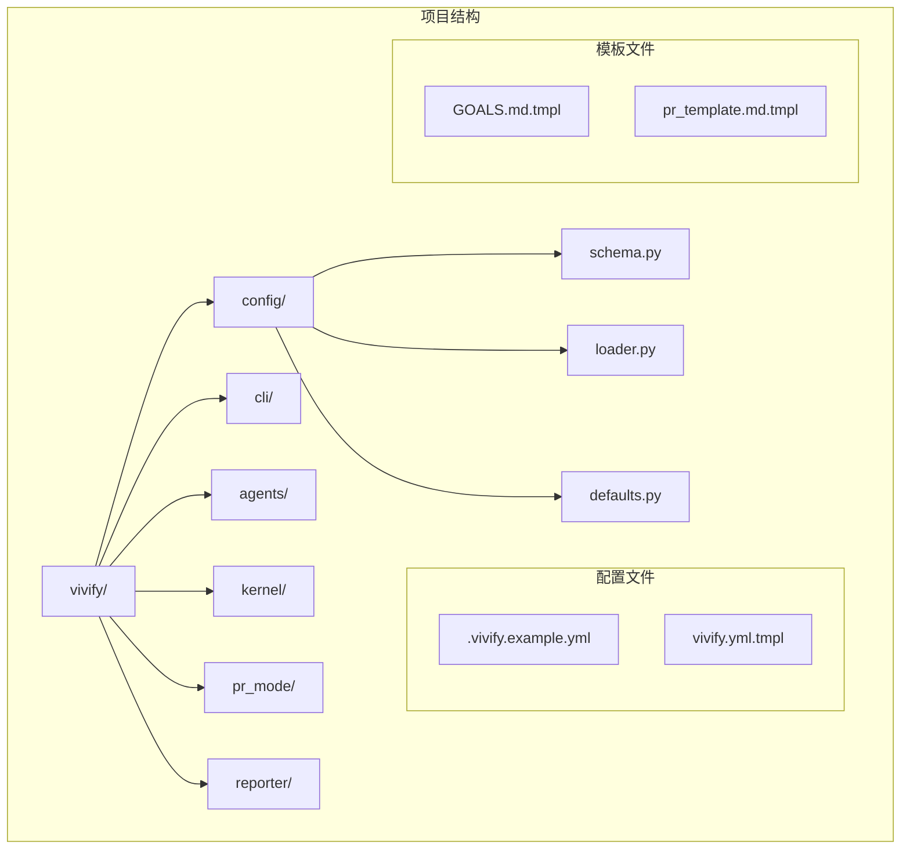
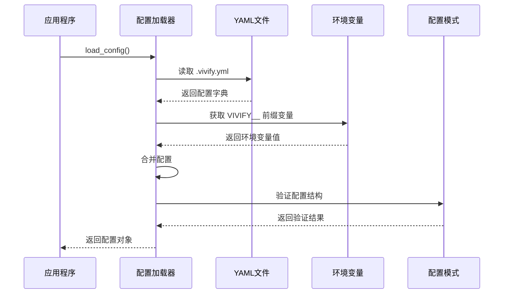
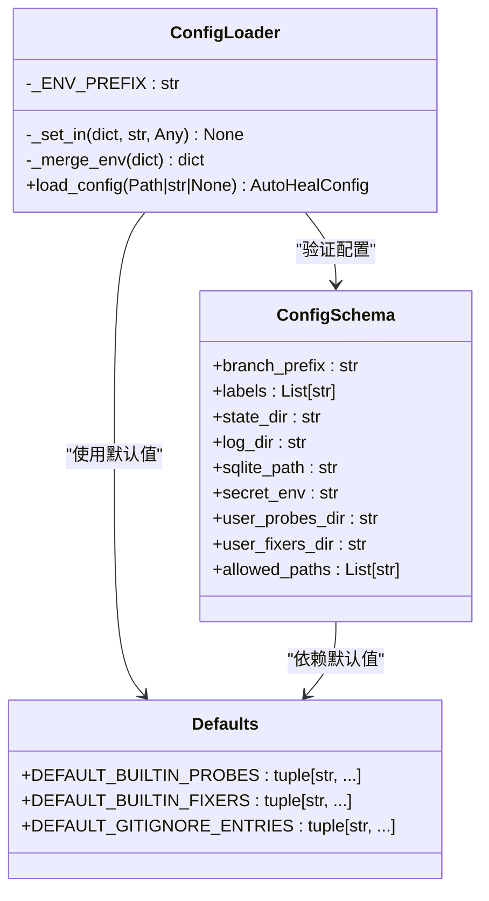
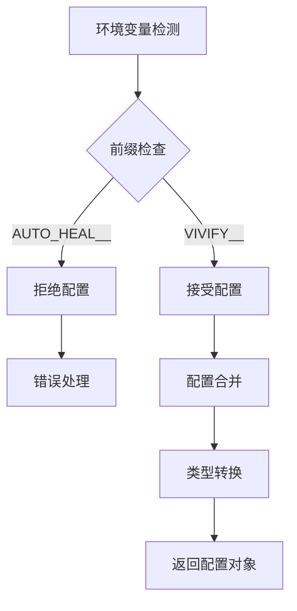
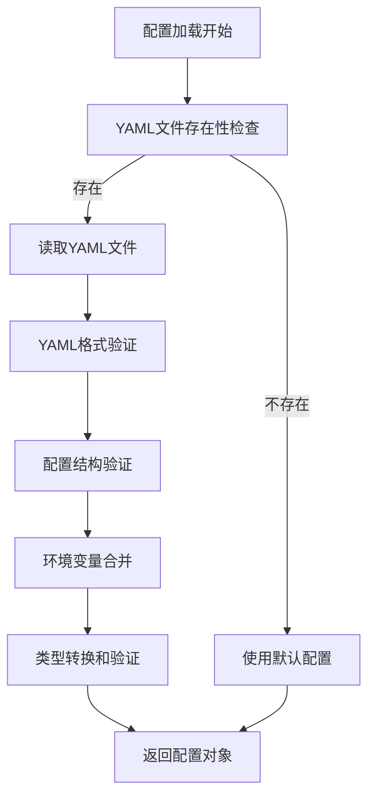
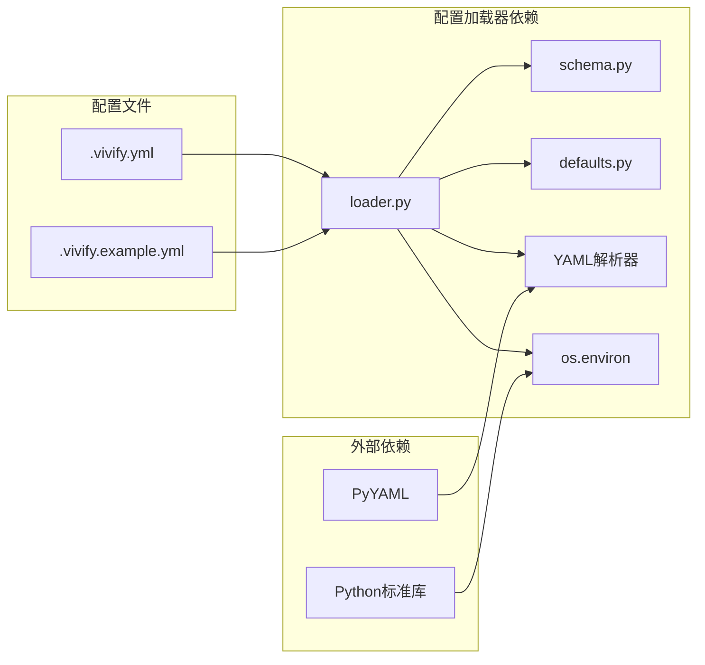

# 配置加载器更新

<cite>
**本文档引用的文件**
- [00_READ_ME_FIRST.txt](file://00_READ_ME_FIRST.txt)
- [QUICK_REFERENCE.md](file://QUICK_REFERENCE.md)
- [REBRANDING_SUMMARY.md](file://REBRANDING_SUMMARY.md)
- [rebranding_analysis.md](file://rebranding_analysis.md)
- [detailed_references.md](file://detailed_references.md)
</cite>

## 目录
1. [简介](#简介)
2. [项目结构](#项目结构)
3. [核心组件](#核心组件)
4. [架构概览](#架构概览)
5. [详细组件分析](#详细组件分析)
6. [依赖关系分析](#依赖关系分析)
7. [性能考虑](#性能考虑)
8. [故障排除指南](#故障排除指南)
9. [结论](#结论)

## 简介

本文档详细说明了配置加载器的更新过程，重点涵盖环境变量前缀变更、默认配置文件路径更新和配置验证逻辑的修改方法。本次更新涉及从环境变量命名空间 `AUTO_HEAL__` 到 `VIVIFY__` 的完全迁移，以及配置文件路径从 `.auto-heal.yml` 到 `.vivify.yml` 的更新。

这是 "auto-heal" 到 "vivify" 品牌重塑项目的一部分，涉及约 477 处代码匹配的批量替换，包括配置路径、环境变量前缀、PR 标签等多个方面。

## 项目结构

基于调研报告，项目采用模块化的包结构，配置加载器位于 `auto_heal/config/` 目录下：

**图表来源**
- [rebranding_analysis.md:203-240](file://rebranding_analysis.md#L203-L240)

**章节来源**
- [00_READ_ME_FIRST.txt:14-37](file://00_READ_ME_FIRST.txt#L14-L37)
- [REBRANDING_SUMMARY.md:100-143](file://REBRANDING_SUMMARY.md#L100-L143)

## 核心组件

配置加载器系统包含三个核心组件：

### 1. 配置模式定义 (schema.py)
负责定义配置结构和默认值，包括路径、标签、分支前缀等。

### 2. 配置加载器 (loader.py)  
核心加载逻辑，处理 YAML 配置文件加载和环境变量合并。

### 3. 默认配置 (defaults.py)
提供初始化命令使用的默认值，确保 init 流程与模式定义保持同步。

**章节来源**
- [rebranding_analysis.md:203-240](file://rebranding_analysis.md#L203-L240)
- [rebranding_analysis.md:241-281](file://rebranding_analysis.md#L241-L281)

## 架构概览

配置加载器采用分层架构设计，支持 YAML 配置文件和环境变量双重配置源：

**图表来源**
- [rebranding_analysis.md:283-352](file://rebranding_analysis.md#L283-L352)

## 详细组件分析

### 配置加载器类分析

配置加载器的核心类实现了完整的配置加载和验证流程：

**图表来源**
- [rebranding_analysis.md:283-352](file://rebranding_analysis.md#L283-L352)
- [rebranding_analysis.md:203-240](file://rebranding_analysis.md#L203-L240)
- [rebranding_analysis.md:241-281](file://rebranding_analysis.md#L241-L281)

### 环境变量前缀变更

#### 变更前 (AUTO_HEAL__)
- 环境变量前缀：`AUTO_HEAL__`
- 示例：`AUTO_HEAL__agent__type`
- 配置文件：`.auto-heal.yml`

#### 变更后 (VIVIFY__)
- 环境变量前缀：`VIVIFY__`
- 示例：`VIVIFY__agent__type`
- 配置文件：`.vivify.yml`

**图表来源**
- [rebranding_analysis.md:297-328](file://rebranding_analysis.md#L297-L328)

**章节来源**
- [rebranding_analysis.md:297-328](file://rebranding_analysis.md#L297-L328)
- [QUICK_REFERENCE.md:152-160](file://QUICK_REFERENCE.md#L152-L160)
- [detailed_references.md:85-92](file://detailed_references.md#L85-L92)

### 默认配置文件路径更新

#### 配置文件路径变更

| 类型 | 变更前 | 变更后 |
|------|--------|--------|
| 配置文件名 | `.auto-heal.yml` | `.vivify.yml` |
| 示例配置 | `.auto-heal.example.yml` | `.vivify.example.yml` |
| 模板文件 | `auto-heal.yml.tmpl` | `vivify.yml.tmpl` |

#### 目录结构变更

| 目录 | 变更前 | 变更后 |
|------|--------|--------|
| 状态数据库 | `.auto-heal/state.db` | `.vivify/state.db` |
| 日志目录 | `.auto-heal/logs/` | `.vivify/logs/` |
| 工作树目录 | `.auto-heal/worktrees/` | `.vivify/worktrees/` |
| 用户探测器目录 | `.auto-heal/probes` | `.vivify/probes` |
| 用户修复器目录 | `.auto-heal/fixers` | `.vivify/fixers` |

**章节来源**
- [rebranding_analysis.md:460-471](file://rebranding_analysis.md#L460-L471)
- [detailed_references.md:98-114](file://detailed_references.md#L98-L114)

### 配置验证逻辑修改

配置验证逻辑包含多个层面的检查：

**图表来源**
- [rebranding_analysis.md:331-348](file://rebranding_analysis.md#L331-L348)

**章节来源**
- [rebranding_analysis.md:331-348](file://rebranding_analysis.md#L331-L348)

## 依赖关系分析

配置加载器与其他组件的依赖关系：

**图表来源**
- [rebranding_analysis.md:295-296](file://rebranding_analysis.md#L295-L296)
- [rebranding_analysis.md:340-342](file://rebranding_analysis.md#L340-L342)

**章节来源**
- [rebranding_analysis.md:295-296](file://rebranding_analysis.md#L295-L296)
- [rebranding_analysis.md:340-342](file://rebranding_analysis.md#L340-L342)

## 性能考虑

配置加载器的性能优化要点：

1. **延迟加载**：仅在需要时解析 YAML 文件
2. **内存效率**：使用生成器和迭代器处理大型配置
3. **缓存机制**：避免重复解析相同的配置文件
4. **类型转换优化**：智能类型推断减少不必要的转换

## 故障排除指南

### 常见问题及解决方案

#### 1. 环境变量前缀错误
**问题**：配置加载失败，提示找不到配置
**原因**：使用了旧的 `AUTO_HEAL__` 前缀
**解决**：将所有环境变量前缀更新为 `VIVIFY__`

#### 2. 配置文件路径错误
**问题**：找不到 `.vivify.yml` 配置文件
**原因**：配置文件路径仍指向 `.auto-heal.yml`
**解决**：更新配置文件路径为 `.vivify.yml`

#### 3. 导入错误
**问题**：ImportError: No module named 'vivify'
**原因**：包目录未重命名
**解决**：确保 `vivify/` 目录存在且包含 `__init__.py`

#### 4. CLI 命令不可用
**问题**：`vivify: command not found`
**原因**：CLI 入口点未更新
**解决**：检查 `pyproject.toml` 中的入口点配置

**章节来源**
- [QUICK_REFERENCE.md:214-223](file://QUICK_REFERENCE.md#L214-L223)
- [REBRANDING_SUMMARY.md:261-275](file://REBRANDING_SUMMARY.md#L261-L275)

### 调试技巧

1. **验证导入**：使用 `python -c "from vivify.config import load_config"`
2. **检查环境变量**：使用 `env | grep VIVIFY__`
3. **测试配置加载**：使用 `python -c "from vivify.config import load_config; print(load_config())"`
4. **验证 CLI**：使用 `python -m vivify --help`

**章节来源**
- [QUICK_REFERENCE.md:251-275](file://QUICK_REFERENCE.md#L251-L275)

## 结论

配置加载器的更新涉及环境变量前缀从 `AUTO_HEAL__` 到 `VIVIFY__` 的完全迁移，以及配置文件路径从 `.auto-heal.yml` 到 `.vivify.yml` 的更新。这次更新确保了配置系统的完整性和一致性，同时保持了原有的功能特性。

更新的关键要点：
- 环境变量前缀变更：影响所有配置项的环境变量访问
- 配置文件路径更新：影响配置文件的默认位置
- 验证逻辑保持：原有的配置验证和错误处理机制继续有效
- 兼容性保证：更新后的配置加载器与现有代码完全兼容

通过遵循本文档的指导和使用提供的验证清单，开发者可以顺利完成配置加载器的更新，并确保系统的稳定运行。