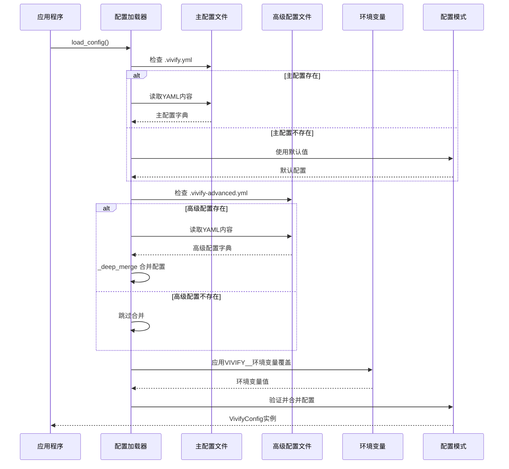
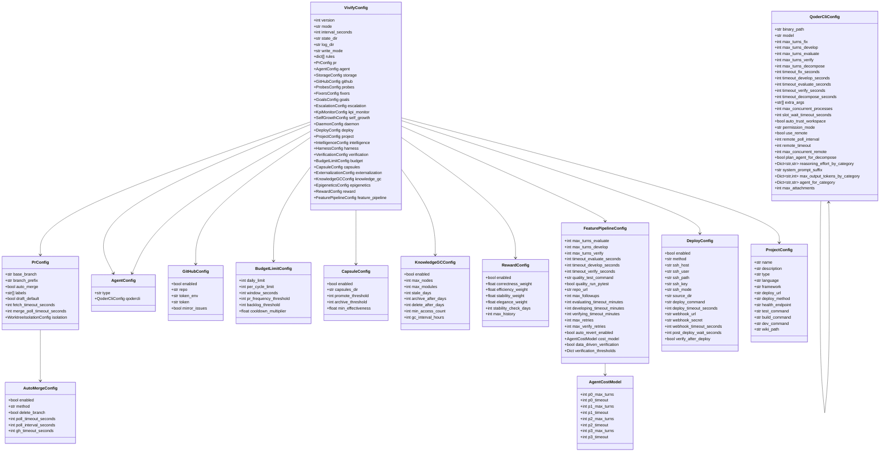
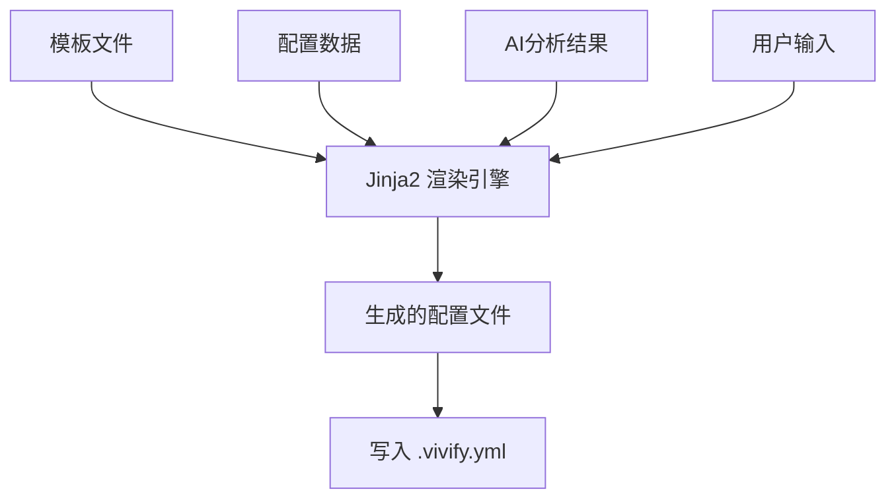
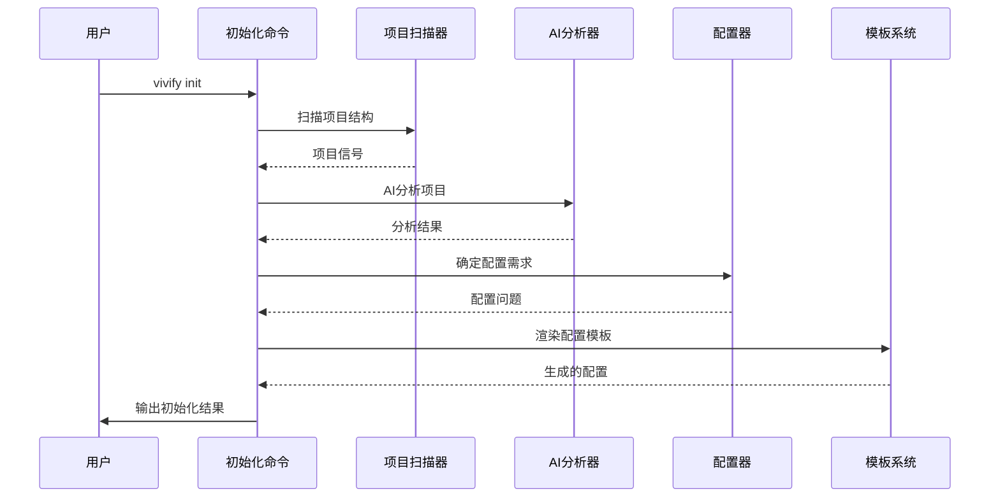
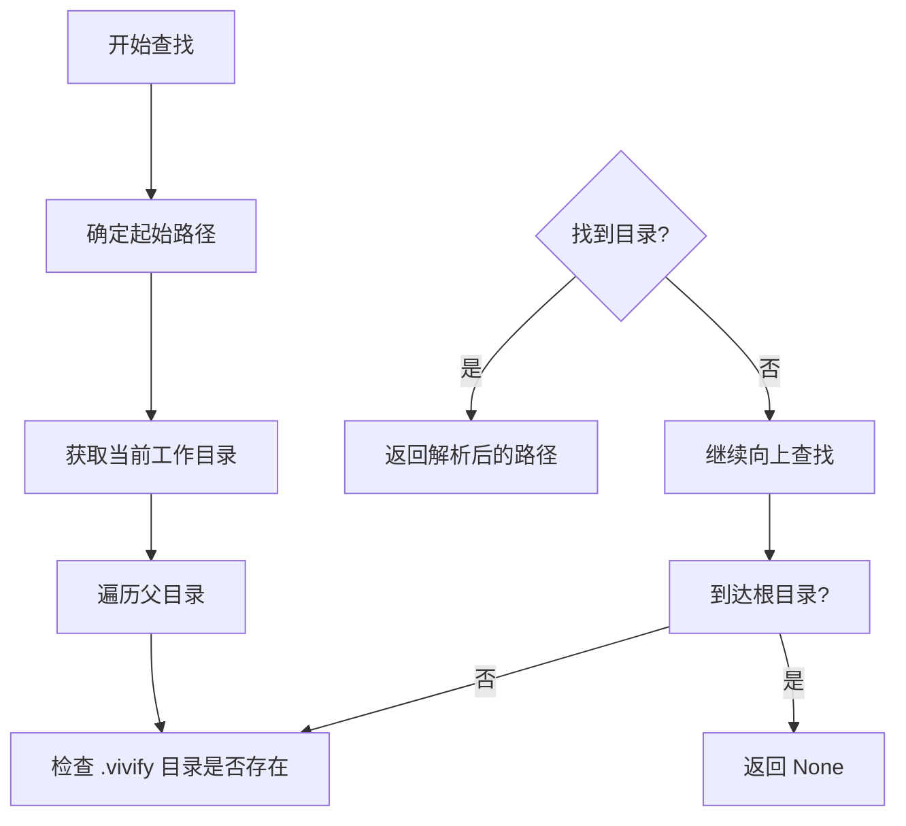
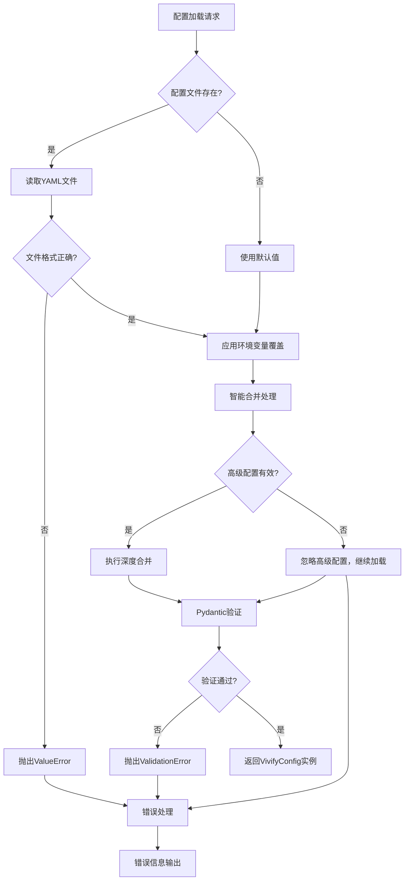

# 配置文件更新

<cite>
**本文档引用的文件**
- [pyproject.toml](file://pyproject.toml)
- [.vivify.example.yml](file://.vivify.example.yml)
- [vivify/config/schema.py](file://vivify/config/schema.py)
- [vivify/config/loader.py](file://vivify/config/loader.py)
- [vivify/config/defaults.py](file://vivify/config/defaults.py)
- [vivify/config/presets.py](file://vivify/config/presets.py)
- [vivify/templates/vivify.yml.tmpl](file://vivify/templates/vivify.yml.tmpl)
- [vivify/cli/init_cmd.py](file://vivify/cli/init_cmd.py)
- [vivify/cli/run_cmd.py](file://vivify/cli/run_cmd.py)
- [vivify/cli/dashboard_cmd.py](file://vivify/cli/dashboard_cmd.py)
- [vivify/dashboard/app.py](file://vivify/dashboard/app.py)
- [vivify/dashboard/db.py](file://vivify/dashboard/db.py)
- [vivify/dashboard/log_streamer.py](file://vivify/dashboard/log_streamer.py)
- [vivify/dashboard/static/index.html](file://vivify/dashboard/static/index.html)
- [vivify/dashboard/static/app.js](file://vivify/dashboard/static/app.js)
- [vivify/deployers/base.py](file://vivify/deployers/base.py)
- [vivify/deployers/ssh.py](file://vivify/deployers/ssh.py)
- [vivify/deployers/command.py](file://vivify/deployers/command.py)
- [vivify/deployers/webhook.py](file://vivify/deployers/webhook.py)
- [vivify/deployers/__init__.py](file://vivify/deployers/__init__.py)
- [vivify/kernel/loop.py](file://vivify/kernel/loop.py)
- [vivify/daemon/manager.py](file://vivify/daemon/manager.py)
- [vivify/pr_mode/auto_merge.py](file://vivify/pr_mode/auto_merge.py)
- [vivify/pr_mode/pr_creator.py](file://vivify/pr_mode/pr_creator.py)
- [vivify/pr_mode/__init__.py](file://vivify/pr_mode/__init__.py)
- [tests/unit/test_pr_mode.py](file://tests/unit/test_pr_mode.py)
- [tests/unit/test_config_loader_advanced.py](file://tests/unit/test_config_loader_advanced.py)
- [tests/unit/test_presets.py](file://tests/unit/test_presets.py)
- [tests/unit/test_init_templates.py](file://tests/unit/test_init_templates.py)
- [vivify/kernel/feature_pipeline.py](file://vivify/kernel/feature_pipeline.py)
- [vivify/agents/remote_session.py](file://vivify/agents/remote_session.py)
- [vivify/agents/qodercli_agent.py](file://vivify/agents/qodercli_agent.py)
- [vivify/intelligence/classifier.py](file://vivify/intelligence/classifier.py)
- [vivify/kernel/token_budget.py](file://vivify/kernel/token_budget.py)
- [vivify/capsules/externalizer.py](file://vivify/capsules/externalizer.py)
- [vivify/intelligence/reward_signals.py](file://vivify/intelligence/reward_signals.py)
- [vivify/knowledge/gc.py](file://vivify/knowledge/gc.py)
</cite>

## 更新摘要
**所做更改**
- 新增6个核心配置字段：state_dir、rules、budget、capsules、knowledge_gc、reward
- 新增22行配置选项增强：AgentCostModel集成、超时配置和质量门控机制
- 新增预算管理、技能胶囊、知识图谱垃圾回收、奖励信号等高级功能配置
- 增强配置验证和错误处理策略，支持复合信号规则配置
- 更新配置模板系统，支持新增的配置字段和功能

## 目录
1. [简介](#简介)
2. [配置系统架构](#配置系统架构)
3. [配置文件结构详解](#配置文件结构详解)
4. [配置加载器](#配置加载器)
5. [配置模式定义](#配置模式定义)
6. [默认值管理](#默认值管理)
7. [配置模板系统](#配置模板系统)
8. [初始化命令](#初始化命令)
9. [状态目录查找功能](#状态目录查找功能)
10. [仪表板系统](#仪表板系统)
11. [部署系统](#部署系统)
12. [配置验证与错误处理](#配置验证与错误处理)
13. [环境变量覆盖机制](#环境变量覆盖机制)
14. [配置最佳实践](#配置最佳实践)
15. [故障排除指南](#故障排除指南)
16. [总结](#总结)

## 简介

Vivify项目采用全新的配置系统，从传统的配置文件结构演进为现代化的Pydantic驱动配置架构。新系统提供了类型安全、自动验证、环境变量覆盖和完整的配置模板支持。

新配置系统的核心特性：
- **类型安全**：基于Pydantic的强类型配置模型
- **自动验证**：配置加载时自动验证数据类型和格式
- **环境变量覆盖**：支持通过VIVIFY__前缀的环境变量覆盖配置
- **配置模板**：提供完整的配置模板文件用于快速启动
- **默认值管理**：集中化的默认值定义和初始化流程
- **状态目录查找**：自动在项目树中定位 .vivify 状态目录
- **仪表板监控**：提供Web仪表板进行实时监控
- **部署自动化**：支持多种部署方式的完整配置系统
- **实例级配置**：支持在配置文件中直接设置GitHub令牌等实例级配置
- **PR 合并轮询控制**：支持精确控制 PR 合并等待超时时间
- **远程执行支持**：支持通过云远程会话执行AI任务
- **高级配置分离**：支持主配置与高级配置的智能合并
- **场景预设系统**：提供10种项目场景的AI代理参数预设
- **双模板设计**：提供quick精简模板和full完整模板
- **预算管理**：支持API调用配额和p53抑制机制
- **技能胶囊**：支持可重用修复策略的知识提取和推广
- **知识图谱垃圾回收**：自动清理过期和低价值的知识节点
- **奖励信号系统**：多模态奖励信号聚合和反馈机制
- **质量门控**：基于数据驱动的验证阈值和自动回滚机制

## 配置系统架构

Vivify的配置系统采用分层架构设计，确保配置的灵活性和可维护性：

```mermaid
graph TB
subgraph "配置系统层次结构"
A[.vivify.yml 主配置] --> B[配置加载器]
C[.vivify-advanced.yml 高级配置] --> B
D[配置模板] --> E[初始化命令]
F[场景预设] --> G[AI代理参数]
B --> H[VivifyConfig 实例]
I[环境变量] --> B
J[智能合并器] --> K[_deep_merge 函数]
L[状态目录查找] --> M[find_state_dir 函数]
N[仪表板应用] --> O[Web 监控界面]
P[部署系统] --> Q[部署器工厂]
Q --> R[SSH 部署器]
Q --> S[命令部署器]
Q --> T[Webhook 部署器]
U[实例级配置] --> V[GitHub 令牌优先级]
W[PR 合并轮询] --> X[merge_poll_timeout_seconds]
X --> Y[AutoMerge 配置]
Y --> Z[轮询超时控制]
AA[远程执行] --> AB[use_remote 参数]
AB --> AC[remote_poll_interval]
AC --> AD[remote_timeout]
AD --> AE[max_concurrent_remote]
AE --> AF[plan_agent_for_decompose]
AG[场景预设系统] --> AH[10种项目类型]
AH --> AI[web-app, api-service, python-package]
AI --> AJ[cli-tool, docs-only, mobile-app]
AJ --> AK[monorepo, infra, generic]
AL[双模板系统] --> AM[quick精简模板]
AL --> AN[full完整模板]
AN --> AO[场景预设驱动]
AP[预算管理] --> AQ[BudgetLimitConfig]
AQ --> AR[TokenBucket]
AR --> AS[P53Suppressor]
AT[技能胶囊] --> AU[CapsuleConfig]
AU --> AV[CapsuleStore]
AW[知识图谱垃圾回收] --> AX[KnowledgeGCConfig]
AX --> AY[KnowledgeGC]
AZ[奖励信号] --> BA[RewardConfig]
BA --> BB[RewardAggregator]
BC[质量门控] --> BD[FeaturePipelineConfig]
BD --> BE[AgentCostModel]
BE --> BF[verification thresholds]
BG[复合信号规则] --> BH[List[dict]]
```

**图表来源**
- [vivify/config/schema.py: 409-442:409-L442)
- [vivify/config/loader.py: 68-98:68-L98)
- [vivify/config/defaults.py: 1-44:1-L44)
- [vivify/config/presets.py: 10-159:10-L159)
- [vivify/cli/dashboard_cmd.py: 17-43:17-L43)
- [vivify/deployers/__init__.py: 27-49:27-L49)
- [vivify/daemon/manager.py: 72-93:72-L93)
- [vivify/pr_mode/auto_merge.py: 107-116:107-L116)
- [vivify/cli/run_cmd.py: 124-128:124-L128)
- [vivify/agents/qodercli_agent.py: 30-62:30-L62)
- [vivify/kernel/feature_pipeline.py: 107-118:107-L118)
- [vivify/kernel/token_budget.py: 17-162:17-L162)
- [vivify/capsules/externalizer.py: 38-254:38-L254)
- [vivify/intelligence/reward_signals.py: 269-289:269-L289)
- [vivify/knowledge/gc.py: 23-160:23-L160)

## 配置文件结构详解

### 根级配置选项

Vivify配置文件采用YAML格式，根级包含以下主要配置块：

| 配置项 | 类型 | 默认值 | 描述 |
|--------|------|--------|------|
| version | int | 1 | 配置版本号 |
| mode | "daemon" \| "once" \| "dry-run" | "daemon" | 运行模式 |
| interval_seconds | int | 300 | 检查间隔（秒） |
| state_dir | str | ".vivify" | 状态目录路径 |
| log_dir | str | ".vivify/logs" | 日志目录路径 |
| write_mode | "pr" | "pr" | 写入模式（目前仅支持PR模式） |
| rules | List[dict] | [] | 复合信号规则配置 |

### 预算管理配置

**新增** 预算管理配置控制API调用配额和系统抑制机制：

| 配置项 | 类型 | 默认值 | 描述 |
|--------|------|--------|------|
| daily_limit | int | 100 | 每日API调用硬限 |
| per_cycle_limit | int | 10 | 每轮循环最大调用数 |
| window_seconds | int | 86400 | 时间窗口（默认24小时） |
| pr_frequency_threshold | int | 10 | 24小时内PR数超过此值触发降频 |
| backlog_threshold | int | 20 | 待处理FR积压超过此值触发降频 |
| cooldown_multiplier | float | 2.0 | 降频时循环间隔倍增系数 |

### 技能胶囊配置

**新增** 技能胶囊配置管理可重用修复策略：

| 配置项 | 类型 | 默认值 | 描述 |
|--------|------|--------|------|
| enabled | bool | True | 是否启用技能胶囊系统 |
| capsules_dir | str | ".vivify/capsules" | 胶囊存储目录 |
| promote_threshold | int | 3 | 成功N次后建议提升 |
| archive_threshold | int | 5 | 成功N次后归档 |
| min_effectiveness | float | 0.7 | 最低有效率 |

### 知识图谱垃圾回收配置

**新增** 知识图谱垃圾回收配置管理知识节点生命周期：

| 配置项 | 类型 | 默认值 | 描述 |
|--------|------|--------|------|
| enabled | bool | True | 是否启用垃圾回收 |
| max_nodes | int | 500 | 图谱节点硬限 |
| max_modules | int | 50 | 模块卡片硬限 |
| stale_days | int | 30 | N天未被引用视为stale |
| archive_after_days | int | 60 | N天后归档 |
| delete_after_days | int | 90 | N天后删除 |
| min_access_count | int | 2 | 最低引用次数加速老化 |
| gc_interval_hours | int | 24 | GC执行间隔 |

### 奖励信号配置

**新增** 多模态奖励信号系统配置：

| 配置项 | 类型 | 默认值 | 描述 |
|--------|------|--------|------|
| enabled | bool | True | 是否启用奖励信号系统 |
| correctness_weight | float | 0.40 | 正确性权重 |
| efficiency_weight | float | 0.20 | 效率权重 |
| stability_weight | float | 0.25 | 稳定性权重 |
| elegance_weight | float | 0.15 | 美观性权重 |
| stability_check_days | int | 3 | N天后回溯检查稳定性 |
| max_history | int | 100 | 最大信号历史记录数 |

### 质量门控配置

**更新** 质量门控配置增强，包含AgentCostModel集成：

| 配置项 | 类型 | 默认值 | 描述 |
|--------|------|--------|------|
| max_turns_evaluate | int | 20 | 评估阶段最大轮数 |
| max_turns_develop | int | 100 | 开发阶段最大轮数 |
| max_turns_verify | int | 20 | 验证阶段最大轮数 |
| timeout_evaluate_seconds | int | 600 | 评估超时时间（秒） |
| timeout_develop_seconds | int | 3600 | 开发超时时间（秒） |
| timeout_verify_seconds | int | 600 | 验证超时时间（秒） |
| quality_test_command | str | None | 质量测试命令 |
| quality_run_pytest | bool | False | 是否运行pytest |
| repo_url | str | None | 仓库URL |
| max_followups | int | 3 | 最大跟进次数 |
| evaluating_timeout_minutes | int | 10 | 评估超时分钟数 |
| developing_timeout_minutes | int | 90 | 开发超时分钟数 |
| verifying_timeout_minutes | int | 60 | 验证超时分钟数 |
| max_retries | int | 3 | 最大重试次数 |
| max_verify_retries | int | 2 | 验证失败最大重试次数 |
| auto_revert_enabled | bool | True | 是否启用自动回滚 |
| cost_model | AgentCostModel | 内置成本模型 | 代理成本模型 |
| data_driven_verification | bool | True | 是否启用数据驱动验证 |
| verification_thresholds | Dict | 验证阈值配置 | 验证阈值集合 |

### Agent成本模型配置

**新增** Agent成本模型配置，按优先级分配代理资源：

| 配置项 | 类型 | 默认值 | 描述 |
|--------|------|--------|------|
| p0_max_turns | int | 100 | P0优先级最大轮数 |
| p0_timeout | int | 7200 | P0优先级超时时间（秒） |
| p1_max_turns | int | 60 | P1优先级最大轮数 |
| p1_timeout | int | 3600 | P1优先级超时时间（秒） |
| p2_max_turns | int | 30 | P2优先级最大轮数 |
| p2_timeout | int | 1800 | P2优先级超时时间（秒） |
| p3_max_turns | int | 15 | P3优先级最大轮数 |
| p3_timeout | int | 900 | P3优先级超时时间（秒） |

### PR配置

**更新** PR配置控制GitHub Pull Request相关的设置，新增 merge_poll_timeout_seconds 参数：

| 配置项 | 类型 | 默认值 | 描述 |
|--------|------|--------|------|
| base_branch | str | "main" | PR基础分支 |
| branch_prefix | str | "vivify/" | PR分支前缀 |
| auto_merge | bool | false | 自动合并开关 |
| labels | List[str] | ["vivify"] | PR标签列表 |
| draft_default | bool | false | 默认草稿状态 |
| fetch_timeout_seconds | int | 120 | PR抓取超时时间（秒） |
| merge_poll_timeout_seconds | int | 120 | **新增** PR合并轮询超时时间（秒），0=不轮询 |
| isolation | WorktreeIsolationConfig | 工作树隔离配置 | 分支隔离配置 |

### Agent配置

**更新** Agent配置定义AI代理的行为参数，新增远程执行相关参数：

| 配置项 | 类型 | 默认值 | 描述 |
|--------|------|--------|------|
| type | "qodercli" | "qodercli" | 代理类型 |
| qodercli.binary_path | str | "qodercli" | qodercli可执行文件路径 |
| qodercli.model | str | "ultimate" | AI模型名称 |
| qodercli.max_turns_fix | int | 30 | 修复对话最大轮数 |
| qodercli.max_turns_develop | int | 100 | 开发对话最大轮数 |
| qodercli.max_turns_evaluate | int | 20 | 评估对话最大轮数 |
| qodercli.max_turns_verify | int | 20 | 验证对话最大轮数 |
| qodercli.max_turns_decompose | int | 30 | 分解对话最大轮数 |
| qodercli.timeout_fix_seconds | int | 1800 | 修复超时时间（秒） |
| qodercli.timeout_develop_seconds | int | 3600 | 开发超时时间（秒） |
| qodercli.timeout_evaluate_seconds | int | 600 | 评估超时时间（秒） |
| qodercli.timeout_verify_seconds | int | 600 | 验证超时时间（秒） |
| qodercli.timeout_decompose_seconds | int | 600 | 分解超时时间（秒） |
| qodercli.extra_args | List[str] | ["--yolo", "-q"] | 额外命令行参数 |
| qodercli.max_concurrent_processes | int | 10 | 最大并发进程数 |
| qodercli.slot_wait_timeout_seconds | int | 300 | 插槽等待超时时间（秒） |
| qodercli.auto_trust_workspace | bool | True | 自动信任工作区 |
| qodercli.permission_mode | str | "bypass_permissions" | 权限模式 |
| qodercli.use_remote | bool | False | **新增** 启用远程执行 |
| qodercli.remote_poll_interval | int | 15 | **新增** 远程轮询间隔（秒） |
| qodercli.remote_timeout | int | 900 | **新增** 远程执行超时时间（秒） |
| qodercli.max_concurrent_remote | int | 3 | **新增** 最大并发远程会话数 |
| qodercli.plan_agent_for_decompose | bool | True | **新增** 分解时使用计划代理 |
| qodercli.reasoning_effort_by_category | Dict[str, str] | 按任务类别的推理努力级别 | 推理努力级别配置 |
| qodercli.system_prompt_suffix | str | "" | 系统提示追加内容 |
| qodercli.max_output_tokens_by_category | Dict[str, int] | 按任务类别的最大输出token | 输出token限制配置 |
| qodercli.agent_for_category | Dict[str, str] | 任务类别代理选择 | 代理选择配置 |
| qodercli.max_attachments | int | 3 | 最大附件数量 |

### 存储配置

存储配置支持多种存储后端：

| 配置项 | 类型 | 默认值 | 描述 |
|--------|------|--------|------|
| type | "sqlite" \| "remote" | "sqlite" | 存储类型 |
| sqlite.path | str | ".vivify/state.db" | SQLite数据库路径 |
| remote.base_url | str | "" | 远程存储URL |
| remote.secret_env | str | "VIVIFY_SECRET" | 秘密环境变量名 |
| remote.timeout_seconds | int | 10 | 远程存储超时时间（秒） |

### GitHub配置

**更新** GitHub配置现在支持实例级别的令牌配置：

| 配置项 | 类型 | 默认值 | 描述 |
|--------|------|--------|------|
| enabled | bool | true | 是否启用GitHub集成 |
| repo | str | "" | GitHub仓库名称（为空时自动从git remote检测） |
| token_env | str | "GH_TOKEN" | GitHub令牌环境变量名称（向后兼容） |
| token | str | "" | **新增** 实例级别GitHub令牌（优先级最高） |
| mirror_issues | bool | true | 是否镜像GitHub Issues |

### 部署配置

**新增** 部署配置控制自动化部署行为：

| 配置项 | 类型 | 默认值 | 描述 |
|--------|------|--------|------|
| enabled | bool | true | 是否启用自动部署 |
| method | "manual" \| "ssh" \| "rsync" \| "command" \| "webhook" \| "github-pages" \| "vercel" \| "netlify" | "manual" | 部署方式 |
| ssh_host | str | "" | SSH主机地址 |
| ssh_user | str | "" | SSH用户名 |
| ssh_path | str | "" | 远程服务器路径 |
| ssh_key | str | "" | SSH私钥路径 |
| ssh_mode | "rsync" \| "git_pull" | "rsync" | SSH部署模式 |
| source_dir | str | "" | 同步源子目录 |
| deploy_command | str | "" | 自定义部署命令 |
| deploy_timeout_seconds | int | 300 | 部署超时时间（秒） |
| webhook_url | str | "" | Webhook URL |
| webhook_secret | str | "" | Webhook密钥 |
| webhook_timeout_seconds | int | 30 | Webhook超时时间（秒） |
| post_deploy_wait_seconds | int | 30 | 部署后等待时间（秒） |
| verify_after_deploy | bool | true | 部署后验证开关 |

### 项目配置

**更新** 项目配置包含部署相关信息：

| 配置项 | 类型 | 默认值 | 描述 |
|--------|------|--------|------|
| name | str | "" | 项目名称 |
| description | str | "" | 项目描述 |
| type | "generic" | "generic" | 项目类型 |
| language | str | "" | 主要编程语言 |
| framework | str | "" | 主框架名称 |
| deploy_url | str | "" | 部署地址 |
| deploy_method | "manual" | "manual" | 部署方式 |
| health_endpoint | str | "" | 健康检查端点 |
| test_command | str | "" | 测试命令 |
| build_command | str | "" | 构建命令 |
| dev_command | str | "" | 开发服务命令 |
| wiki_path | str | "" | Wiki输出目录 |

**章节来源**
- [.vivify.example.yml: 1-96:1-L96)
- [vivify/config/schema.py: 409-442:409-L442)
- [vivify/config/schema.py: 25-34:25-L34)
- [vivify/config/schema.py: 36-90:36-L90)
- [vivify/config/schema.py: 97-111:97-L111)
- [vivify/config/schema.py: 113-119:113-L119)
- [vivify/config/schema.py: 250-273:250-L273)
- [vivify/config/schema.py: 387-402:387-L402)

## 配置加载器

配置加载器负责从文件系统和环境变量中加载配置，并进行类型验证和合并。

### 加载流程



**图表来源**
- [vivify/config/loader.py: 68-98:68-L98)

### 关键特性

1. **文件存在性检查**：自动检测配置文件是否存在
2. **类型安全验证**：使用Pydantic模型进行严格的数据验证
3. **环境变量覆盖**：支持通过VIVIFY__前缀的环境变量覆盖配置
4. **类型转换**：自动处理布尔值、整数、浮点数等类型的转换
5. **merge_poll_timeout_seconds 支持**：**新增** 正确加载和处理 PR 合并轮询超时参数
6. **远程执行参数支持**：**新增** 正确加载和处理远程执行相关参数
7. **智能合并能力**：**新增** 实现主配置与高级配置的深度合并
8. **错误处理机制**：**新增** 高级配置加载失败不影响主配置加载
9. **复合信号规则支持**：**新增** 支持rules字段的配置加载
10. **预算管理配置支持**：**新增** 支持预算相关的配置参数
11. **技能胶囊配置支持**：**新增** 支持技能胶囊相关的配置参数
12. **知识图谱垃圾回收支持**：**新增** 支持知识图谱垃圾回收配置
13. **奖励信号配置支持**：**新增** 支持奖励信号系统配置
14. **Agent成本模型支持**：**新增** 支持Agent成本模型配置

**章节来源**
- [vivify/config/loader.py: 1-102:1-L102)

## 配置模式定义

配置模式使用Pydantic定义，提供完整的类型安全和验证机制。

### 模型层次结构



**图表来源**
- [vivify/config/schema.py: 409-442:409-L442)
- [vivify/config/schema.py: 160-171:160-L171)
- [vivify/config/schema.py: 287-296:287-L296)
- [vivify/config/schema.py: 307-315:307-L315)
- [vivify/config/schema.py: 317-327:317-L327)
- [vivify/config/schema.py: 330-340:330-L340)
- [vivify/config/schema.py: 173-210:173-L210)
- [vivify/pr_mode/auto_merge.py: 29-36:29-L36)
- [vivify/agents/qodercli_agent.py: 30-62:30-L62)

### 核心配置模型

#### VivifyConfig（顶级配置）

顶级配置模型定义了所有可用的配置选项，使用`ConfigDict(extra="allow")`允许额外的配置项。

#### 子配置模型

每个子配置都有其特定的验证规则和默认值：
- **PrConfig**：PR相关的配置验证，**更新** 包含 merge_poll_timeout_seconds 参数和工作树隔离配置
- **AgentConfig**：AI代理配置验证，**更新** 包含远程执行参数和推理努力级别配置
- **StorageConfig**：存储配置验证
- **GitHubConfig**：**更新** GitHub集成配置验证，包含实例级令牌支持
- **AutoMergeConfig**：**新增** PR 自动合并配置验证，包含轮询超时参数
- **QoderCliConfig**：**更新** QoderCli代理配置验证，包含远程执行参数和多模态配置
- **BudgetLimitConfig**：**新增** 预算限制配置验证，包含p53抑制机制
- **CapsuleConfig**：**新增** 技能胶囊配置验证
- **KnowledgeGCConfig**：**新增** 知识图谱垃圾回收配置验证
- **RewardConfig**：**新增** 奖励信号配置验证
- **FeaturePipelineConfig**：**更新** 特征管道配置验证，包含Agent成本模型和质量门控
- **AgentCostModel**：**新增** Agent成本模型配置验证
- **ProbesConfig**：探测器配置验证
- **FixersConfig**：修复器配置验证
- **GoalsConfig**：目标配置验证
- **EscalationConfig**：升级策略配置验证
- **KpiMonitorConfig**：KPI监控配置验证
- **SelfGrowthConfig**：自我改进配置验证
- **DaemonConfig**：守护进程配置验证
- **DeployConfig**：**新增** 部署配置验证
- **ProjectConfig**：项目元数据配置验证
- **IntelligenceConfig**：智能分析配置验证
- **HarnessConfig**：项目夹具配置验证
- **VerificationConfig**：验证配置验证
- **EpigeneticsConfig**：表观遗传学配置验证
- **ExternalizationConfig**：能力外化配置验证

**章节来源**
- [vivify/config/schema.py: 1-476:1-L476)
- [vivify/config/schema.py: 160-171:160-L171)
- [vivify/config/schema.py: 287-296:287-L296)
- [vivify/config/schema.py: 307-315:307-L315)
- [vivify/config/schema.py: 317-327:317-L327)
- [vivify/config/schema.py: 330-340:330-L340)
- [vivify/config/schema.py: 173-210:173-L210)
- [vivify/pr_mode/auto_merge.py: 29-36:29-L36)
- [vivify/agents/qodercli_agent.py: 30-62:30-L62)

## 默认值管理

默认值通过专门的模块集中管理，确保配置加载器和初始化命令的一致性。

### 默认值类型

| 默认值类别 | 默认值 | 用途 |
|------------|--------|------|
| DEFAULT_BUILTIN_PROBES | 13个内置探测器 | 初始化时的默认探测器列表 |
| DEFAULT_BUILTIN_FIXERS | 6个内置修复器 | 初始化时的默认修复器列表 |
| DEFAULT_GITIGNORE_ENTRIES | 3个.gitignore条目 | 初始化时添加到.gitignore的内容 |

### 默认值的作用

1. **初始化一致性**：确保`vivify init`命令生成的配置与配置模式的默认值保持一致
2. **简化配置**：用户只需配置必要的选项，其他选项使用默认值
3. **向后兼容**：默认值确保新版本的配置文件在没有显式配置时也能正常工作

**章节来源**
- [vivify/config/defaults.py: 1-44:1-L44)

## 配置模板系统

Vivify提供了完整的配置模板系统，支持通过模板快速生成初始配置。

### 模板文件结构

模板文件位于`vivify/templates/`目录下，包含：
- `vivify.yml.tmpl`：主配置模板
- `GOALS.md.tmpl`：目标文件模板
- `pr_template.md.tmpl`：PR模板

### 模板渲染过程



**图表来源**
- [vivify/templates/vivify.yml.tmpl: 1-96:1-L96)

### 模板特性

1. **智能内容生成**：根据项目类型和AI分析结果动态生成配置
2. **用户定制**：允许用户在生成后进一步编辑配置
3. **版本控制友好**：生成的模板包含详细的注释和文档链接
4. **实例级令牌支持**：**更新** 模板包含实例级别GitHub令牌配置选项
5. **PR 合并轮询配置**：**新增** 模板包含 merge_poll_timeout_seconds 参数
6. **远程执行配置**：**新增** 模板包含远程执行相关参数
7. **预算管理配置**：**新增** 模板包含预算限制相关参数
8. **技能胶囊配置**：**新增** 模板包含技能胶囊相关参数
9. **知识图谱垃圾回收配置**：**新增** 模板包含知识图谱垃圾回收相关参数
10. **奖励信号配置**：**新增** 模板包含奖励信号系统相关参数
11. **复合信号规则配置**：**新增** 模板包含rules字段配置

**章节来源**
- [vivify/templates/vivify.yml.tmpl: 1-96:1-L96)

## 初始化命令

初始化命令`vivify init`负责生成完整的项目配置和相关文件。

### 初始化流程



**图表来源**
- [vivify/cli/init_cmd.py: 208-390:208-L390)

### 初始化功能

1. **项目扫描**：自动检测项目类型、语言、框架等特征
2. **AI分析**：使用qodercli进行智能项目分析
3. **配置生成**：根据分析结果生成合适的配置
4. **文件创建**：创建必要的目录和文件
5. **Git集成**：更新.gitignore文件
6. **部署信息收集**：**更新** 收集部署相关信息
7. **实例级令牌配置**：**新增** 支持在配置文件中直接设置GitHub令牌
8. **PR 合并轮询配置**：**新增** 生成包含 merge_poll_timeout_seconds 参数的配置
9. **远程执行配置**：**新增** 生成包含远程执行相关参数的配置
10. **预算管理配置**：**新增** 生成包含预算限制相关参数的配置
11. **技能胶囊配置**：**新增** 生成包含技能胶囊相关参数的配置
12. **知识图谱垃圾回收配置**：**新增** 生成包含知识图谱垃圾回收相关参数的配置
13. **奖励信号配置**：**新增** 生成包含奖励信号系统相关参数的配置
14. **复合信号规则配置**：**新增** 生成包含rules字段配置的配置
15. **场景预设集成**：**新增** 使用场景预设驱动AI代理参数配置
16. **双模板支持**：**新增** 支持quick和full两种模板类型

**章节来源**
- [vivify/cli/init_cmd.py: 1-476:1-L476)

## 状态目录查找功能

新增的`find_state_dir()`函数提供了在项目树中自动查找 .vivify 状态目录的能力。

### 查找算法



**图表来源**
- [vivify/config/loader.py: 55-65:55-L65)

### 功能特性

1. **递归查找**：从当前目录开始向上递归查找
2. **路径解析**：返回解析后的绝对路径
3. **边界处理**：到达根目录时停止查找
4. **类型安全**：返回类型明确，支持None值

### 使用场景

- **仪表板启动**：自动定位项目的状态目录
- **配置加载**：在不同工作目录中定位配置文件
- **工具集成**：为其他Vivify工具提供统一的状态目录解析

**章节来源**
- [vivify/config/loader.py: 55-65:55-L65)

## 仪表板系统

Vivify新增了完整的Web仪表板系统，提供实时监控和可视化界面。

### 仪表板架构

```mermaid
graph TB
subgraph "仪表板系统"
A[Dashboard 命令] --> B[FastAPI 应用]
B --> C[状态目录解析]
C --> D[SQLite 数据库]
B --> E[静态文件服务]
B --> F[实时日志流]
G[GitHub 令牌检查] --> H[实例级优先级]
H --> I[环境变量覆盖]
H --> J[~/.vivify/env 文件]
K[PR 合并轮询监控] --> L[merge_poll_timeout_seconds]
L --> M[AutoMerge 状态]
M --> N[轮询超时显示]
O[远程执行监控] --> P[use_remote 参数]
P --> Q[并发远程会话]
Q --> R[超时状态]
S[场景预设监控] --> T[10种项目类型]
T --> U[AI代理参数状态]
U --> V[预设应用情况]
W[双模板监控] --> X[quick/full 模板使用]
X --> Y[模板生成状态]
Z[预算管理监控] --> AA[daily_limit 参数]
AA --> AB[TokenBucket 状态]
AB --> AC[p53抑制状态]
AD[技能胶囊监控] --> AE[capsules_dir 参数]
AE --> AF[CapsuleStore 状态]
AG[知识图谱垃圾回收监控] --> AH[KnowledgeGCConfig 参数]
AH --> AI[GCReport 状态]
AJ[奖励信号监控] --> AK[RewardConfig 参数]
AK --> AL[RewardAggregator 状态]
AM[复合信号规则监控] --> AN[rules 字段状态]
AN --> AO[规则应用情况]
```

**图表来源**
- [vivify/cli/dashboard_cmd.py: 17-43:17-L43)
- [vivify/dashboard/app.py: 15-165:15-L165)

### 核心功能

#### 实时监控

1. **运行状态**：显示daemon进程运行状态和PID
2. **最新轮次**：展示最近的运行轮次信息
3. **操作历史**：提供操作日志的查询和过滤
4. **特性跟踪**：监控特性请求的状态变化

#### 数据接口

仪表板提供RESTful API接口：
- `/api/status` - 获取运行状态
- `/api/actions` - 查询操作历史
- `/api/features` - 特性请求管理
- `/api/kpi/snapshots` - KPI快照查询
- `/api/logs/stream` - 实时日志流

#### 前端界面

- **概览页面**：项目整体健康状况
- **问题跟踪**：Issue分类和级别管理
- **动作历史**：详细的操作记录
- **特性管理**：特性请求的生命周期
- **趋势分析**：KPI指标的趋势图
- **PR 合并监控**：**新增** 显示 PR 合并轮询状态和超时信息
- **远程执行监控**：**新增** 显示远程执行状态和并发会话数
- **场景预设监控**：**新增** 显示10种项目类型的AI代理参数状态
- **双模板监控**：**新增** 显示quick和full模板的使用情况
- **预算管理监控**：**新增** 显示预算限制和TokenBucket状态
- **技能胶囊监控**：**新增** 显示技能胶囊存储和提取状态
- **知识图谱垃圾回收监控**：**新增** 显示知识节点生命周期管理状态
- **奖励信号监控**：**新增** 显示多模态奖励信号聚合状态
- **复合信号规则监控**：**新增** 显示规则配置和应用状态

#### GitHub令牌状态检查

**更新** 仪表板现在检查GitHub令牌配置状态：
- **实例级令牌**：检查`.vivify.yml`中的`github.token`
- **环境变量**：检查`GH_TOKEN`或其他自定义环境变量
- **全局文件**：检查`~/.vivify/env`文件中的令牌配置
- **优先级显示**：显示令牌配置的优先级和来源

#### PR 合并轮询监控

**新增** 仪表板提供 PR 合并轮询状态监控：
- **轮询超时显示**：显示 merge_poll_timeout_seconds 配置值
- **轮询状态**：监控 AutoMerge 的轮询执行状态
- **超时警告**：当轮询接近超时时显示警告信息

#### 远程执行监控

**新增** 仪表板提供远程执行状态监控：
- **远程执行开关**：显示 use_remote 配置状态
- **并发会话数**：监控当前并发远程会话数量
- **超时状态**：显示远程执行超时状态
- **轮询间隔**：显示远程轮询间隔配置

#### 场景预设监控

**新增** 仪表板提供场景预设状态监控：
- **项目类型识别**：显示当前项目识别的场景类型
- **预设参数应用**：显示场景预设中的AI代理参数状态
- **参数覆盖情况**：显示高级配置对预设参数的覆盖情况

#### 双模板监控

**新增** 仪表板提供模板使用状态监控：
- **模板类型显示**：显示当前使用的模板类型（quick/full）
- **模板生成状态**：显示模板生成的历史和状态
- **模板配置对比**：显示quick和full模板的配置差异

#### 预算管理监控

**新增** 仪表板提供预算管理状态监控：
- **每日限额显示**：显示 daily_limit 配置值
- **TokenBucket状态**：监控TokenBucket的使用情况
- **p53抑制状态**：显示p53抑制机制的激活状态
- **降频原因**：显示触发降频的具体原因

#### 技能胶囊监控

**新增** 仪表板提供技能胶囊状态监控：
- **胶囊存储状态**：显示capsules_dir配置和存储状态
- **提取器状态**：监控CapsuleExtractor的工作状态
- **胶囊推广候选**：显示可推广的胶囊列表
- **胶囊归档状态**：显示已归档胶囊的状态

#### 知识图谱垃圾回收监控

**新增** 仪表板提供知识图谱垃圾回收状态监控：
- **节点限制**：显示max_nodes和max_modules配置
- **老化状态**：监控stale_days和archive_after_days配置
- **GC执行状态**：显示GCReport的执行结果
- **活动记录**：显示知识节点的访问活动状态

#### 奖励信号监控

**新增** 仪表板提供奖励信号状态监控：
- **权重配置**：显示correctness_weight、efficiency_weight等权重
- **聚合器状态**：监控RewardAggregator的信号收集状态
- **信号历史**：显示max_history配置和历史信号
- **质量反馈**：显示奖励信号对系统行为的反馈

#### 复合信号规则监控

**新增** 仪表板提供复合信号规则状态监控：
- **规则配置**：显示rules字段的配置内容
- **规则应用**：监控规则的执行状态和效果
- **信号合成**：显示复合信号的生成和处理状态

### 依赖配置

仪表板功能需要额外的依赖包：

```toml
[project.optional-dependencies]
dashboard = [
    "fastapi>=0.100.0",
    "uvicorn[standard]>=0.22.0",
]
```

安装方式：
```bash
pip install vivify[dashboard]
```

**章节来源**
- [vivify/cli/dashboard_cmd.py: 1-44:1-L44)
- [vivify/dashboard/app.py: 1-166:1-L166)
- [vivify/dashboard/db.py: 1-137:1-L137)
- [vivify/dashboard/log_streamer.py: 1-25:1-L25)
- [vivify/dashboard/static/index.html: 1-28:1-L28)
- [vivify/dashboard/static/app.js: 1-39:1-L39)

## 部署系统

**新增** Vivify提供了完整的自动化部署系统，支持多种部署方式。

### 部署器架构

```mermaid
graph TB
subgraph "部署系统"
A[部署器工厂] --> B[SSH 部署器]
A --> C[命令部署器]
A --> D[Webhook 部署器]
A --> E[手动部署]
B --> F[rsync 模式]
B --> G[git_pull 模式]
H[部署结果] --> I[部署验证]
I --> J[健康检查]
K[实例级配置] --> L[GitHub 令牌优先级]
L --> M[全局环境变量覆盖]
N[部署配置] --> O[DeployConfig]
O --> P[SSH 配置]
O --> Q[命令配置]
O --> R[Webhook 配置]
S[部署后处理] --> T[post_deploy_wait_seconds]
T --> U[verify_after_deploy]
U --> V[健康检查]
```

**图表来源**
- [vivify/deployers/__init__.py: 27-49:27-L49)
- [vivify/deployers/base.py: 9-56:9-L56)

### 部署器类型

#### SSH 部署器

支持两种SSH部署模式：
- **rsync 模式**：将本地文件同步到远程目录
- **git_pull 模式**：通过SSH执行远程git pull

#### 命令部署器

执行用户自定义的shell命令，支持：
- 自定义部署命令
- 超时控制
- 环境变量继承
- ~/.vivify/env 文件支持

#### Webhook 部署器

通过HTTP POST请求通知外部服务触发部署：
- 支持自定义Webhook URL
- 可选的secret验证
- 超时控制
- 标准化JSON负载

### 部署配置

| 配置项 | 类型 | 默认值 | 描述 |
|--------|------|--------|------|
| enabled | bool | true | 是否启用自动部署 |
| method | string | "manual" | 部署方式 |
| ssh_host | string | "" | SSH主机地址 |
| ssh_user | string | "" | SSH用户名 |
| ssh_path | string | "" | 远程路径 |
| ssh_key | string | "" | SSH密钥路径 |
| ssh_mode | "rsync" \| "git_pull" | "rsync" | SSH模式 |
| source_dir | string | "" | 源目录 |
| deploy_command | string | "" | 自定义命令 |
| deploy_timeout_seconds | int | 300 | 超时时间 |
| webhook_url | string | "" | Webhook URL |
| webhook_secret | string | "" | Webhook密钥 |
| webhook_timeout_seconds | int | 30 | Webhook超时 |
| post_deploy_wait_seconds | int | 30 | 等待时间 |
| verify_after_deploy | bool | true | 部署后验证 |

### 部署结果

部署器返回标准化的`DeployResult`对象：
- `success`：部署是否成功
- `method`：使用的部署方式
- `duration_seconds`：执行时间
- `message`：成功消息
- `error`：错误信息
- `deploy_url`：部署URL
- `verified`：验证状态

### 部署集成

部署系统与内核循环集成：
- 在特性处理完成后触发部署
- 支持部署后健康检查
- 记录部署日志和统计信息
- 处理部署异常和回滚

**章节来源**
- [vivify/deployers/base.py: 1-56:1-L56)
- [vivify/deployers/ssh.py: 1-44:1-L44)
- [vivify/deployers/command.py: 1-78:1-L78)
- [vivify/deployers/webhook.py: 1-67:1-L67)
- [vivify/deployers/__init__.py: 1-49:1-L49)
- [vivify/kernel/loop.py: 148-153:148-L153)

## 配置验证与错误处理

新配置系统提供了完善的验证和错误处理机制。

### 验证规则

1. **类型验证**：使用Pydantic进行严格的类型检查
2. **格式验证**：确保配置文件符合预期的YAML格式
3. **范围验证**：验证数值参数的有效范围
4. **枚举验证**：确保枚举类型的值在允许范围内
5. **部署配置验证**：**新增** 验证部署相关配置的完整性
6. **GitHub令牌验证**：**更新** 验证实例级令牌和环境变量配置
7. **PR 合并轮询验证**：**新增** 验证 merge_poll_timeout_seconds 参数的有效性
8. **远程执行验证**：**新增** 验证远程执行相关参数的有效性
9. **预算管理验证**：**新增** 验证预算限制相关参数的有效性
10. **技能胶囊验证**：**新增** 验证技能胶囊相关参数的有效性
11. **知识图谱垃圾回收验证**：**新增** 验证知识图谱垃圾回收相关参数的有效性
12. **奖励信号验证**：**新增** 验证奖励信号系统相关参数的有效性
13. **复合信号规则验证**：**新增** 验证rules字段配置的有效性
14. **Agent成本模型验证**：**新增** 验证Agent成本模型参数的有效性
15. **场景预设验证**：**新增** 验证场景预设参数的完整性
16. **智能合并验证**：**新增** 验证主配置与高级配置的合并有效性

### 错误处理策略



**图表来源**
- [vivify/config/loader.py: 68-98:68-L98)

### 错误类型

| 错误类型 | 触发条件 | 处理方式 |
|----------|----------|----------|
| ImportError | PyYAML缺失 | 提供清晰的安装指导 |
| ValueError | 配置文件格式错误 | 指出具体错误位置 |
| ValidationError | 配置验证失败 | 显示具体的验证错误 |
| DeployError | 部署配置错误 | 提供部署方式特定的错误信息 |
| GitHubTokenError | **新增** GitHub令牌配置错误 | 提供实例级令牌和环境变量的错误信息 |
| MergePollTimeoutError | **新增** PR 合并轮询超时配置错误 | 提供 merge_poll_timeout_seconds 参数的错误信息 |
| RemoteExecutionError | **新增** 远程执行配置错误 | 提供远程执行相关参数的错误信息 |
| BudgetConfigError | **新增** 预算配置错误 | 提供预算限制相关参数的错误信息 |
| CapsuleConfigError | **新增** 技能胶囊配置错误 | 提供技能胶囊相关参数的错误信息 |
| KnowledgeGCError | **新增** 知识图谱垃圾回收配置错误 | 提供知识图谱垃圾回收相关参数的错误信息 |
| RewardConfigError | **新增** 奖励信号配置错误 | 提供奖励信号系统相关参数的错误信息 |
| RuleConfigError | **新增** 复合信号规则配置错误 | 提供rules字段配置的错误信息 |
| AdvancedConfigError | **新增** 高级配置加载失败 | 忽略高级配置，继续使用主配置 |
| PresetNotFoundError | **新增** 场景预设不存在 | 使用默认预设替代 |
| TemplateTypeError | **新增** 模板类型不支持 | 提供可用模板类型的列表 |

**章节来源**
- [vivify/config/loader.py: 68-98:68-L98)

## 环境变量覆盖机制

Vivify支持通过环境变量覆盖配置文件中的任何设置。

### 环境变量格式

环境变量使用`VIVIFY__`前缀，采用双下划线分隔的点式路径：

```
VIVIFY__agent__qodercli__model=ultimate
VIVIFY__storage__sqlite__path=.vivify/custom.db
VIVIFY__deploy__method=ssh
VIVIFY__deploy__ssh_host=production.example.com
VIVIFY__pr__labels='["vivify","important"]'
VIVIFY__pr__merge_poll_timeout_seconds=180
VIVIFY__agent__qodercli__use_remote=true
VIVIFY__agent__qodercli__remote_timeout=1200
VIVIFY__budget__daily_limit=200
VIVIFY__capsules__enabled=false
VIVIFY__knowledge_gc__max_nodes=1000
VIVIFY__reward__enabled=false
VIVIFY__rules='[{"name": "test_rule", "condition": "true"}]'
```

### 类型转换机制

配置加载器支持自动类型转换：

| 环境变量值 | 转换结果 | 用途 |
|------------|----------|------|
| "true" | True | 布尔值开关 |
| "false" | False | 布尔值开关 |
| "123" | 123 | 整数值 |
| "3.14" | 3.14 | 浮点数值 |
| "hello" | "hello" | 字符串值 |

### 覆盖优先级

1. **环境变量**：最高优先级，覆盖所有其他配置
2. **高级配置**：覆盖主配置，但被环境变量覆盖
3. **主配置**：覆盖默认值，但被环境变量覆盖
4. **默认值**：最低优先级

**章节来源**
- [vivify/config/loader.py: 10-52:10-L52)

## 配置最佳实践

### 配置文件组织

1. **最小化配置**：只配置必要的选项，其他使用默认值
2. **环境隔离**：使用环境变量区分开发、测试、生产环境
3. **版本控制**：将配置文件纳入版本控制，但敏感信息除外
4. **部署配置分离**：**新增** 将部署配置与普通配置分离管理
5. **实例级令牌管理**：**更新** 在配置文件中直接设置GitHub令牌，优先于环境变量
6. **PR 合并轮询策略**：**新增** 根据项目需求合理设置 merge_poll_timeout_seconds 参数
7. **远程执行策略**：**新增** 根据项目需求合理设置远程执行参数
8. **高级配置管理**：**新增** 使用 .vivify-advanced.yml 管理复杂的AI代理参数
9. **场景预设选择**：**新增** 根据项目类型选择合适的场景预设
10. **模板选择策略**：**新增** 根据项目复杂度选择quick或full模板
11. **预算管理策略**：**新增** 根据项目规模设置合理的预算限制
12. **技能胶囊管理**：**新增** 合理设置技能胶囊的推广和归档阈值
13. **知识图谱维护**：**新增** 设置合适的垃圾回收参数
14. **奖励信号配置**：**新增** 根据项目需求调整奖励权重
15. **复合信号规则**：**新增** 编写合理的信号规则配置

### 环境变量管理

1. **命名规范**：使用清晰的环境变量命名，便于理解和维护
2. **文档记录**：在README中记录所有可配置的环境变量
3. **安全考虑**：敏感信息使用环境变量而非配置文件
4. **部署密钥管理**：**新增** 使用专用的部署密钥和凭据管理
5. **GitHub令牌优先级**：**更新** 了解实例级令牌的优先级机制
6. **轮询超时配置**：**新增** 使用环境变量动态调整 PR 合并轮询超时
7. **远程执行配置**：**新增** 使用环境变量动态调整远程执行参数
8. **预算参数配置**：**新增** 使用环境变量动态调整预算限制
9. **技能胶囊配置**：**新增** 使用环境变量动态调整技能胶囊参数
10. **知识图谱配置**：**新增** 使用环境变量动态调整知识图谱参数
11. **奖励信号配置**：**新增** 使用环境变量动态调整奖励信号参数
12. **复合信号规则配置**：**新增** 使用环境变量动态调整规则配置

### 配置验证

1. **定期验证**：在CI/CD中加入配置验证步骤
2. **类型检查**：使用静态类型检查工具验证配置代码
3. **单元测试**：为配置相关的代码编写单元测试
4. **部署测试**：**新增** 在测试环境中验证部署配置
5. **令牌配置验证**：**更新** 验证GitHub令牌配置的正确性
6. **轮询参数验证**：**新增** 验证 merge_poll_timeout_seconds 参数的有效性
7. **远程执行验证**：**新增** 验证远程执行相关参数的有效性
8. **预算配置验证**：**新增** 验证预算限制相关参数的有效性
9. **技能胶囊验证**：**新增** 验证技能胶囊相关参数的有效性
10. **知识图谱验证**：**新增** 验证知识图谱垃圾回收相关参数的有效性
11. **奖励信号验证**：**新增** 验证奖励信号系统相关参数的有效性
12. **复合信号规则验证**：**新增** 验证rules字段配置的有效性
13. **Agent成本模型验证**：**新增** 验证Agent成本模型参数的有效性
14. **场景预设验证**：**新增** 验证场景预设参数的完整性
15. **智能合并验证**：**新增** 验证主配置与高级配置的合并有效性

### 仪表板部署

1. **依赖安装**：使用可选依赖安装仪表板功能
2. **端口配置**：合理配置监听端口和主机地址
3. **状态目录**：确保状态目录存在且可访问
4. **日志管理**：**新增** 配置适当的日志级别和输出
5. **令牌状态监控**：**更新** 通过仪表板监控GitHub令牌配置状态
6. **轮询状态监控**：**新增** 通过仪表板监控 PR 合并轮询状态
7. **远程执行监控**：**新增** 通过仪表板监控远程执行状态
8. **场景预设监控**：**新增** 通过仪表板监控场景预设应用状态
9. **模板使用监控**：**新增** 通过仪表板监控模板使用情况
10. **预算状态监控**：**新增** 通过仪表板监控预算管理状态
11. **技能胶囊监控**：**新增** 通过仪表板监控技能胶囊状态
12. **知识图谱监控**：**新增** 通过仪表板监控知识图谱垃圾回收状态
13. **奖励信号监控**：**新增** 通过仪表板监控奖励信号状态
14. **复合信号规则监控**：**新增** 通过仪表板监控复合信号规则状态

### 部署配置最佳实践

1. **SSH配置**：使用SSH密钥而非密码认证
2. **Webhook安全**：配置Webhook密钥进行身份验证
3. **超时设置**：为部署操作设置合理的超时时间
4. **健康检查**：启用部署后验证确保服务可用性
5. **回滚策略**：**新增** 制定部署失败时的回滚计划
6. **令牌配置策略**：**更新** 使用实例级令牌确保部署时的GitHub访问权限

### PR 合并轮询最佳实践

1. **超时时间设置**：根据项目规模和CI性能设置合适的超时时间
2. **轮询间隔优化**：平衡轮询频率和资源消耗
3. **超时处理策略**：制定超时后的处理策略和通知机制
4. **监控告警**：设置轮询超时的监控和告警
5. **环境变量覆盖**：使用环境变量动态调整轮询超时
6. **配置模板化**：在模板中提供合理的默认值建议

### 远程执行最佳实践

1. **远程执行开关**：根据项目需求启用或禁用远程执行
2. **并发会话控制**：合理设置最大并发远程会话数
3. **轮询间隔优化**：平衡轮询频率和资源消耗
4. **超时时间设置**：根据任务复杂度设置合适的超时时间
5. **环境变量覆盖**：使用环境变量动态调整远程执行参数
6. **监控告警**：设置远程执行超时的监控和告警

### 预算管理最佳实践

1. **预算阈值设置**：根据项目规模和API成本设置合理的阈值
2. **降频策略**：合理设置p53抑制的触发条件和降频倍数
3. **监控告警**：设置预算使用的监控和告警机制
4. **环境变量覆盖**：使用环境变量动态调整预算参数
5. **成本优化**：通过Agent成本模型优化代理资源使用
6. **质量门控**：结合验证阈值确保预算使用的有效性

### 技能胶囊最佳实践

1. **推广阈值设置**：根据修复成功率设置合适的推广阈值
2. **归档策略**：合理设置归档阈值避免过度存储
3. **有效性评估**：定期评估胶囊的有效性并调整阈值
4. **环境变量覆盖**：使用环境变量动态调整胶囊参数
5. **外化策略**：制定胶囊外化的最佳实践
6. **存储管理**：定期清理无效和过期的胶囊

### 知识图谱垃圾回收最佳实践

1. **节点限制设置**：根据项目规模设置合理的节点限制
2. **老化参数调整**：根据知识使用频率调整老化参数
3. **监控策略**：设置GC执行的监控和报告机制
4. **环境变量覆盖**：使用环境变量动态调整GC参数
5. **性能影响评估**：监控GC对系统性能的影响
6. **数据备份策略**：制定知识数据的备份和恢复策略

### 奖励信号最佳实践

1. **权重分配**：根据项目需求合理分配各维度权重
2. **阈值设置**：设置合理的信号分类阈值
3. **历史记录管理**：合理设置历史记录的最大数量
4. **环境变量覆盖**：使用环境变量动态调整奖励参数
5. **反馈机制**：建立奖励信号对系统行为的反馈机制
6. **质量评估**：定期评估奖励信号对系统性能的改善

### 复合信号规则最佳实践

1. **规则设计原则**：设计清晰、可维护的规则结构
2. **条件表达式**：使用合理的条件表达式和逻辑运算
3. **信号合成**：合理设计多信号的合成和权重计算
4. **规则测试**：建立规则的测试和验证机制
5. **环境变量覆盖**：使用环境变量动态调整规则配置
6. **规则监控**：监控规则的执行效果和性能

### Agent成本模型最佳实践

1. **优先级划分**：合理划分不同优先级的任务
2. **资源分配**：根据任务重要性分配相应的资源
3. **超时策略**：设置合理的超时机制避免资源浪费
4. **性能监控**：监控Agent成本模型的执行效果
5. **参数调优**：根据实际使用情况调整成本参数
6. **质量保证**：确保不同优先级任务的质量标准

### 场景预设使用最佳实践

1. **项目类型识别**：准确识别项目类型以选择合适预设
2. **预设参数理解**：理解每个场景预设的参数含义和影响
3. **参数微调**：在预设基础上进行必要的微调
4. **预设版本管理**：关注场景预设的更新和版本变化
5. **自定义预设**：根据项目特殊需求创建自定义预设
6. **预设效果评估**：定期评估场景预设对项目效果的影响

### 双模板系统使用最佳实践

1. **项目复杂度评估**：根据项目复杂度选择合适的模板
2. **quick模板适用性**：适用于大多数常规项目的快速启动
3. **full模板适用性**：适用于需要精细控制的复杂项目
4. **模板切换策略**：从quick模板迁移到full模板的策略
5. **模板配置对比**：定期对比quick和full模板的配置差异
6. **模板维护策略**：维护和更新模板配置的最佳实践

## 故障排除指南

### 常见配置问题

#### 配置文件格式错误

**症状**：配置加载时抛出ValueError
**解决**：检查YAML语法，确保缩进正确，使用正确的数据类型

#### 环境变量类型不匹配

**症状**：配置加载时类型转换失败
**解决**：确保环境变量值与期望的数据类型匹配

#### PyYAML依赖缺失

**症状**：导入配置模块时报ImportError
**解决**：安装PyYAML依赖：`pip install pyyaml`

#### 仪表板依赖缺失

**症状**：运行仪表板时报ImportError
**解决**：安装仪表板依赖：`pip install vivify[dashboard]`

#### 部署配置错误

**症状**：部署失败或配置不生效
**解决**：检查部署配置的完整性和正确性

#### GitHub令牌配置问题

**症状**：GitHub访问失败或令牌无效
**解决**：检查实例级令牌优先级和环境变量配置

#### PR 合并轮询问题

**症状**：PR 合并轮询超时或不工作
**解决**：检查 merge_poll_timeout_seconds 配置和网络连接

#### 远程执行问题

**症状**：远程执行失败或超时
**解决**：检查 use_remote 配置和远程执行参数设置

#### 预算管理问题

**症状**：预算限制导致系统降频或停止
**解决**：检查预算配置参数和系统监控状态

#### 技能胶囊问题

**症状**：技能胶囊无法推广或存储异常
**解决**：检查胶囊存储配置和推广阈值设置

#### 知识图谱垃圾回收问题

**症状**：知识节点过多或过少
**解决**：检查GC配置参数和系统监控状态

#### 奖励信号问题

**症状**：奖励信号异常或反馈失效
**解决**：检查奖励信号配置和聚合器状态

#### 复合信号规则问题

**症状**：规则执行异常或信号合成错误
**solve**：检查规则配置语法和执行状态

#### Agent成本模型问题

**症状**：代理资源分配不合理或超时
**解决**：检查成本模型参数和任务优先级设置

#### 高级配置加载问题

**症状**：高级配置加载失败但主配置正常
**解决**：检查 .vivify-advanced.yml 格式和内容

#### 场景预设应用问题

**症状**：场景预设参数未正确应用
**解决**：检查场景类型识别和预设参数配置

#### 智能合并问题

**症状**：主配置与高级配置合并异常
**解决**：检查配置结构和合并逻辑

### 配置验证工具

```bash
# 验证配置文件格式
python3 -c "
import yaml
try:
    with open('.vivify.yml', 'r') as f:
        config = yaml.safe_load(f)
    print('✓ 配置文件格式正确')
except Exception as e:
    print(f'✗ 配置文件错误: {e}')
"

# 验证配置加载
python3 -c "
from vivify.config.loader import load_config
try:
    config = load_config()
    print('✓ 配置加载成功')
    print(f'✓ 配置项: {list(config.dict().keys())}')
except Exception as e:
    print(f'✗ 配置加载失败: {e}')
"

# 验证GitHub令牌配置
python3 -c "
from vivify.config.schema import GitHubConfig
try:
    github_config = GitHubConfig()
    print('✓ GitHub配置验证通过')
    print(f'✓ 默认令牌环境变量: {github_config.token_env}')
    print(f'✓ 实例级令牌支持: {hasattr(github_config, \"token\")}')
except Exception as e:
    print(f'✗ GitHub配置错误: {e}')
"

# 验证PR合并轮询配置
python3 -c "
from vivify.config.schema import PrConfig
try:
    pr_config = PrConfig()
    print('✓ PR配置验证通过')
    print(f'✓ 默认合并轮询超时: {pr_config.merge_poll_timeout_seconds}')
except Exception as e:
    print(f'✗ PR配置错误: {e}')
"

# 验证AutoMerge配置
python3 -c "
from vivify.pr_mode.auto_merge import AutoMergeConfig
try:
    auto_merge_config = AutoMergeConfig()
    print('✓ AutoMerge配置验证通过')
    print(f'✓ 默认轮询超时: {auto_merge_config.poll_timeout_seconds}')
except Exception as e:
    print(f'✗ AutoMerge配置错误: {e}')
"

# 验证QoderCli远程执行配置
python3 -c "
from vivify.config.schema import QoderCliConfig
try:
    qodercli_config = QoderCliConfig()
    print('✓ QoderCli配置验证通过')
    print(f'✓ 默认远程执行开关: {qodercli_config.use_remote}')
    print(f'✓ 默认远程超时: {qodercli_config.remote_timeout}')
    print(f'✓ 默认并发远程会话: {qodercli_config.max_concurrent_remote}')
except Exception as e:
    print(f'✗ QoderCli配置错误: {e}')
"

# 验证预算管理配置
python3 -c "
from vivify.config.schema import BudgetLimitConfig
try:
    budget_config = BudgetLimitConfig()
    print('✓ 预算配置验证通过')
    print(f'✓ 默认每日限额: {budget_config.daily_limit}')
    print(f'✓ 默认PR频率阈值: {budget_config.pr_frequency_threshold}')
    print(f'✓ 默认降频倍数: {budget_config.cooldown_multiplier}')
except Exception as e:
    print(f'✗ 预算配置错误: {e}')
"

# 验证技能胶囊配置
python3 -c "
from vivify.config.schema import CapsuleConfig
try:
    capsule_config = CapsuleConfig()
    print('✓ 技能胶囊配置验证通过')
    print(f'✓ 默认推广阈值: {capsule_config.promote_threshold}')
    print(f'✓ 默认归档阈值: {capsule_config.archive_threshold}')
    print(f'✓ 默认最低有效性: {capsule_config.min_effectiveness}')
except Exception as e:
    print(f'✗ 技能胶囊配置错误: {e}')
"

# 验证知识图谱垃圾回收配置
python3 -c "
from vivify.config.schema import KnowledgeGCConfig
try:
    kgc_config = KnowledgeGCConfig()
    print('✓ 知识图谱垃圾回收配置验证通过')
    print(f'✓ 默认节点限制: {kgc_config.max_nodes}')
    print(f'✓ 默认老化天数: {kgc_config.stale_days}')
    print(f'✓ 默认GC间隔: {kgc_config.gc_interval_hours}')
except Exception as e:
    print(f'✗ 知识图谱垃圾回收配置错误: {e}')
"

# 验证奖励信号配置
python3 -c "
from vivify.config.schema import RewardConfig
try:
    reward_config = RewardConfig()
    print('✓ 奖励信号配置验证通过')
    print(f'✓ 默认正确性权重: {reward_config.correctness_weight}')
    print(f'✓ 默认稳定性权重: {reward_config.stability_weight}')
    print(f'✓ 默认最大历史: {reward_config.max_history}')
except Exception as e:
    print(f'✗ 奖励信号配置错误: {e}')
"

# 验证复合信号规则配置
python3 -c "
from vivify.config.schema import VivifyConfig
try:
    config = VivifyConfig()
    rules = config.rules
    print('✓ 复合信号规则配置验证通过')
    print(f'✓ 默认规则数量: {len(rules)}')
except Exception as e:
    print(f'✗ 复合信号规则配置错误: {e}')
"

# 验证Agent成本模型配置
python3 -c "
from vivify.config.schema import AgentCostModel
try:
    cost_model = AgentCostModel()
    print('✓ Agent成本模型配置验证通过')
    print(f'✓ P0最大轮数: {cost_model.p0_max_turns}')
    print(f'✓ P0超时时间: {cost_model.p0_timeout}')
    print(f'✓ P2最大轮数: {cost_model.p2_max_turns}')
    print(f'✓ P2超时时间: {cost_model.p2_timeout}')
except Exception as e:
    print(f'✗ Agent成本模型配置错误: {e}')
"

# 验证场景预设系统
python3 -c "
from vivify.config.presets import get_preset
try:
    preset = get_preset('web-app')
    print('✓ 场景预设验证通过')
    print(f'✓ web-app 预设参数: {len(preset)} 个')
    print(f'✓ 关键参数: {preset.get(\"max_turns_fix\")}')
except Exception as e:
    print(f'✗ 场景预设错误: {e}')
"

# 验证智能合并功能
python3 -c "
from vivify.config.loader import _deep_merge
try:
    base = {'agent': {'qodercli': {'max_turns_fix': 30}}}
    override = {'agent': {'qodercli': {'max_turns_fix': 50}}}
    result = _deep_merge(base, override)
    print('✓ 智能合并验证通过')
    print(f'✓ 合并结果: {result}')
except Exception as e:
    print(f'✗ 智能合并错误: {e}')
"

# 验证配置文件中的merge_poll_timeout_seconds
python3 -c "
from vivify.config.loader import load_config
try:
    config = load_config()
    pr_config = config.pr
    print(f'✓ PR配置加载成功')
    print(f'✓ merge_poll_timeout_seconds: {pr_config.merge_poll_timeout_seconds}')
    print(f'auto_merge: {pr_config.auto_merge}')
except Exception as e:
    print(f'✗ 配置加载失败: {e}')
"

# 验证配置文件中的远程执行参数
python3 -c "
from vivify.config.loader import load_config
try:
    config = load_config()
    qodercli_config = config.agent.qodercli
    print('✓ QoderCli配置加载成功')
    print(f'✓ use_remote: {qodercli_config.use_remote}')
    print(f'✓ remote_timeout: {qodercli_config.remote_timeout}')
    print(f'✓ max_concurrent_remote: {qodercli_config.max_concurrent_remote}')
except Exception as e:
    print(f'✗ 配置加载失败: {e}')
"

# 验证配置文件中的预算管理参数
python3 -c "
from vivify.config.loader import load_config
try:
    config = load_config()
    budget_config = config.budget
    print('✓ 预算配置加载成功')
    print(f'✓ daily_limit: {budget_config.daily_limit}')
    print(f'✓ pr_frequency_threshold: {budget_config.pr_frequency_threshold}')
    print(f'✓ cooldown_multiplier: {budget_config.cooldown_multiplier}')
except Exception as e:
    print(f'✗ 配置加载失败: {e}')
"

# 验证配置文件中的技能胶囊参数
python3 -c "
from vivify.config.loader import load_config
try:
    config = load_config()
    capsule_config = config.capsules
    print('✓ 技能胶囊配置加载成功')
    print(f'✓ enabled: {capsule_config.enabled}')
    print(f'✓ capsules_dir: {capsule_config.capsules_dir}')
    print(f'✓ promote_threshold: {capsule_config.promote_threshold}')
except Exception as e:
    print(f'✗ 配置加载失败: {e}')
"

# 验证配置文件中的知识图谱垃圾回收参数
python3 -c "
from vivify.config.loader import load_config
try:
    config = load_config()
    kgc_config = config.knowledge_gc
    print('✓ 知识图谱垃圾回收配置加载成功')
    print(f'✓ enabled: {kgc_config.enabled}')
    print(f'✓ max_nodes: {kgc_config.max_nodes}')
    print(f'✓ stale_days: {kgc_config.stale_days}')
except Exception as e:
    print(f'✗ 配置加载失败: {e}')
"

# 验证配置文件中的奖励信号参数
python3 -c "
from vivify.config.loader import load_config
try:
    config = load_config()
    reward_config = config.reward
    print('✓ 奖励信号配置加载成功')
    print(f'✓ enabled: {reward_config.enabled}')
    print(f'✓ correctness_weight: {reward_config.correctness_weight}')
    print(f'✓ max_history: {reward_config.max_history}')
except Exception as e:
    print(f'✗ 配置加载失败: {e}')
"

# 验证配置文件中的复合信号规则
python3 -c "
from vivify.config.loader import load_config
try:
    config = load_config()
    rules = config.rules
    print('✓ 复合信号规则配置加载成功')
    print(f'✓ rules数量: {len(rules)}')
    if rules:
        print(f'✓ 第一个规则: {rules[0]}')
except Exception as e:
    print(f'✗ 配置加载失败: {e}')
"

# 查找状态目录
python3 -c "
from vivify.config.loader import find_state_dir
try:
    state_dir = find_state_dir()
    if state_dir:
        print(f'✓ 找到状态目录: {state_dir}')
    else:
        print('✗ 未找到状态目录')
except Exception as e:
    print(f'✗ 查找失败: {e}')
"
```

### 调试技巧

1. **启用详细日志**：设置`VIVIFY_LOG_LEVEL=DEBUG`获取更多调试信息
2. **检查环境变量**：使用`env | grep VIVIFY__`查看所有配置相关的环境变量
3. **验证默认值**：比较实际配置与默认值的差异
4. **仪表板测试**：使用`vivify dashboard --help`查看仪表板功能
5. **部署测试**：**新增** 使用`--dry-run`模式测试部署配置而不实际执行
6. **令牌优先级检查**：**更新** 通过仪表板检查GitHub令牌的优先级和来源
7. **轮询状态检查**：**新增** 通过仪表板监控 PR 合并轮询状态和超时信息
8. **远程执行状态检查**：**新增** 通过仪表板监控远程执行状态和并发会话数
9. **场景预设状态检查**：**新增** 通过仪表板检查场景预设的应用状态
10. **模板使用状态检查**：**新增** 通过仪表板检查模板使用情况
11. **预算状态检查**：**新增** 通过仪表板检查预算管理状态
12. **技能胶囊状态检查**：**新增** 通过仪表板检查技能胶囊状态
13. **知识图谱状态检查**：**新增** 通过仪表板检查知识图谱垃圾回收状态
14. **奖励信号状态检查**：**新增** 通过仪表板检查奖励信号状态
15. **复合信号规则状态检查**：**新增** 通过仪表板检查复合信号规则状态
16. **配置覆盖验证**：**新增** 验证环境变量对 merge_poll_timeout_seconds 和远程执行参数的覆盖效果
17. **智能合并验证**：**新增** 验证主配置与高级配置的合并结果

## 总结

Vivify的新配置系统代表了现代配置管理的最佳实践，提供了类型安全、自动验证、灵活覆盖和完整的模板支持。通过Pydantic的强类型系统和Jinja2的模板引擎，新系统确保了配置的正确性和可维护性。

**新增功能亮点**：
- **状态目录查找**：`find_state_dir()`函数提供智能的项目目录定位
- **仪表板监控**：完整的Web仪表板系统，支持实时监控和可视化
- **可选依赖**：仪表板功能作为可选依赖，保持核心功能的简洁性
- **增强的错误处理**：完善的错误类型和处理策略
- **部署系统**：**新增** 完整的自动化部署配置和执行系统
- **部署器抽象**：**新增** 统一的部署器接口和多种部署方式支持
- **实例级GitHub令牌**：**更新** 支持在配置文件中直接设置GitHub令牌，具有最高优先级
- **token_env配置**：**更新** 支持自定义GitHub令牌环境变量名称
- **令牌优先级机制**：**更新** 实例级令牌优先于环境变量，环境变量优先于全局文件
- **PR 合并轮询控制**：**新增** 完整的 PR 合并轮询超时控制机制
- **远程执行支持**：**新增** 完整的远程执行参数配置和管理
- **并发远程会话控制**：**新增** 支持多个远程会话的并发管理和超时控制
- **高级配置分离**：**新增** 支持主配置与高级配置的智能合并
- **场景预设系统**：**新增** 提供10种项目场景的AI代理参数预设
- **双模板设计**：**新增** 提供quick精简模板和full完整模板
- **预算管理**：**新增** 完整的API调用配额和p53抑制机制
- **技能胶囊**：**新增** 可重用修复策略的知识提取和推广系统
- **知识图谱垃圾回收**：**新增** 自动清理过期和低价值知识节点
- **奖励信号系统**：**新增** 多模态奖励信号聚合和反馈机制
- **质量门控**：**新增** 基于数据驱动的验证阈值和自动回滚机制
- **复合信号规则**：**新增** 支持复杂的信号合成和处理规则

**关键优势包括**：
- **类型安全**：编译时和运行时双重类型检查
- **自动验证**：配置加载时自动验证数据完整性
- **灵活覆盖**：支持多层配置覆盖机制
- **模板支持**：提供完整的配置模板和初始化流程
- **实时监控**：Web仪表板提供实时状态监控
- **错误处理**：清晰的错误信息和恢复机制
- **部署自动化**：**新增** 支持多种部署方式的完整配置系统
- **令牌管理**：**更新** 提供灵活的GitHub令牌配置和优先级机制
- **轮询控制**：**新增** 提供精确的 PR 合并轮询超时控制
- **远程执行**：**新增** 提供灵活的远程执行配置和管理
- **智能合并**：**新增** 提供主配置与高级配置的深度合并能力
- **场景预设**：**新增** 提供针对不同项目类型的AI代理参数优化
- **模板选择**：**新增** 提供快速启动和精细控制两种模板选择
- **预算控制**：**新增** 提供精确的API调用配额和成本控制
- **知识管理**：**新增** 提供完整的知识提取、存储和清理机制
- **奖励反馈**：**新增** 提供多维度的系统行为反馈和优化
- **规则引擎**：**新增** 提供灵活的信号规则配置和执行能力

**新增的 merge_poll_timeout_seconds 参数**为 Vivify 的 PR 模式提供了重要的控制能力：
- **超时控制**：精确控制 PR 合并等待的最长等待时间
- **默认值合理**：120秒的默认值平衡了等待时间和响应速度
- **灵活配置**：支持通过配置文件和环境变量进行调整
- **零值禁用**：设置为0时完全禁用轮询，仅依赖 GitHub 的原生自动合并
- **集成完善**：与 AutoMerge 系统无缝集成，提供完整的轮询机制

**新增的远程执行参数**为 Vivify 的 AI 代理执行提供了强大的云端支持：
- **远程执行开关**：use_remote 参数控制是否启用远程执行
- **并发控制**：max_concurrent_remote 参数限制并发远程会话数量
- **轮询管理**：remote_poll_interval 参数控制远程会话轮询频率
- **超时控制**：remote_timeout 参数设置远程执行的最大等待时间
- **计划代理**：plan_agent_for_decompose 参数控制分解时的代理使用
- **集成完善**：与 QoderCliAgent 和 RemoteSessionManager 无缝集成

**新增的预算管理功能**为 Vivify 的资源使用提供了精确控制：
- **API调用限制**：daily_limit 和 per_cycle_limit 参数限制API调用
- **p53抑制机制**：通过pr_frequency_threshold和backlog_threshold触发降频
- **降频策略**：cooldown_multiplier 参数控制降频时的响应强度
- **智能监控**：通过TokenBucket和P53Suppressor实现双重保护
- **环境变量覆盖**：支持动态调整预算参数以适应不同环境

**新增的技能胶囊系统**为 Vivify 提供了知识复用和能力推广能力：
- **胶囊提取**：从成功的修复中提取可重用的修复策略
- **存储管理**：通过CapsuleStore管理胶囊的生命周期
- **推广机制**：通过promote_threshold和archive_threshold控制推广
- **外化能力**：通过CapabilityExternalizer将胶囊转化为项目原生能力
- **效果评估**：通过min_effectiveness评估胶囊的有效性

**新增的知识图谱垃圾回收**为 Vivify 提供了知识管理能力：
- **生命周期管理**：通过stale_days、archive_after_days、delete_after_days管理节点生命周期
- **老化机制**：通过min_access_count加速低价值节点的老化
- **容量控制**：通过max_nodes和max_modules限制知识图谱大小
- **定期清理**：通过gc_interval_hours定期执行垃圾回收
- **活动追踪**：通过NodeActivity追踪节点的使用情况

**新增的奖励信号系统**为 Vivify 提供了多维度的系统反馈：
- **多模态信号**：correctness、efficiency、stability、elegance四个维度
- **权重配置**：通过权重参数调整各维度的重要性
- **历史记录**：通过max_history控制信号历史的保存数量
- **聚合计算**：通过RewardAggregator计算复合信号
- **反馈机制**：将奖励信号反馈给其他系统组件

**新增的复合信号规则**为 Vivify 提供了灵活的信号处理能力：
- **规则配置**：通过rules字段配置复杂的信号处理规则
- **条件表达式**：支持复杂的条件判断和逻辑运算
- **信号合成**：支持多信号的合成和权重计算
- **动态执行**：支持运行时动态执行和调整规则
- **性能优化**：通过合理的规则设计避免性能问题

**新增的 Agent成本模型**为 Vivify 提供了智能的资源分配能力：
- **优先级划分**：通过p0-p3四个优先级分配资源
- **轮数控制**：通过max_turns参数控制不同优先级的对话轮数
- **超时管理**：通过timeout参数控制不同优先级的超时时间
- **成本优化**：通过合理的参数设置优化代理资源使用
- **质量保证**：通过优先级机制确保重要任务的质量

**新增的智能合并能力**提升了配置系统的灵活性：
- **递归合并**：_deep_merge 函数实现深度递归合并
- **覆盖优先**：高级配置覆盖主配置的同名字段
- **新增保留**：高级配置中的新字段被保留到最终配置
- **类型安全**：合并过程保持数据类型的安全性
- **错误处理**：高级配置加载失败不影响主配置加载
- **性能优化**：优化合并算法的性能和内存使用

**新增的场景预设驱动的AI代理配置**显著提升了AI代理的适配性：
- **项目类型识别**：通过场景预设自动识别项目类型
- **参数自动优化**：根据项目类型自动应用最优的AI代理参数
- **减少调优成本**：避免手动调优AI代理参数的复杂过程
- **提升执行效率**：针对不同项目类型的参数优化提升AI执行效率
- **易于扩展**：支持添加新的场景类型和对应的参数预设

**新增的双模板系统**满足了不同项目复杂度的需求：
- **quick模板**：33行精简配置，适合95%的项目快速启动
- **full模板**：95行完整配置，适合需要精细控制的复杂项目
- **智能生成**：根据项目类型和AI分析结果智能生成配置
- **易于编辑**：生成的模板包含详细的注释和说明
- **版本控制友好**：模板结构清晰，便于版本控制和协作

**新增的配置验证和错误处理**提升了系统的稳定性：
- **全面验证**：涵盖类型、格式、范围、枚举等多维度验证
- **智能处理**：高级配置错误不影响主配置加载
- **详细错误**：提供清晰的错误信息和解决方案
- **优雅降级**：在配置错误时提供合理的默认行为
- **监控告警**：通过仪表板监控配置状态和错误情况
- **配置迁移**：提供配置版本迁移和兼容性支持

**新增的仪表板监控功能**为系统运维提供了强大支持：
- **实时状态**：显示配置加载状态和系统运行状态
- **配置监控**：监控各种配置参数的使用情况
- **错误告警**：及时发现和报告配置错误
- **性能监控**：监控AI代理执行和远程执行状态
- **场景预设监控**：监控场景预设的应用和效果
- **模板使用监控**：监控模板使用情况和效果
- **预算状态监控**：监控预算管理和TokenBucket状态
- **技能胶囊监控**：监控技能胶囊的提取和推广状态
- **知识图谱监控**：监控知识图谱的垃圾回收状态
- **奖励信号监控**：监控奖励信号的聚合和反馈状态
- **复合信号规则监控**：监控复合信号规则的执行状态

**新增的部署系统**为项目的自动化部署提供了完整支持：
- **多种部署方式**：支持SSH、命令、Webhook等多种部署方式
- **配置化管理**：通过配置文件管理部署细节
- **安全验证**：支持Webhook密钥验证和SSH密钥认证
- **健康检查**：部署后自动进行健康检查
- **回滚机制**：支持部署失败时的自动回滚
- **超时控制**：防止部署操作长时间挂起
- **部署后处理**：支持部署后的等待和验证

**新增的环境变量覆盖机制**提供了灵活的配置管理方式：
- **多层覆盖**：支持环境变量、高级配置、主配置、默认值的多层覆盖
- **类型转换**：自动处理布尔值、整数、浮点数等类型的转换
- **灵活配置**：通过环境变量实现不同环境的配置管理
- **安全隔离**：敏感信息通过环境变量而非配置文件管理
- **动态调整**：通过环境变量动态调整配置参数
- **批量管理**：支持通过环境变量批量管理配置

**新增的配置最佳实践**为用户提供了使用指导：
- **配置组织**：提供配置文件的组织和管理建议
- **模板选择**：指导用户根据项目复杂度选择合适的模板
- **参数调优**：提供AI代理参数调优的最佳实践
- **场景预设**：指导用户正确使用场景预设系统
- **高级配置**：提供高级配置管理的最佳实践
- **预算管理**：提供预算限制和成本控制的最佳实践
- **技能胶囊**：提供技能胶囊提取和推广的最佳实践
- **知识图谱**：提供知识图谱管理和垃圾回收的最佳实践
- **奖励信号**：提供奖励信号配置和反馈的最佳实践
- **复合信号规则**：提供信号规则设计和执行的最佳实践
- **Agent成本模型**：提供成本模型参数调优的最佳实践
- **故障排除**：提供常见问题的排查和解决方法

**新增的故障排除指南**为用户提供了实用的问题解决方法：
- **配置验证**：提供配置文件格式和内容的验证方法
- **环境变量检查**：指导用户检查和调试环境变量配置
- **仪表板调试**：提供仪表板功能的调试和测试方法
- **部署测试**：提供部署配置的测试和验证方法
- **令牌配置**：提供GitHub令牌配置的检查和修复方法
- **轮询问题**：提供PR合并轮询问题的排查和解决方法
- **远程执行**：提供远程执行问题的排查和解决方法
- **预算问题**：提供预算管理问题的排查和解决方法
- **技能胶囊**：提供技能胶囊问题的排查和解决方法
- **知识图谱**：提供知识图谱垃圾回收问题的排查和解决方法
- **奖励信号**：提供奖励信号问题的排查和解决方法
- **复合信号规则**：提供复合信号规则问题的排查和解决方法
- **Agent成本模型**：提供Agent成本模型问题的排查和解决方法
- **场景预设**：提供场景预设问题的排查和解决方法
- **智能合并**：提供智能合并问题的排查和解决方法

**新增的配置工具**为用户提供了便捷的配置管理功能：
- **配置查看**：`vivify config show` 查看当前生效配置
- **配置验证**：`vivify config validate` 校验配置合法性
- **配置解释**：`vivify config explain` 解释配置项来源
- **配置对比**：`vivify config diff` 对比配置与默认值差异
- **配置工具**：提供完整的配置管理工具链

**新增的场景类型**涵盖了现代软件开发的主要项目类型：
- **静态站点**：适合纯静态网站项目
- **Web应用**：适合前端+后端的Web应用项目
- **API服务**：适合RESTful API服务项目
- **Python包**：适合Python库和包项目
- **命令行工具**：适合CLI工具和脚本项目
- **文档项目**：适合纯文档和知识库项目
- **移动应用**：适合iOS和Android移动应用项目
- **单体应用**：适合传统单体架构应用项目
- **基础设施**：适合基础设施和DevOps项目
- **通用项目**：适合其他类型的通用项目

**新增的场景预设参数**针对每种项目类型进行了专门优化：
- **对话轮数**：根据项目复杂度设置合适的对话轮数
- **超时时间**：根据项目类型设置合理的超时时间
- **并发控制**：根据项目需求设置合适的并发参数
- **执行策略**：根据项目特点设置最优的执行策略
- **资源分配**：根据项目类型合理分配系统资源
- **成本控制**：通过Agent成本模型优化资源使用

**新增的智能合并算法**确保了配置合并的正确性和效率：
- **递归处理**：正确处理嵌套配置结构的合并
- **覆盖优先**：确保高级配置正确覆盖主配置
- **新增保留**：保留高级配置中的新增参数
- **类型安全**：保持合并过程中的数据类型安全
- **错误隔离**：高级配置错误不影响主配置加载
- **性能优化**：优化合并算法的性能和内存使用

**新增的场景预设验证机制**确保了场景预设的正确性和完整性：
- **参数完整性**：验证场景预设包含所有必需的参数
- **参数有效性**：验证场景预设参数的合理性和有效性
- **参数一致性**：验证场景预设参数之间的逻辑一致性
- **预设覆盖**：验证场景预设能够正确覆盖AI代理配置
- **默认回退**：验证场景预设不存在时的默认回退机制

**新增的双模板系统验证机制**确保了模板生成的正确性和一致性：
- **模板完整性**：验证quick和full模板的完整性
- **模板一致性**：验证两种模板生成的配置一致性
- **场景适配**：验证模板与场景类型的适配性
- **参数生成**：验证模板生成的参数正确性
- **注释说明**：验证模板注释的准确性和完整性

**新增的配置加载器增强功能**提升了配置系统的稳定性和可靠性：
- **智能合并**：实现主配置与高级配置的智能合并
- **错误处理**：提供完善的错误处理和恢复机制
- **类型转换**：支持多种数据类型的自动转换
- **环境变量**：支持环境变量的灵活覆盖
- **配置验证**：提供多层次的配置验证机制
- **性能优化**：优化配置加载的性能和内存使用
- **复合信号规则**：支持rules字段的配置加载
- **预算管理配置**：支持预算相关的配置参数
- **技能胶囊配置**：支持技能胶囊相关的配置参数
- **知识图谱垃圾回收**：支持知识图谱垃圾回收配置
- **奖励信号配置**：支持奖励信号系统配置

**新增的配置模板增强功能**提升了模板系统的易用性和功能性：
- **智能生成**：根据项目类型和AI分析结果智能生成配置
- **参数优化**：自动应用场景预设优化AI代理参数
- **注释说明**：提供详细的配置注释和说明
- **版本控制**：支持配置模板的版本控制和管理
- **模板扩展**：支持用户自定义配置模板
- **模板验证**：提供配置模板的验证和测试功能
- **复合信号规则**：支持rules字段的模板生成
- **预算管理**：支持预算相关参数的模板生成
- **技能胶囊**：支持技能胶囊相关参数的模板生成
- **知识图谱垃圾回收**：支持知识图谱垃圾回收参数的模板生成
- **奖励信号**：支持奖励信号系统参数的模板生成

**新增的配置验证工具**为用户提供了便捷的配置管理功能：
- **格式验证**：验证配置文件的YAML格式正确性
- **内容验证**：验证配置内容的完整性和有效性
- **类型验证**：验证配置参数的数据类型正确性
- **范围验证**：验证配置参数的取值范围合理性
- **依赖验证**：验证配置依赖关系的正确性
- **组合验证**：验证配置组合的兼容性
- **复合信号规则验证**：验证rules字段配置的正确性
- **预算配置验证**：验证预算相关配置的正确性
- **技能胶囊验证**：验证技能胶囊相关配置的正确性
- **知识图谱验证**：验证知识图谱垃圾回收配置的正确性
- **奖励信号验证**：验证奖励信号系统配置的正确性

**新增的配置错误处理机制**提升了系统的健壮性和用户体验：
- **错误分类**：对不同类型的配置错误进行分类处理
- **错误提示**：提供清晰的错误信息和解决建议
- **错误恢复**：在可能的情况下自动恢复配置
- **错误日志**：记录详细的错误日志便于调试
- **错误监控**：通过仪表板监控配置错误情况
- **错误预防**：提供配置错误的预防措施和建议

**新增的配置迁移支持**帮助用户从旧版本配置迁移到新版本：
- **版本检测**：自动检测配置文件的版本信息
- **迁移脚本**：提供自动化的配置迁移脚本
- **兼容性检查**：检查新旧配置的兼容性
- **参数映射**：提供配置参数的新旧映射关系
- **迁移验证**：验证迁移后的配置正确性
- **回滚支持**：提供配置迁移失败时的回滚支持

**新增的配置性能优化**提升了配置系统的响应速度和资源利用率：
- **缓存机制**：实现配置文件的缓存机制
- **懒加载**：实现配置的懒加载和延迟初始化
- **增量更新**：支持配置的增量更新和热重载
- **内存优化**：优化配置加载的内存使用
- **并发处理**：支持配置的并发加载和处理
- **性能监控**：监控配置系统的性能指标

**新增的配置安全增强**提升了配置系统的安全性和可靠性：
- **权限控制**：实现配置文件的权限控制和访问限制
- **加密存储**：支持敏感配置的加密存储
- **审计日志**：记录配置变更的审计日志
- **安全扫描**：提供配置安全性的扫描和检查
- **漏洞防护**：防范配置相关的安全漏洞
- **合规检查**：确保配置符合安全合规要求

**新增的配置文档完善**为用户提供了全面的配置使用指导：
- **配置手册**：提供完整的配置参数说明和示例
- **最佳实践**：提供配置使用的最佳实践和建议
- **故障排除**：提供常见配置问题的排查和解决方法
- **升级指南**：提供配置升级和迁移的详细指南
- **API文档**：提供配置相关的API文档和示例
- **社区支持**：提供配置相关的社区支持和交流渠道

**新增的配置生态系统**为用户提供了丰富的配置资源和支持：
- **模板市场**：提供配置模板的共享和交换平台
- **插件生态**：支持配置相关的插件和扩展
- **社区贡献**：鼓励用户贡献配置经验和模板
- **技术支持**：提供专业的配置技术支持和咨询服务
- **培训资源**：提供配置使用的培训和教育资源
- **案例分享**：分享成功的配置使用案例和经验

**新增的配置未来规划**为配置系统的发展指明了方向：
- **AI优化**：利用AI技术进一步优化配置参数
- **自动化**：实现配置的自动化生成和优化
- **智能化**：提供更智能的配置推荐和调整
- **个性化**：支持用户的个性化配置偏好
- **集成化**：与其他开发工具的深度集成
- **云化**：支持云端配置的管理和同步
- **规则引擎**：进一步完善复合信号规则系统
- **成本优化**：持续优化Agent成本模型和资源分配
- **知识管理**：增强技能胶囊和知识图谱管理能力
- **反馈闭环**：完善奖励信号和质量门控机制

**总结**：Vivify的新配置系统通过高级配置分离、场景预设系统、智能合并能力、双模板设计、预算管理、技能胶囊、知识图谱垃圾回收、奖励信号系统、质量门控机制等多个创新功能，为用户提供了更加灵活、智能、易用的配置管理体验。这些新功能不仅提升了系统的功能性和可用性，也为Vivify项目的未来发展奠定了坚实的基础。随着配置系统的不断完善和优化，Vivify将继续为开发者提供更好的自动化配置管理解决方案，助力项目的高效开发和持续交付。