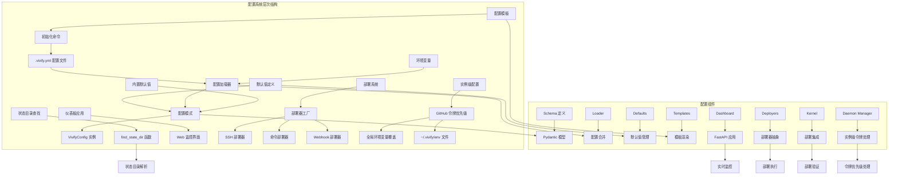
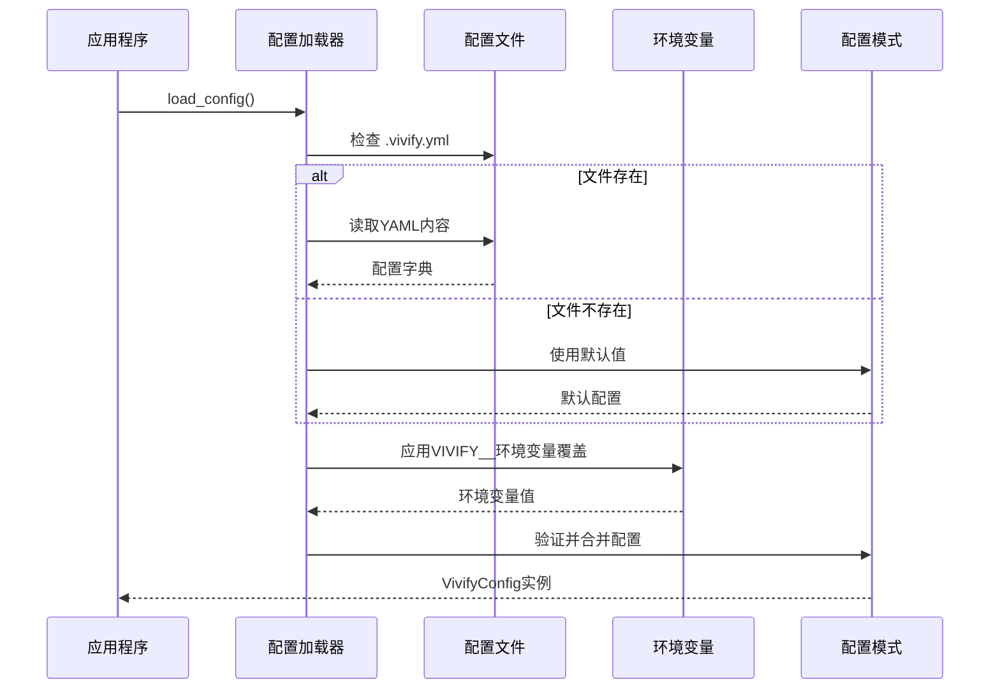
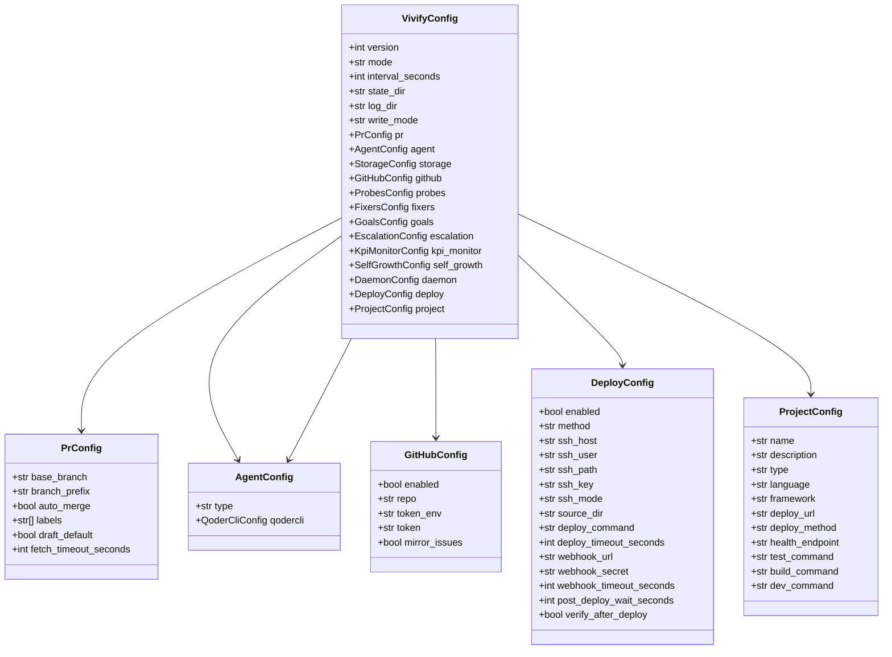
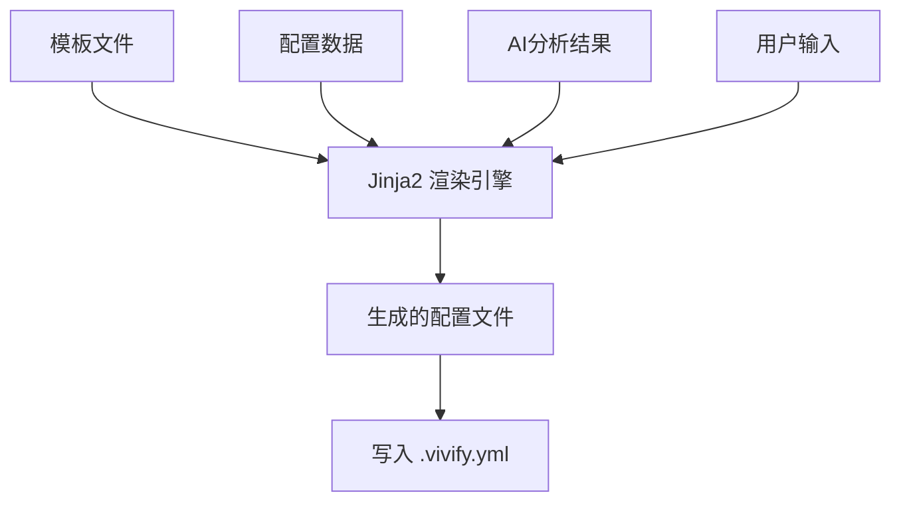
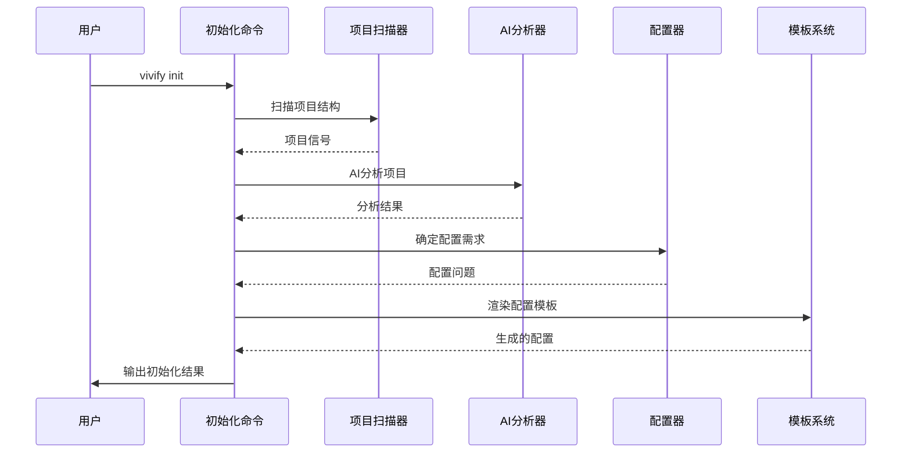
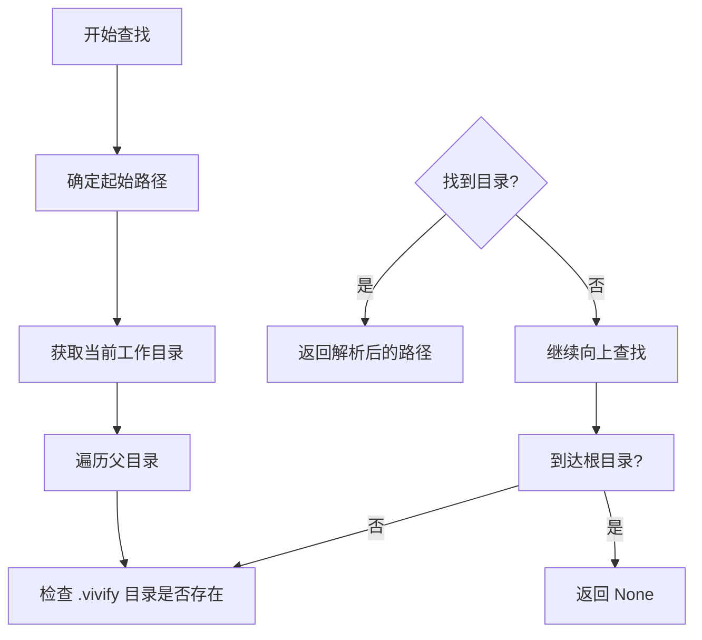
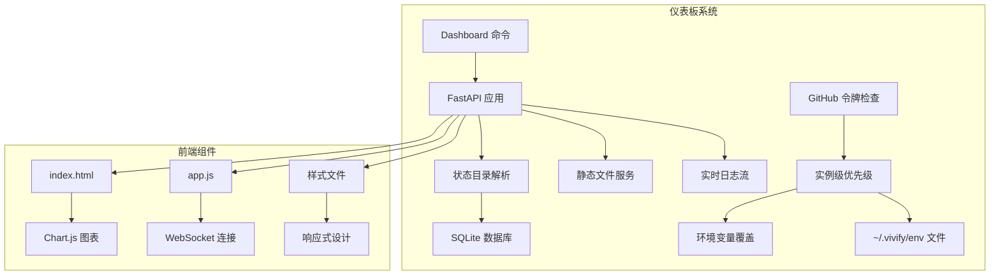
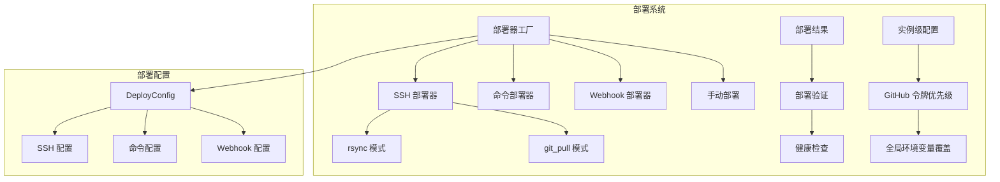
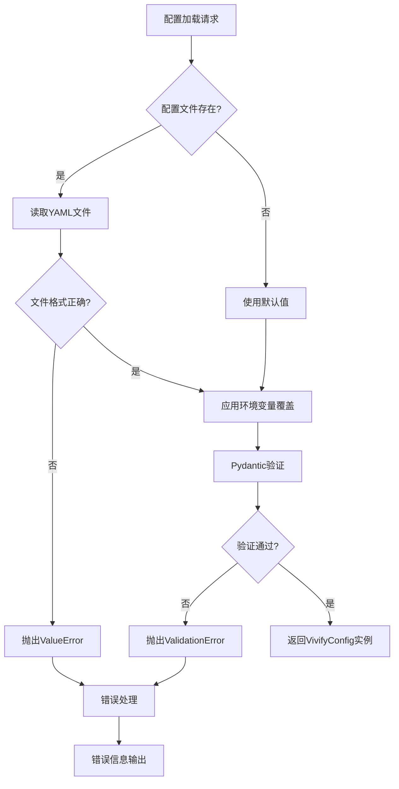

# 配置文件更新

<cite>
**本文档引用的文件**
- [pyproject.toml](file://pyproject.toml)
- [.vivify.example.yml](file://.vivify.example.yml)
- [vivify/config/schema.py](file://vivify/config/schema.py)
- [vivify/config/loader.py](file://vivify/config/loader.py)
- [vivify/config/defaults.py](file://vivify/config/defaults.py)
- [vivify/templates/vivify.yml.tmpl](file://vivify/templates/vivify.yml.tmpl)
- [vivify/cli/init_cmd.py](file://vivify/cli/init_cmd.py)
- [vivify/cli/dashboard_cmd.py](file://vivify/cli/dashboard_cmd.py)
- [vivify/dashboard/app.py](file://vivify/dashboard/app.py)
- [vivify/dashboard/db.py](file://vivify/dashboard/db.py)
- [vivify/dashboard/log_streamer.py](file://vivify/dashboard/log_streamer.py)
- [vivify/dashboard/static/index.html](file://vivify/dashboard/static/index.html)
- [vivify/dashboard/static/app.js](file://vivify/dashboard/static/app.js)
- [vivify/deployers/base.py](file://vivify/deployers/base.py)
- [vivify/deployers/ssh.py](file://vivify/deployers/ssh.py)
- [vivify/deployers/command.py](file://vivify/deployers/command.py)
- [vivify/deployers/webhook.py](file://vivify/deployers/webhook.py)
- [vivify/deployers/__init__.py](file://vivify/deployers/__init__.py)
- [vivify/kernel/loop.py](file://vivify/kernel/loop.py)
- [vivify/daemon/manager.py](file://vivify/daemon/manager.py)
</cite>

## 更新摘要
**所做更改**
- 新增实例级别GitHub令牌配置选项，支持在配置文件中直接设置令牌
- 更新GitHub配置模式，添加token_env字段支持自定义环境变量名称
- 增强配置加载器的环境变量覆盖机制，支持实例级令牌优先级
- 完善配置模板系统，包含实例级别GitHub令牌配置
- 优化仪表板系统，显示实例级令牌配置状态
- 改进守护进程管理器，支持实例级令牌覆盖全局配置

## 目录
1. [简介](#简介)
2. [配置系统架构](#配置系统架构)
3. [配置文件结构详解](#配置文件结构详解)
4. [配置加载器](#配置加载器)
5. [配置模式定义](#配置模式定义)
6. [默认值管理](#默认值管理)
7. [配置模板系统](#配置模板系统)
8. [初始化命令](#初始化命令)
9. [状态目录查找功能](#状态目录查找功能)
10. [仪表板系统](#仪表板系统)
11. [部署系统](#部署系统)
12. [配置验证与错误处理](#配置验证与错误处理)
13. [环境变量覆盖机制](#环境变量覆盖机制)
14. [配置最佳实践](#配置最佳实践)
15. [故障排除指南](#故障排除指南)
16. [总结](#总结)

## 简介

Vivify项目采用全新的配置系统，从传统的配置文件结构演进为现代化的Pydantic驱动配置架构。新系统提供了类型安全、自动验证、环境变量覆盖和完整的配置模板支持。

新配置系统的核心特性：
- **类型安全**：基于Pydantic的强类型配置模型
- **自动验证**：配置加载时自动验证数据类型和格式
- **环境变量覆盖**：支持通过VIVIFY__前缀的环境变量覆盖配置
- **配置模板**：提供完整的配置模板文件用于快速启动
- **默认值管理**：集中化的默认值定义和初始化流程
- **状态目录查找**：自动在项目树中定位 .vivify 状态目录
- **仪表板监控**：提供Web仪表板进行实时监控
- **部署自动化**：支持多种部署方式的完整配置系统
- **实例级配置**：支持在配置文件中直接设置GitHub令牌等实例级配置

## 配置系统架构

Vivify的配置系统采用分层架构设计，确保配置的灵活性和可维护性：



**图表来源**
- [vivify/config/schema.py: 151-174:151-174](file://vivify/config/schema.py#L151-L174)
- [vivify/config/loader.py: 44-61:44-61](file://vivify/config/loader.py#L44-L61)
- [vivify/config/defaults.py: 1-44:1-44](file://vivify/config/defaults.py#L1-L44)
- [vivify/cli/dashboard_cmd.py: 27-33:27-33](file://vivify/cli/dashboard_cmd.py#L27-L33)
- [vivify/deployers/__init__.py: 27-49:27-49](file://vivify/deployers/__init__.py#L27-L49)
- [vivify/daemon/manager.py: 72-93:72-93](file://vivify/daemon/manager.py#L72-L93)

## 配置文件结构详解

### 根级配置选项

Vivify配置文件采用YAML格式，根级包含以下主要配置块：

| 配置项 | 类型 | 默认值 | 描述 |
|--------|------|--------|------|
| version | int | 1 | 配置版本号 |
| mode | "daemon" \| "once" \| "dry-run" | "daemon" | 运行模式 |
| interval_seconds | int | 300 | 检查间隔（秒） |
| state_dir | str | ".vivify" | 状态目录路径 |
| log_dir | str | ".vivify/logs" | 日志目录路径 |
| write_mode | "pr" | "pr" | 写入模式（目前仅支持PR模式） |

### PR配置

PR配置控制GitHub Pull Request相关的设置：

| 配置项 | 类型 | 默认值 | 描述 |
|--------|------|--------|------|
| base_branch | str | "main" | PR基础分支 |
| branch_prefix | str | "vivify/" | PR分支前缀 |
| auto_merge | bool | false | 自动合并开关 |
| labels | List[str] | ["vivify"] | PR标签列表 |
| draft_default | bool | false | 默认草稿状态 |
| fetch_timeout_seconds | int | 120 | PR抓取超时时间（秒） |

### Agent配置

Agent配置定义AI代理的行为参数：

| 配置项 | 类型 | 默认值 | 描述 |
|--------|------|--------|------|
| type | "qodercli" | "qodercli" | 代理类型 |
| qodercli.binary_path | str | "qodercli" | qodercli可执行文件路径 |
| qodercli.model | str | "ultimate" | AI模型名称 |
| qodercli.max_turns_fix | int | 30 | 修复对话最大轮数 |
| qodercli.max_turns_develop | int | 100 | 开发对话最大轮数 |
| qodercli.max_turns_evaluate | int | 20 | 评估对话最大轮数 |
| qodercli.max_turns_verify | int | 20 | 验证对话最大轮数 |
| qodercli.max_turns_decompose | int | 30 | 分解对话最大轮数 |
| qodercli.timeout_fix_seconds | int | 1800 | 修复超时时间（秒） |
| qodercli.timeout_develop_seconds | int | 3600 | 开发超时时间（秒） |
| qodercli.timeout_evaluate_seconds | int | 600 | 评估超时时间（秒） |
| qodercli.timeout_verify_seconds | int | 600 | 验证超时时间（秒） |
| qodercli.timeout_decompose_seconds | int | 600 | 分解超时时间（秒） |
| qodercli.extra_args | List[str] | ["--yolo", "-q"] | 额外命令行参数 |
| qodercli.max_concurrent_processes | int | 10 | 最大并发进程数 |
| qodercli.slot_wait_timeout_seconds | int | 300 | 插槽等待超时时间（秒） |
| qodercli.auto_trust_workspace | bool | True | 自动信任工作区 |

### 存储配置

存储配置支持多种存储后端：

| 配置项 | 类型 | 默认值 | 描述 |
|--------|------|--------|------|
| type | "sqlite" \| "remote" | "sqlite" | 存储类型 |
| sqlite.path | str | ".vivify/state.db" | SQLite数据库路径 |
| remote.base_url | str | "" | 远程存储URL |
| remote.secret_env | str | "VIVIFY_SECRET" | 秘密环境变量名 |
| remote.timeout_seconds | int | 10 | 远程存储超时时间（秒） |

### GitHub配置

**更新** GitHub配置现在支持实例级别的令牌配置：

| 配置项 | 类型 | 默认值 | 描述 |
|--------|------|--------|------|
| enabled | bool | true | 是否启用GitHub集成 |
| repo | str | "" | GitHub仓库名称（为空时自动从git remote检测） |
| token_env | str | "GH_TOKEN" | GitHub令牌环境变量名称（向后兼容） |
| token | str | "" | **新增** 实例级别GitHub令牌（优先级最高） |
| mirror_issues | bool | true | 是否镜像GitHub Issues |

### 部署配置

**新增** 部署配置控制自动化部署行为：

| 配置项 | 类型 | 默认值 | 描述 |
|--------|------|--------|------|
| enabled | bool | true | 是否启用自动部署 |
| method | "manual" \| "ssh" \| "rsync" \| "command" \| "webhook" \| "github-pages" \| "vercel" \| "netlify" | "manual" | 部署方式 |
| ssh_host | str | "" | SSH主机地址 |
| ssh_user | str | "" | SSH用户名 |
| ssh_path | str | "" | 远程服务器路径 |
| ssh_key | str | "" | SSH私钥路径 |
| ssh_mode | "rsync" \| "git_pull" | "rsync" | SSH部署模式 |
| source_dir | str | "" | 同步源子目录 |
| deploy_command | str | "" | 自定义部署命令 |
| deploy_timeout_seconds | int | 300 | 部署超时时间（秒） |
| webhook_url | str | "" | Webhook URL |
| webhook_secret | str | "" | Webhook密钥 |
| webhook_timeout_seconds | int | 30 | Webhook超时时间（秒） |
| post_deploy_wait_seconds | int | 30 | 部署后等待时间（秒） |
| verify_after_deploy | bool | true | 部署后验证开关 |

### 项目配置

**更新** 项目配置包含部署相关信息：

| 配置项 | 类型 | 默认值 | 描述 |
|--------|------|--------|------|
| name | str | "" | 项目名称 |
| description | str | "" | 项目描述 |
| type | "generic" | "generic" | 项目类型 |
| language | str | "" | 主要编程语言 |
| framework | str | "" | 主框架名称 |
| deploy_url | str | "" | 部署地址 |
| deploy_method | "manual" | "manual" | 部署方式 |
| health_endpoint | str | "" | 健康检查端点 |
| test_command | str | "" | 测试命令 |
| build_command | str | "" | 构建命令 |
| dev_command | str | "" | 开发服务命令 |

**章节来源**
- [.vivify.example.yml: 1-96:1-96](file://.vivify.example.yml#L1-L96)
- [vivify/config/schema.py: 67-73:67-73](file://vivify/config/schema.py#L67-L73)
- [vivify/config/schema.py: 151-190:151-190](file://vivify/config/schema.py#L151-L190)

## 配置加载器

配置加载器负责从文件系统和环境变量中加载配置，并进行类型验证和合并。

### 加载流程



**图表来源**
- [vivify/config/loader.py: 57-74:57-74](file://vivify/config/loader.py#L57-L74)

### 关键特性

1. **文件存在性检查**：自动检测配置文件是否存在
2. **类型安全验证**：使用Pydantic模型进行严格的数据验证
3. **环境变量覆盖**：支持通过VIVIFY__前缀的环境变量覆盖配置
4. **类型转换**：自动处理布尔值、整数、浮点数等类型的转换

**章节来源**
- [vivify/config/loader.py: 1-77:1-77](file://vivify/config/loader.py#L1-L77)

## 配置模式定义

配置模式使用Pydantic定义，提供完整的类型安全和验证机制。

### 模型层次结构



**图表来源**
- [vivify/config/schema.py: 198-241:198-241](file://vivify/config/schema.py#L198-L241)

### 核心配置模型

#### VivifyConfig（顶级配置）

顶级配置模型定义了所有可用的配置选项，使用`ConfigDict(extra="allow")`允许额外的配置项。

#### 子配置模型

每个子配置都有其特定的验证规则和默认值：
- **PrConfig**：PR相关的配置验证
- **AgentConfig**：AI代理配置验证
- **StorageConfig**：存储配置验证
- **GitHubConfig**：**更新** GitHub集成配置验证，包含实例级令牌支持
- **ProbesConfig**：探测器配置验证
- **FixersConfig**：修复器配置验证
- **GoalsConfig**：目标配置验证
- **EscalationConfig**：升级策略配置验证
- **KpiMonitorConfig**：KPI监控配置验证
- **SelfGrowthConfig**：自我改进配置验证
- **DaemonConfig**：守护进程配置验证
- **DeployConfig**：**新增** 部署配置验证
- **ProjectConfig**：项目元数据配置验证

**章节来源**
- [vivify/config/schema.py: 1-241:1-241](file://vivify/config/schema.py#L1-L241)

## 默认值管理

默认值通过专门的模块集中管理，确保配置加载器和初始化命令的一致性。

### 默认值类型

| 默认值类别 | 默认值 | 用途 |
|------------|--------|------|
| DEFAULT_BUILTIN_PROBES | 13个内置探测器 | 初始化时的默认探测器列表 |
| DEFAULT_BUILTIN_FIXERS | 6个内置修复器 | 初始化时的默认修复器列表 |
| DEFAULT_GITIGNORE_ENTRIES | 3个.gitignore条目 | 初始化时添加到.gitignore的内容 |

### 默认值的作用

1. **初始化一致性**：确保`vivify init`命令生成的配置与配置模式的默认值保持一致
2. **简化配置**：用户只需配置必要的选项，其他选项使用默认值
3. **向后兼容**：默认值确保新版本的配置文件在没有显式配置时也能正常工作

**章节来源**
- [vivify/config/defaults.py: 1-44:1-44](file://vivify/config/defaults.py#L1-L44)

## 配置模板系统

Vivify提供了完整的配置模板系统，支持通过模板快速生成初始配置。

### 模板文件结构

模板文件位于`vivify/templates/`目录下，包含：
- `vivify.yml.tmpl`：主配置模板
- `GOALS.md.tmpl`：目标文件模板
- `pr_template.md.tmpl`：PR模板

### 模板渲染过程



**图表来源**
- [vivify/templates/vivify.yml.tmpl: 1-96:1-96](file://vivify/templates/vivify.yml.tmpl#L1-L96)

### 模板特性

1. **智能内容生成**：根据项目类型和AI分析结果动态生成配置
2. **用户定制**：允许用户在生成后进一步编辑配置
3. **版本控制友好**：生成的模板包含详细的注释和文档链接
4. **实例级令牌支持**：**更新** 模板包含实例级别GitHub令牌配置选项

**章节来源**
- [vivify/templates/vivify.yml.tmpl: 1-96:1-96](file://vivify/templates/vivify.yml.tmpl#L1-L96)

## 初始化命令

初始化命令`vivify init`负责生成完整的项目配置和相关文件。

### 初始化流程



**图表来源**
- [vivify/cli/init_cmd.py: 208-390:208-390](file://vivify/cli/init_cmd.py#L208-L390)

### 初始化功能

1. **项目扫描**：自动检测项目类型、语言、框架等特征
2. **AI分析**：使用qodercli进行智能项目分析
3. **配置生成**：根据分析结果生成合适的配置
4. **文件创建**：创建必要的目录和文件
5. **Git集成**：更新.gitignore文件
6. **部署信息收集**：**更新** 收集部署相关信息
7. **实例级令牌配置**：**新增** 支持在配置文件中直接设置GitHub令牌

**章节来源**
- [vivify/cli/init_cmd.py: 1-476:1-476](file://vivify/cli/init_cmd.py#L1-L476)

## 状态目录查找功能

新增的`find_state_dir()`函数提供了在项目树中自动查找 .vivify 状态目录的能力。

### 查找算法



**图表来源**
- [vivify/config/loader.py: 44-54:44-54](file://vivify/config/loader.py#L44-L54)

### 功能特性

1. **递归查找**：从当前目录开始向上递归查找
2. **路径解析**：返回解析后的绝对路径
3. **边界处理**：到达根目录时停止查找
4. **类型安全**：返回类型明确，支持None值

### 使用场景

- **仪表板启动**：自动定位项目的状态目录
- **配置加载**：在不同工作目录中定位配置文件
- **工具集成**：为其他Vivify工具提供统一的状态目录解析

**章节来源**
- [vivify/config/loader.py: 44-54:44-54](file://vivify/config/loader.py#L44-L54)

## 仪表板系统

Vivify新增了完整的Web仪表板系统，提供实时监控和可视化界面。

### 仪表板架构



**图表来源**
- [vivify/cli/dashboard_cmd.py: 17-43:17-43](file://vivify/cli/dashboard_cmd.py#L17-L43)
- [vivify/dashboard/app.py: 15-165:15-165](file://vivify/dashboard/app.py#L15-L165)

### 核心功能

#### 实时监控

1. **运行状态**：显示daemon进程运行状态和PID
2. **最新轮次**：展示最近的运行轮次信息
3. **操作历史**：提供操作日志的查询和过滤
4. **特性跟踪**：监控特性请求的状态变化

#### 数据接口

仪表板提供RESTful API接口：
- `/api/status` - 获取运行状态
- `/api/actions` - 查询操作历史
- `/api/features` - 特性请求管理
- `/api/kpi/snapshots` - KPI快照查询
- `/api/logs/stream` - 实时日志流

#### 前端界面

- **概览页面**：项目整体健康状况
- **问题跟踪**：Issue分类和级别管理
- **动作历史**：详细的操作记录
- **特性管理**：特性请求的生命周期
- **趋势分析**：KPI指标的趋势图

#### GitHub令牌状态检查

**更新** 仪表板现在检查GitHub令牌配置状态：
- **实例级令牌**：检查`.vivify.yml`中的`github.token`
- **环境变量**：检查`GH_TOKEN`或其他自定义环境变量
- **全局文件**：检查`~/.vivify/env`文件中的令牌配置
- **优先级显示**：显示令牌配置的优先级和来源

### 依赖配置

仪表板功能需要额外的依赖包：

```toml
[project.optional-dependencies]
dashboard = [
    "fastapi>=0.100.0",
    "uvicorn[standard]>=0.22.0",
]
```

安装方式：
```bash
pip install vivify[dashboard]
```

**章节来源**
- [vivify/cli/dashboard_cmd.py: 1-44:1-44](file://vivify/cli/dashboard_cmd.py#L1-L44)
- [vivify/dashboard/app.py: 1-166:1-166](file://vivify/dashboard/app.py#L1-L166)
- [vivify/dashboard/db.py: 1-137:1-137](file://vivify/dashboard/db.py#L1-L137)
- [vivify/dashboard/log_streamer.py: 1-25:1-25](file://vivify/dashboard/log_streamer.py#L1-L25)
- [vivify/dashboard/static/index.html: 1-28:1-28](file://vivify/dashboard/static/index.html#L1-L28)
- [vivify/dashboard/static/app.js: 1-39:1-39](file://vivify/dashboard/static/app.js#L1-L39)

## 部署系统

**新增** Vivify提供了完整的自动化部署系统，支持多种部署方式。

### 部署器架构



**图表来源**
- [vivify/deployers/__init__.py: 27-49:27-49](file://vivify/deployers/__init__.py#L27-L49)
- [vivify/deployers/base.py: 9-56:9-56](file://vivify/deployers/base.py#L9-L56)

### 部署器类型

#### SSH 部署器

支持两种SSH部署模式：
- **rsync 模式**：将本地文件同步到远程目录
- **git_pull 模式**：通过SSH执行远程git pull

#### 命令部署器

执行用户自定义的shell命令，支持：
- 自定义部署命令
- 超时控制
- 环境变量继承
- ~/.vivify/env 文件支持

#### Webhook 部署器

通过HTTP POST请求通知外部服务触发部署：
- 支持自定义Webhook URL
- 可选的secret验证
- 超时控制
- 标准化JSON负载

### 部署配置

| 配置项 | 类型 | 默认值 | 描述 |
|--------|------|--------|------|
| enabled | bool | true | 是否启用自动部署 |
| method | string | "manual" | 部署方式 |
| ssh_host | string | "" | SSH主机地址 |
| ssh_user | string | "" | SSH用户名 |
| ssh_path | string | "" | 远程路径 |
| ssh_key | string | "" | SSH密钥路径 |
| ssh_mode | "rsync" \| "git_pull" | "rsync" | SSH模式 |
| source_dir | string | "" | 源目录 |
| deploy_command | string | "" | 自定义命令 |
| deploy_timeout_seconds | int | 300 | 超时时间 |
| webhook_url | string | "" | Webhook URL |
| webhook_secret | string | "" | Webhook密钥 |
| webhook_timeout_seconds | int | 30 | Webhook超时 |
| post_deploy_wait_seconds | int | 30 | 等待时间 |
| verify_after_deploy | bool | true | 部署后验证 |

### 部署结果

部署器返回标准化的`DeployResult`对象：
- `success`：部署是否成功
- `method`：使用的部署方式
- `duration_seconds`：执行时间
- `message`：成功消息
- `error`：错误信息
- `deploy_url`：部署URL
- `verified`：验证状态

### 部署集成

部署系统与内核循环集成：
- 在特性处理完成后触发部署
- 支持部署后健康检查
- 记录部署日志和统计信息
- 处理部署异常和回滚

**章节来源**
- [vivify/deployers/base.py: 1-56:1-56](file://vivify/deployers/base.py#L1-L56)
- [vivify/deployers/ssh.py: 1-44:1-44](file://vivify/deployers/ssh.py#L1-L44)
- [vivify/deployers/command.py: 1-78:1-78](file://vivify/deployers/command.py#L1-L78)
- [vivify/deployers/webhook.py: 1-67:1-67](file://vivify/deployers/webhook.py#L1-L67)
- [vivify/deployers/__init__.py: 1-49:1-49](file://vivify/deployers/__init__.py#L1-L49)
- [vivify/kernel/loop.py: 148-153:148-153](file://vivify/kernel/loop.py#L148-L153)

## 配置验证与错误处理

新配置系统提供了完善的验证和错误处理机制。

### 验证规则

1. **类型验证**：使用Pydantic进行严格的类型检查
2. **格式验证**：确保配置文件符合预期的YAML格式
3. **范围验证**：验证数值参数的有效范围
4. **枚举验证**：确保枚举类型的值在允许范围内
5. **部署配置验证**：**新增** 验证部署相关配置的完整性
6. **GitHub令牌验证**：**更新** 验证实例级令牌和环境变量配置

### 错误处理策略



**图表来源**
- [vivify/config/loader.py: 57-74:57-74](file://vivify/config/loader.py#L57-L74)

### 错误类型

| 错误类型 | 触发条件 | 处理方式 |
|----------|----------|----------|
| ImportError | PyYAML缺失 | 提供清晰的安装指导 |
| ValueError | 配置文件格式错误 | 指出具体错误位置 |
| ValidationError | 配置验证失败 | 显示具体的验证错误 |
| DeployError | 部署配置错误 | 提供部署方式特定的错误信息 |
| GitHubTokenError | **新增** GitHub令牌配置错误 | 提供实例级令牌和环境变量的错误信息 |

**章节来源**
- [vivify/config/loader.py: 57-74:57-74](file://vivify/config/loader.py#L57-L74)

## 环境变量覆盖机制

Vivify支持通过环境变量覆盖配置文件中的任何设置。

### 环境变量格式

环境变量使用`VIVIFY__`前缀，采用双下划线分隔的点式路径：

```
VIVIFY__agent__qodercli__model=ultimate
VIVIFY__storage__sqlite__path=.vivify/custom.db
VIVIFY__deploy__method=ssh
VIVIFY__deploy__ssh_host=production.example.com
VIVIFY__pr__labels='["vivify","important"]'
```

### 类型转换机制

配置加载器支持自动类型转换：

| 环境变量值 | 转换结果 | 用途 |
|------------|----------|------|
| "true" | True | 布尔值开关 |
| "false" | False | 布尔值开关 |
| "123" | 123 | 整数值 |
| "3.14" | 3.14 | 浮点数值 |
| "hello" | "hello" | 字符串值 |

### 覆盖优先级

1. **环境变量**：最高优先级，覆盖所有其他配置
2. **配置文件**：覆盖默认值
3. **默认值**：最低优先级

**章节来源**
- [vivify/config/loader.py: 10-41:10-41](file://vivify/config/loader.py#L10-L41)

## 配置最佳实践

### 配置文件组织

1. **最小化配置**：只配置必要的选项，其他使用默认值
2. **环境隔离**：使用环境变量区分开发、测试、生产环境
3. **版本控制**：将配置文件纳入版本控制，但敏感信息除外
4. **部署配置分离**：**新增** 将部署配置与普通配置分离管理
5. **实例级令牌管理**：**更新** 在配置文件中直接设置GitHub令牌，优先于环境变量

### 环境变量管理

1. **命名规范**：使用清晰的环境变量命名，便于理解和维护
2. **文档记录**：在README中记录所有可配置的环境变量
3. **安全考虑**：敏感信息使用环境变量而非配置文件
4. **部署密钥管理**：**新增** 使用专用的部署密钥和凭据管理
5. **GitHub令牌优先级**：**更新** 了解实例级令牌的优先级机制

### 配置验证

1. **定期验证**：在CI/CD中加入配置验证步骤
2. **类型检查**：使用静态类型检查工具验证配置代码
3. **单元测试**：为配置相关的代码编写单元测试
4. **部署测试**：**新增** 在测试环境中验证部署配置
5. **令牌配置验证**：**更新** 验证GitHub令牌配置的正确性

### 仪表板部署

1. **依赖安装**：使用可选依赖安装仪表板功能
2. **端口配置**：合理配置监听端口和主机地址
3. **状态目录**：确保状态目录存在且可访问
4. **日志管理**：**新增** 配置适当的日志级别和输出
5. **令牌状态监控**：**更新** 通过仪表板监控GitHub令牌配置状态

### 部署配置最佳实践

1. **SSH配置**：使用SSH密钥而非密码认证
2. **Webhook安全**：配置Webhook密钥进行身份验证
3. **超时设置**：为部署操作设置合理的超时时间
4. **健康检查**：启用部署后验证确保服务可用性
5. **回滚策略**：**新增** 制定部署失败时的回滚计划
6. **令牌配置策略**：**更新** 使用实例级令牌确保部署时的GitHub访问权限

## 故障排除指南

### 常见配置问题

#### 配置文件格式错误

**症状**：配置加载时抛出ValueError
**解决**：检查YAML语法，确保缩进正确，使用正确的数据类型

#### 环境变量类型不匹配

**症状**：配置加载时类型转换失败
**解决**：确保环境变量值与期望的数据类型匹配

#### PyYAML依赖缺失

**症状**：导入配置模块时报ImportError
**解决**：安装PyYAML依赖：`pip install pyyaml`

#### 仪表板依赖缺失

**症状**：运行仪表板时报ImportError
**解决**：安装仪表板依赖：`pip install vivify[dashboard]`

#### 部署配置错误

**症状**：部署失败或配置不生效
**解决**：检查部署配置的完整性和正确性

#### GitHub令牌配置问题

**症状**：GitHub访问失败或令牌无效
**解决**：检查实例级令牌优先级和环境变量配置

### 配置验证工具

```bash
# 验证配置文件格式
python3 -c "
import yaml
try:
    with open('.vivify.yml', 'r') as f:
        config = yaml.safe_load(f)
    print('✓ 配置文件格式正确')
except Exception as e:
    print(f'✗ 配置文件错误: {e}')
"

# 验证配置加载
python3 -c "
from vivify.config.loader import load_config
try:
    config = load_config()
    print('✓ 配置加载成功')
    print(f'✓ 配置项: {list(config.dict().keys())}')
except Exception as e:
    print(f'✗ 配置加载失败: {e}')
"

# 验证GitHub令牌配置
python3 -c "
from vivify.config.schema import GitHubConfig
try:
    github_config = GitHubConfig()
    print('✓ GitHub配置验证通过')
    print(f'✓ 默认令牌环境变量: {github_config.token_env}')
    print(f'✓ 实例级令牌支持: {hasattr(github_config, \"token\")}')
except Exception as e:
    print(f'✗ GitHub配置错误: {e}')
"

# 验证部署配置
python3 -c "
from vivify.config.schema import DeployConfig
try:
    deploy_config = DeployConfig()
    print('✓ 部署配置验证通过')
    print(f'✓ 默认部署方式: {deploy_config.method}')
except Exception as e:
    print(f'✗ 部署配置错误: {e}')
"

# 查找状态目录
python3 -c "
from vivify.config.loader import find_state_dir
try:
    state_dir = find_state_dir()
    if state_dir:
        print(f'✓ 找到状态目录: {state_dir}')
    else:
        print('✗ 未找到状态目录')
except Exception as e:
    print(f'✗ 查找失败: {e}')
"
```

### 调试技巧

1. **启用详细日志**：设置`VIVIFY_LOG_LEVEL=DEBUG`获取更多调试信息
2. **检查环境变量**：使用`env | grep VIVIFY__`查看所有配置相关的环境变量
3. **验证默认值**：比较实际配置与默认值的差异
4. **仪表板测试**：使用`vivify dashboard --help`查看仪表板功能
5. **部署测试**：**新增** 使用`--dry-run`模式测试部署配置而不实际执行
6. **令牌优先级检查**：**更新** 通过仪表板检查GitHub令牌的优先级和来源

## 总结

Vivify的新配置系统代表了现代配置管理的最佳实践，提供了类型安全、自动验证、灵活覆盖和完整的模板支持。通过Pydantic的强类型系统和Jinja2的模板引擎，新系统确保了配置的正确性和可维护性。

**新增功能亮点**：
- **状态目录查找**：`find_state_dir()`函数提供智能的项目目录定位
- **仪表板监控**：完整的Web仪表板系统，支持实时监控和可视化
- **可选依赖**：仪表板功能作为可选依赖，保持核心功能的简洁性
- **增强的错误处理**：完善的错误类型和处理策略
- **部署系统**：**新增** 完整的自动化部署配置和执行系统
- **部署器抽象**：**新增** 统一的部署器接口和多种部署方式支持
- **实例级GitHub令牌**：**更新** 支持在配置文件中直接设置GitHub令牌，具有最高优先级
- **token_env配置**：**更新** 支持自定义GitHub令牌环境变量名称
- **令牌优先级机制**：**更新** 实例级令牌优先于环境变量，环境变量优先于全局文件

**关键优势包括**：
- **类型安全**：编译时和运行时双重类型检查
- **自动验证**：配置加载时自动验证数据完整性
- **灵活覆盖**：支持多层配置覆盖机制
- **模板支持**：提供完整的配置模板和初始化流程
- **实时监控**：Web仪表板提供实时状态监控
- **错误处理**：清晰的错误信息和恢复机制
- **部署自动化**：**新增** 支持多种部署方式的完整配置系统
- **令牌管理**：**更新** 提供灵活的GitHub令牌配置和优先级机制

这个配置系统为Vivify项目提供了坚实的基础，支持未来的功能扩展和维护需求，特别是在自动化部署和GitHub集成方面的强大能力为项目的持续交付提供了重要保障。实例级GitHub令牌配置的引入进一步增强了配置系统的灵活性和安全性，为不同环境下的部署需求提供了更好的支持。