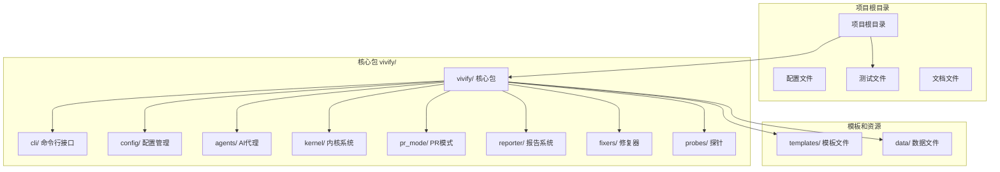
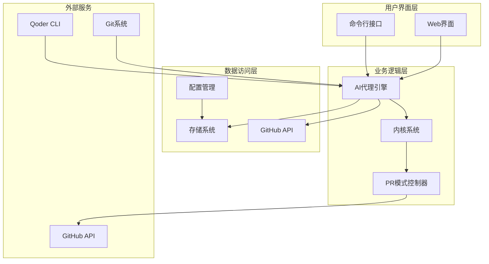
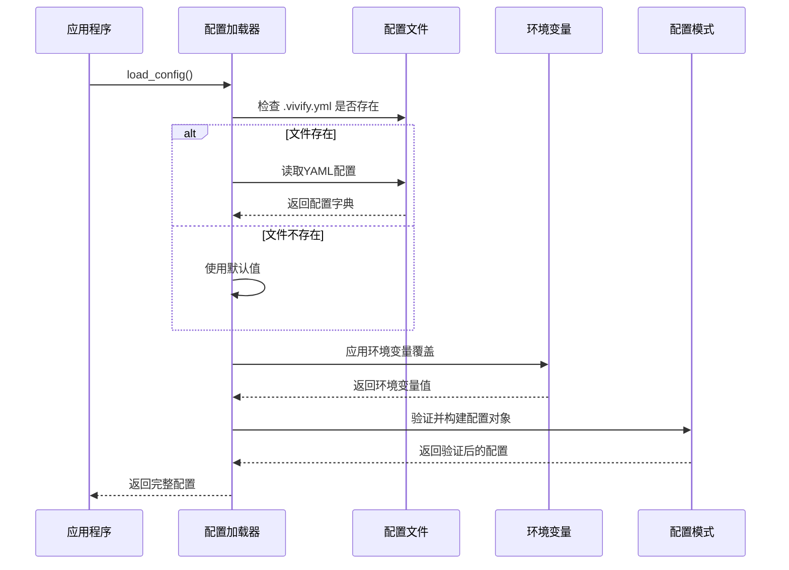
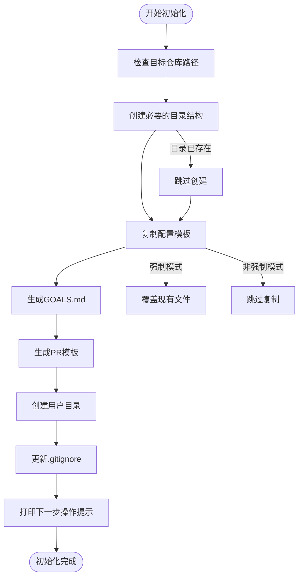
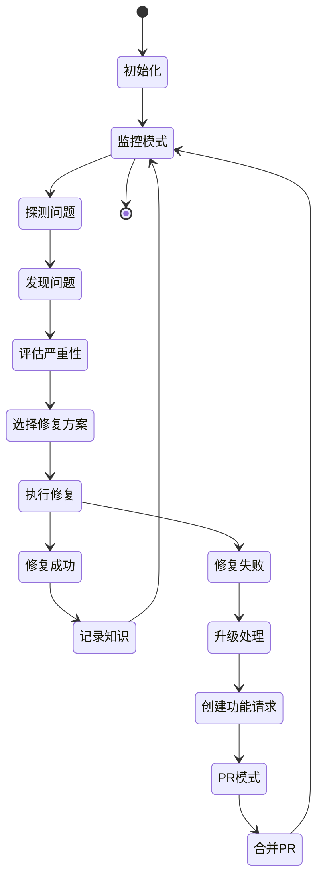
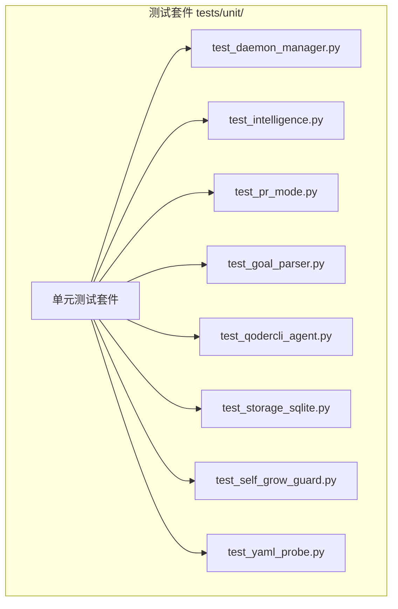
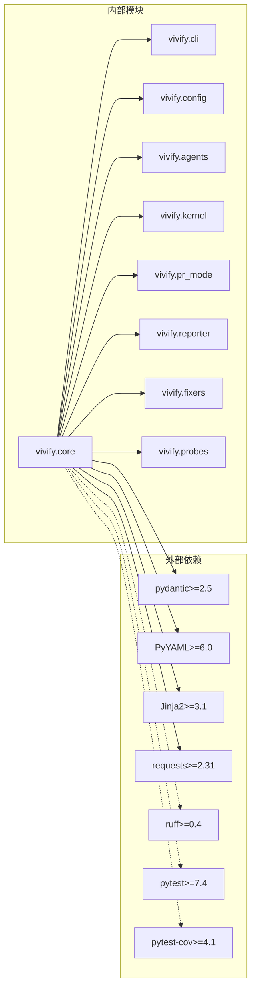

# 验证测试流程

<cite>
**本文档引用的文件**
- [tests/unit/__init__.py](file://tests/unit/__init__.py)
- [tests/unit/test_daemon_manager.py](file://tests/unit/test_daemon_manager.py)
- [tests/unit/test_intelligence.py](file://tests/unit/test_intelligence.py)
- [tests/unit/test_pr_mode.py](file://tests/unit/test_pr_mode.py)
- [tests/unit/test_goal_parser.py](file://tests/unit/test_goal_parser.py)
- [tests/unit/test_qodercli_agent.py](file://tests/unit/test_qodercli_agent.py)
- [tests/unit/test_storage_sqlite.py](file://tests/unit/test_storage_sqlite.py)
- [tests/unit/test_self_grow_guard.py](file://tests/unit/test_self_grow_guard.py)
- [tests/unit/test_yaml_probe.py](file://tests/unit/test_yaml_probe.py)
- [pyproject.toml](file://pyproject.toml)
- [tests/__init__.py](file://tests/__init__.py)
</cite>

## 更新摘要
**变更内容**
- 新增完整的单元测试基础设施分析
- 添加daemon_manager、intelligence、pr_mode等核心模块的测试策略
- 更新测试执行方法和验证流程
- 增加自动化测试脚本和手动验证清单

## 目录
1. [简介](#简介)
2. [项目结构](#项目结构)
3. [核心组件](#核心组件)
4. [架构概览](#架构概览)
5. [详细组件分析](#详细组件分析)
6. [测试基础设施](#测试基础设施)
7. [依赖关系分析](#依赖关系分析)
8. [性能考虑](#性能考虑)
9. [故障排除指南](#故障排除指南)
10. [结论](#结论)
11. [附录](#附录)

## 简介

本文档为Vivify项目（原auto-heal）的品牌重塑改造提供了完整的验证测试流程技术参考。该改造涉及从"auto-heal"到"vivify"的全面品牌转换，包括代码重构、配置更新、CLI功能测试和配置加载测试等多个方面。

Vivify是一个自增长型AI代理系统，能够挂载到任何GitHub仓库上，自主监控系统健康状况，修复问题，将目标分解为功能，并通过PR模式与Qoder CLI迭代开发。本次改造确保了所有功能保持不变，仅进行品牌名称的统一更新。

**更新** 项目现已包含完整的单元测试基础设施，涵盖daemon_manager、intelligence、pr_mode、goal_parser、qodercli_agent、storage_sqlite、self_grow_guard和yaml_probe等核心模块的测试。

## 项目结构

Vivify项目采用模块化的Python包结构，主要包含以下核心目录：



**图表来源**
- [rebranding_analysis.md:14-31](file://rebranding_analysis.md#L14-L31)
- [rebranding_analysis.md:104-143](file://rebranding_analysis.md#L104-L143)

**章节来源**
- [rebranding_analysis.md:14-31](file://rebranding_analysis.md#L14-L31)
- [rebranding_analysis.md:104-143](file://rebranding_analysis.md#L104-L143)

## 核心组件

### 配置管理系统

配置系统是Vivify的核心组件之一，负责管理所有运行时配置参数。主要包含以下关键文件：

- **schema.py**: 定义配置结构和默认值
- **loader.py**: 加载和合并配置文件与环境变量
- **defaults.py**: 定义默认配置值

### CLI命令行接口

Vivify提供完整的命令行接口，支持多种操作模式：

- **init**: 初始化新仓库
- **run**: 运行主程序
- **doctor**: 健康检查
- **goals**: 目标管理
- **probes**: 探针管理
- **fixers**: 修复器管理
- **features**: 功能管理
- **logs**: 日志查看

### AI代理系统

Vivify包含智能AI代理，能够：
- 自主检测系统问题
- 执行修复操作
- 将目标分解为可执行的功能请求
- 通过PR模式与团队协作

**章节来源**
- [rebranding_analysis.md:201-240](file://rebranding_analysis.md#L201-L240)
- [rebranding_analysis.md:116-198](file://rebranding_analysis.md#L116-L198)

## 架构概览

Vivify的整体架构采用分层设计，确保各组件之间的松耦合和高内聚：



**图表来源**
- [rebranding_analysis.md:201-240](file://rebranding_analysis.md#L201-L240)
- [rebranding_analysis.md:116-198](file://rebranding_analysis.md#L116-L198)

## 详细组件分析

### 配置加载流程

配置加载是Vivify启动过程中的关键步骤，确保系统能够正确读取和应用各种配置参数：



**图表来源**
- [rebranding_analysis.md:283-361](file://rebranding_analysis.md#L283-L361)

### CLI初始化流程

CLI初始化是用户首次使用Vivify时的重要步骤，负责设置项目结构和基础配置：



**图表来源**
- [rebranding_analysis.md:474-580](file://rebranding_analysis.md#L474-L580)

**章节来源**
- [rebranding_analysis.md:283-361](file://rebranding_analysis.md#L283-L361)
- [rebranding_analysis.md:474-580](file://rebranding_analysis.md#L474-L580)

### AI代理工作流程

AI代理是Vivify的核心智能组件，负责系统的自动化决策和执行：



**图表来源**
- [rebranding_analysis.md:201-240](file://rebranding_analysis.md#L201-L240)

**章节来源**
- [rebranding_analysis.md:201-240](file://rebranding_analysis.md#L201-L240)

## 测试基础设施

Vivify项目现已建立完整的单元测试基础设施，涵盖核心功能模块的全面测试覆盖。

### 测试套件结构



**图表来源**
- [tests/unit/__init__.py:1-2](file://tests/unit/__init__.py#L1-L2)

### 核心测试模块分析

#### Daemon Manager 测试

Daemon Manager测试专注于进程锁管理和守护进程生命周期控制：

- **InstanceLock测试**: 验证锁获取/释放语义、双重获取失败、上下文管理器行为
- **DaemonManager测试**: 覆盖未运行状态检查、PID文件处理、实例列表过滤

#### Intelligence 模块测试

Intelligence模块测试包含多个子组件的全面验证：

- **Scanner测试**: 目录扫描、文件扩展名识别、忽略目录处理
- **Classifier测试**: 项目类型分类、场景识别准确性
- **Configurator测试**: 配置问题生成、自动发现功能、探针/修复器映射
- **Interviewer测试**: 交互式问答、非交互模式行为
- **Goals Templates测试**: 目标模板渲染、YAML前置内容验证
- **AIAnalyzer测试**: AI可用性检测、JSON输出解析、错误处理

#### PR Mode 测试

PR Mode测试覆盖整个PR创建和自动合并流程：

- **PrCreator测试**: PR创建命令构建、标签处理、分支推送
- **AutoMerge测试**: 自动合并策略、条件判断、错误处理
- **SelfGrowGuard测试**: 差分分类、安全决策、标签生成

#### 其他重要测试模块

- **Goal Parser测试**: 目标文档解析、KPI提取、截止日期处理
- **QoderCli Agent测试**: 子进程调用、超时处理、输出过滤
- **Storage SQLite测试**: CRUD操作、知识库管理、KPI快照
- **YAML Probe测试**: 探针解析、规则分析、收集步骤执行

**章节来源**
- [tests/unit/test_daemon_manager.py:1-94](file://tests/unit/test_daemon_manager.py#L1-L94)
- [tests/unit/test_intelligence.py:1-378](file://tests/unit/test_intelligence.py#L1-L378)
- [tests/unit/test_pr_mode.py:1-185](file://tests/unit/test_pr_mode.py#L1-L185)
- [tests/unit/test_goal_parser.py:1-145](file://tests/unit/test_goal_parser.py#L1-L145)
- [tests/unit/test_qodercli_agent.py:1-164](file://tests/unit/test_qodercli_agent.py#L1-L164)
- [tests/unit/test_storage_sqlite.py:1-77](file://tests/unit/test_storage_sqlite.py#L1-L77)
- [tests/unit/test_self_grow_guard.py:1-102](file://tests/unit/test_self_grow_guard.py#L1-L102)
- [tests/unit/test_yaml_probe.py:1-149](file://tests/unit/test_yaml_probe.py#L1-L149)

### 测试执行策略

#### 单元测试执行

```bash
# 运行所有单元测试
pytest tests/unit/ -v

# 运行特定模块测试
pytest tests/unit/test_intelligence.py -v

# 生成覆盖率报告
pytest tests/unit/ --cov=vivify --cov-report=html

# 运行带调试信息的测试
pytest tests/unit/ -v -s --tb=long
```

#### 测试配置

项目使用pytest作为测试框架，配置位于pyproject.toml中：

- **测试路径**: `tests/` 目录
- **警告过滤**: 忽略弃用警告
- **依赖**: pytest>=7.4, pytest-cov>=4.1

**章节来源**
- [pyproject.toml:63-66](file://pyproject.toml#L63-L66)

## 依赖关系分析

Vivify项目具有清晰的模块化依赖关系，确保系统的可维护性和扩展性：



**图表来源**
- [rebranding_analysis.md:33-103](file://rebranding_analysis.md#L33-L103)

**章节来源**
- [rebranding_analysis.md:33-103](file://rebranding_analysis.md#L33-L103)

## 性能考虑

在Vivify的性能优化方面，主要关注以下几个关键领域：

### 配置加载性能
- 使用缓存机制避免重复解析配置文件
- 实现增量更新以减少不必要的重新加载
- 优化环境变量解析算法

### AI代理执行效率
- 实现任务队列管理避免并发冲突
- 使用异步处理提升响应速度
- 优化探针和修复器的执行顺序

### 存储系统优化
- SQLite数据库连接池管理
- 合理的索引设计提升查询性能
- 数据清理和压缩策略

### 测试性能优化
- 使用pytest的并行执行能力
- 合理的测试隔离和mock使用
- 临时文件和资源的有效管理

## 故障排除指南

### 常见问题及解决方案

| 问题类型 | 症状描述 | 可能原因 | 解决方案 |
|---------|---------|---------|---------|
| 导入错误 | ImportError: No module named 'vivify' | 包目录未正确重命名 | 检查 `vivify/` 目录是否存在 |
| CLI不可用 | vivify: command not found | CLI入口点未更新 | 检查pyproject.toml中的入口点配置 |
| 配置加载失败 | VIVIFY__ env not found | 环境变量前缀未更新 | 检查config/loader.py中的环境变量前缀 |
| 测试失败 | 测试中仍有旧名称引用 | 测试文件未更新 | 运行 `grep -r "auto-heal" tests/` 并更新 |
| 单元测试失败 | 特定模块测试异常 | 依赖或mock配置问题 | 检查对应测试文件的依赖注入 |

### 验证检查清单

在完成品牌重塑改造后，必须执行以下验证步骤：

1. **目录结构验证**
   - 检查 `vivify/` 目录是否存在
   - 验证配置文件 `.vivify.example.yml` 已重命名
   - 确认模板文件已更新为 `vivify.yml.tmpl`
   - 验证 `tests/unit/` 目录结构完整

2. **导入路径验证**
   ```bash
   # 检查是否有遗留的旧导入
   grep -r "from auto_heal" . --include="*.py" | wc -l  # 应该为 0
   grep -r "import auto_heal" . --include="*.py" | wc -l  # 应该为 0
   
   # 验证新导入正常工作
   python3 -c "from vivify.cli.main import cli; print('OK')"
   python3 -c "from vivify.config import load_config; print('OK')"
   ```

3. **CLI功能验证**
   ```bash
   # 测试CLI帮助
   python3 -m vivify --help
   
   # 测试init命令
   python3 -m vivify init --repo /tmp/test_vivify --force
   ```

4. **配置加载验证**
   ```bash
   # 运行测试套件
   pytest tests/unit/ -v
   
   # 验证配置文件加载
   python3 -c "from vivify.config import load_config; cfg = load_config(); print('配置加载成功')"
   ```

5. **字符串引用验证**
   ```bash
   # 检查是否有遗留的旧字符串引用
   grep -r "auto-heal\|auto_heal\|AUTO_HEAL" . --include="*.py" --include="*.yml" --include="*.md" | grep -v ".git" | wc -l
   # 应该为 0 或仅在注释/示例中出现
   
   # 验证新字符串引用
   grep -r "vivify" . --include="*.py" --include="*.yml" --include="*.md" | head -20
   ```

6. **单元测试验证**
   ```bash
   # 运行特定模块测试
   pytest tests/unit/test_daemon_manager.py -v
   pytest tests/unit/test_intelligence.py -v
   pytest tests/unit/test_pr_mode.py -v
   
   # 验证测试覆盖率
   pytest tests/unit/ --cov=vivify --cov-report=term-missing
   ```

**章节来源**
- [QUICK_REFERENCE.md:181-210](file://QUICK_REFERENCE.md#L181-L210)
- [QUICK_REFERENCE.md:214-223](file://QUICK_REFERENCE.md#L214-L223)
- [REBRANDING_SUMMARY.md:261-275](file://REBRANDING_SUMMARY.md#L261-L275)

## 结论

Vivify品牌重塑改造是一个系统性的项目重构工程，涉及代码、配置、文档和测试的全面更新。通过遵循本文档提供的验证测试流程，可以确保改造的完整性和正确性。

改造完成后，Vivify项目在功能上保持完全一致，但在品牌标识、配置路径、环境变量和文档内容等方面实现了统一的品牌转换。**新增的完整单元测试基础设施**进一步增强了项目的质量和可靠性。

关键的成功因素包括：
- 严格的文件重命名和导入更新
- 完善的配置文件和模板更新
- 全面的测试验证，包括8个核心模块的单元测试
- 清晰的文档更新
- 有效的故障排除机制

## 附录

### 自动化测试脚本

以下是一套完整的自动化测试脚本，可用于验证Vivify改造的各个方面：

```bash
#!/bin/bash
# vivify_validation.sh - Vivify改造验证脚本

echo "开始Vivify改造验证..."
echo "================================"

# 1. 目录结构验证
echo "1. 验证目录结构..."
if [ -d "vivify/" ]; then
    echo "✓ vivify/ 目录存在"
else
    echo "✗ vivify/ 目录不存在"
fi

if [ -f ".vivify.example.yml" ]; then
    echo "✓ .vivify.example.yml 存在"
else
    echo "✗ .vivify.example.yml 不存在"
fi

if [ -d "tests/unit/" ]; then
    echo "✓ tests/unit/ 目录存在"
    TEST_COUNT=$(ls tests/unit/test_*.py | wc -l)
    echo "✓ 包含 $TEST_COUNT 个单元测试文件"
else
    echo "✗ tests/unit/ 目录不存在"
fi

echo ""

# 2. 导入验证
echo "2. 验证导入路径..."
IMPORT_ERRORS=$(grep -r "from auto_heal" . --include="*.py" | wc -l)
if [ $IMPORT_ERRORS -eq 0 ]; then
    echo "✓ 无遗留的旧导入路径"
else
    echo "✗ 发现 $IMPORT_ERRORS 个遗留导入路径"
fi

IMPORT_ERRORS=$(grep -r "import auto_heal" . --include="*.py" | wc -l)
if [ $IMPORT_ERRORS -eq 0 ]; then
    echo "✓ 无遗留的旧导入语句"
else
    echo "✗ 发现 $IMPORT_ERRORS 个遗留导入语句"
fi

echo ""

# 3. 字符串引用验证
echo "3. 验证字符串引用..."
OLD_REFERENCES=$(grep -r "auto-heal\|auto_heal\|AUTO_HEAL" . --include="*.py" --include="*.yml" --include="*.md" | grep -v ".git" | wc -l)
if [ $OLD_REFERENCES -eq 0 ]; then
    echo "✓ 无遗留的旧字符串引用"
else
    echo "✗ 发现 $OLD_REFERENCES 个遗留字符串引用"
    grep -r "auto-heal\|auto_heal\|AUTO_HEAL" . --include="*.py" --include="*.yml" --include="*.md" | grep -v ".git"
fi

echo ""

# 4. CLI功能验证
echo "4. 验证CLI功能..."
if command -v vivify &> /dev/null; then
    echo "✓ vivify 命令可用"
    vivify --help > /dev/null 2>&1
    if [ $? -eq 0 ]; then
        echo "✓ vivify --help 执行成功"
    else
        echo "✗ vivify --help 执行失败"
    fi
else
    echo "✗ vivify 命令不可用"
fi

echo ""

# 5. 单元测试验证
echo "5. 运行单元测试套件..."
if [ -f "tests/unit/" ]; then
    echo "正在运行单元测试..."
    pytest tests/unit/ -v
    TEST_EXIT_CODE=$?
    if [ $TEST_EXIT_CODE -eq 0 ]; then
        echo "✓ 所有单元测试通过"
    else
        echo "✗ 部分单元测试失败"
    fi
    
    # 验证特定模块测试
    echo "正在运行核心模块测试..."
    pytest tests/unit/test_daemon_manager.py tests/unit/test_intelligence.py tests/unit/test_pr_mode.py -v
else
    echo "✗ 测试目录不存在"
fi

echo ""
echo "================================"
echo "验证完成！"
```

### 手动验证清单

除了自动化脚本外，还需要进行以下手动验证：

1. **配置文件验证**
   - 检查 `.vivify.yml` 配置文件中的所有路径是否已更新
   - 验证环境变量前缀是否正确
   - 确认PR标签和分支前缀已更新

2. **文档完整性检查**
   - 验证README.md中的所有引用是否已更新
   - 检查示例代码和命令行输出
   - 确认文档链接指向新的位置

3. **功能回归测试**
   - 手动执行关键CLI命令
   - 验证配置加载功能
   - 测试AI代理的基本功能

4. **边界情况测试**
   - 测试配置文件缺失的情况
   - 验证环境变量覆盖功能
   - 检查错误处理机制

5. **单元测试验证**
   - 运行每个核心模块的测试用例
   - 验证测试覆盖率
   - 检查测试输出和断言

**章节来源**
- [QUICK_REFERENCE.md:251-275](file://QUICK_REFERENCE.md#L251-L275)