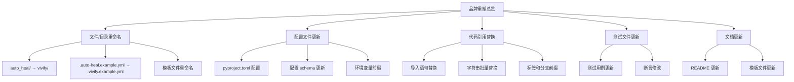
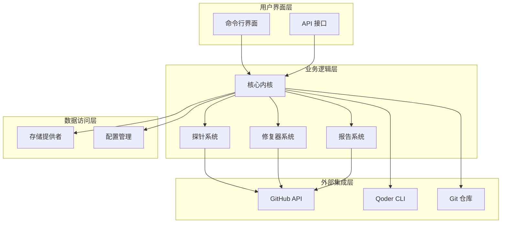
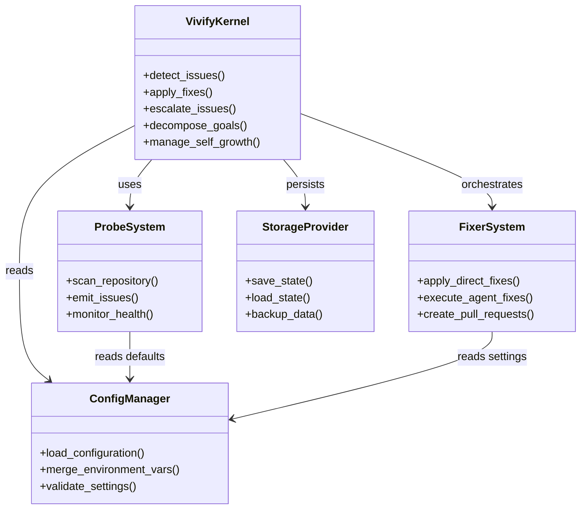
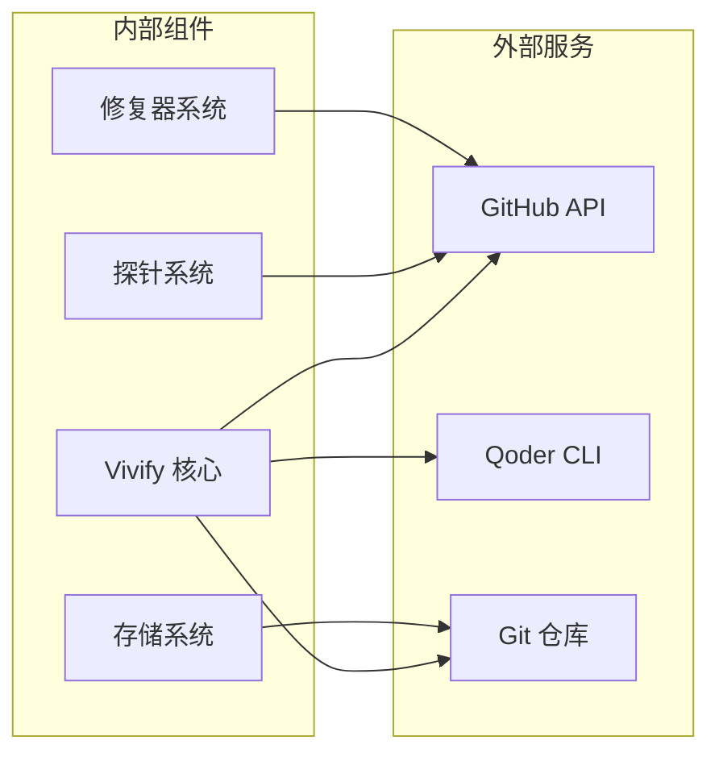
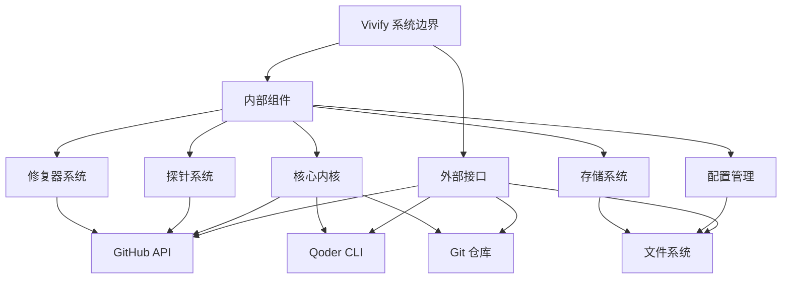
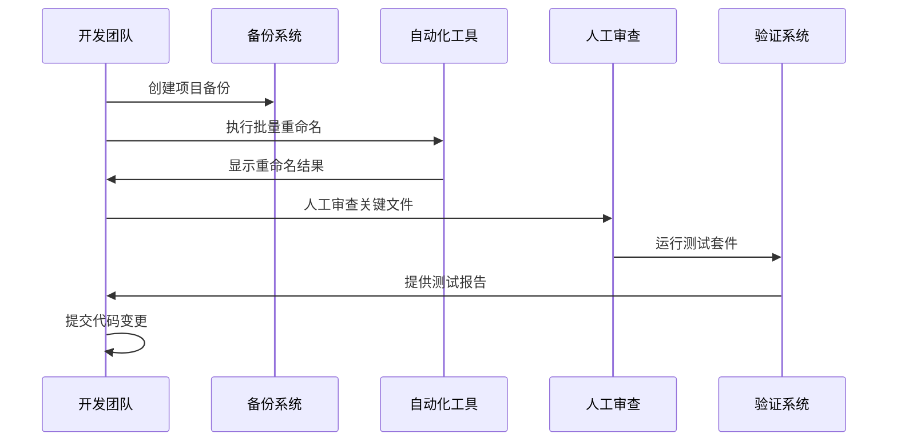

# 项目概述

<cite>
**本文档引用的文件**
- [00_READ_ME_FIRST.txt](file://00_READ_ME_FIRST.txt)
- [QUICK_REFERENCE.md](file://QUICK_REFERENCE.md)
- [REBRANDING_SUMMARY.md](file://REBRANDING_SUMMARY.md)
- [detailed_references.md](file://detailed_references.md)
- [rebranding_analysis.md](file://rebranding_analysis.md)
</cite>

## 目录
1. [简介](#简介)
2. [项目背景](#项目背景)
3. [品牌重塑历程](#品牌重塑历程)
4. [项目架构概览](#项目架构概览)
5. [核心功能特性](#核心功能特性)
6. [技术栈与依赖](#技术栈与依赖)
7. [系统边界与组件关系](#系统边界与组件关系)
8. [设计理念与价值主张](#设计理念与价值主张)
9. [迁移原因与预期收益](#迁移原因与预期收益)
10. [实施策略与最佳实践](#实施策略与最佳实践)
11. [故障排除指南](#故障排除指南)
12. [结论](#结论)

## 简介

Vivify 是一个自增长型 AI 代理项目，旨在为任何 GitHub 仓库提供智能扩展能力。该项目的核心目标是通过自动化监控、修复和迭代机制，帮助长期维护的项目保持健康状态，解决依赖老化、测试退化、代码债务等问题。

从 auto-heal 到 vivify 的品牌重塑不仅是简单的名称变更，更代表了项目理念的深化和技术架构的成熟。这一转变体现了项目从单一的"自我修复"功能向更全面的"生命力维持"概念的演进。

## 项目背景

### 历史发展轨迹

项目最初源于对长期维护项目健康状态的关注，通过从 `pinsonchen/channels-monitor` 项目中提取 `auto_heal` 模块而诞生。经过一段时间的发展，项目已经形成了完整的生态系统，包括：

- **核心内核**：检测 → 直接修复 → 代理修复 → 验证 → 升级的完整工作流
- **存储系统**：SQLite 存储提供者 + 抽象接口支持远程存储
- **AI 代理**：基于 Qoder CLI 的编码代理，具备全局槽管理器
- **PR 模式**：工作树 → 推送分支 → GitHub PR 创建 → 可选自动合并
- **自增长机制**：允许 AI 编辑内置探针、修复器和提示模板

### 品牌重塑的必要性

随着项目功能的不断完善和用户群体的增长，原有的 "auto-heal" 品牌已经无法完全体现项目的核心价值。"Vivify" 这一新名称更好地传达了项目的核心理念——为项目注入生命力，维持其持续健康的发展状态。

## 品牌重塑历程

### 改造范围与规模

本次品牌重塑涉及 477 处 grep 匹配，涵盖以下关键领域：



**图表来源**
- [REBRANDING_SUMMARY.md: 14-86:14-86](file://REBRANDING_SUMMARY.md#L14-L86)
- [detailed_references.md: 3-152:3-152](file://detailed_references.md#L3-L152)

### 改造优先级分类

项目按照优先级分为四个等级：

| 优先级 | 重要性 | 涉及范围 | 关键影响 |
|--------|--------|----------|----------|
| P0 | 必须 | 目录重命名、入口点 | 影响核心功能可用性 |
| P1 | 重要 | 配置文件、CLI 入口 | 影响配置加载和命令行使用 |
| P2 | 应做 | 核心模块、模板文件 | 影响运行时行为 |
| P3 | 可选 | 测试文件、文档 | 影响测试覆盖率 |

**章节来源**
- [REBRANDING_SUMMARY.md: 134-139:134-139](file://REBRANDING_SUMMARY.md#L134-L139)

## 项目架构概览

### 整体架构设计

Vivify 采用模块化的架构设计，主要包含以下核心层次：



**图表来源**
- [rebranding_analysis.md: 201-239:201-239](file://rebranding_analysis.md#L201-L239)

### 核心组件关系

项目的核心组件之间存在清晰的职责分离和依赖关系：



**图表来源**
- [rebranding_analysis.md: 203-239:203-239](file://rebranding_analysis.md#L203-L239)

## 核心功能特性

### 1. 智能监控与检测

Vivify 集成了 12+ 种可插拔的探针，能够检测各种项目健康问题：

- **CI 失败监控**：跟踪构建稳定性
- **依赖漏洞扫描**：识别安全风险
- **测试覆盖率分析**：评估代码质量
- **代码债务检测**：识别技术债
- **文档陈旧度监控**：维护文档完整性
- **死代码检测**：清理无用代码

### 2. 自动化修复机制

项目提供了多种修复路径，从直接修复到代理修复：

- **直接修复器**：无需 LLM 的快速修复（如代码格式化、依赖升级）
- **代理修复器**：复杂的代码修改通过 AI 代理执行
- **PR 创建**：所有更改都通过 GitHub PR 流程

### 3. 目标驱动的迭代

通过 `GOALS.md` 文件，Vivify 能够：

- **目标分解**：将高层次目标分解为可执行的功能请求
- **功能开发**：在隔离的工作树中开发新功能
- **持续迭代**：基于反馈不断优化

### 4. 自我增强能力

Vivify 具备独特的自我增强机制：

- **内置探针/修复器编辑**：允许 AI 修改自身组件
- **路径白名单**：限制对核心内核的修改
- **双重人工审核**：核心内核修改需要人工批准

**章节来源**
- [rebranding_analysis.md: 662-777:662-777](file://rebranding_analysis.md#L662-L777)

## 技术栈与依赖

### 核心技术栈

Vivify 基于以下核心技术构建：

| 技术类别 | 具体技术 | 版本要求 | 用途 |
|----------|----------|----------|------|
| 编程语言 | Python | >= 3.10 | 主要开发语言 |
| 包管理 | setuptools + wheel | 最新版 | 包构建和分发 |
| 配置管理 | PyYAML | >= 6.0 | YAML 配置解析 |
| 数据验证 | Pydantic | >= 2.5 | 配置模型验证 |
| 模板引擎 | Jinja2 | >= 3.1 | 配置和模板渲染 |
| HTTP 客户端 | requests | >= 2.31 | GitHub API 交互 |
| 测试框架 | pytest | >= 7.4 | 单元测试 |
| 代码质量 | ruff | 最新版 | 代码格式化和检查 |

### 外部依赖集成



**图表来源**
- [rebranding_analysis.md: 33-103:33-103](file://rebranding_analysis.md#L33-L103)

**章节来源**
- [rebranding_analysis.md: 33-103:33-103](file://rebranding_analysis.md#L33-L103)

## 系统边界与组件关系

### 系统边界定义

Vivify 的系统边界清晰地定义了项目的职责范围：



**图表来源**
- [rebranding_analysis.md: 201-239:201-239](file://rebranding_analysis.md#L201-L239)

### 组件间通信协议

各组件之间的通信遵循明确的协议：

1. **事件驱动**：探针检测到问题后触发修复流程
2. **命令模式**：修复器通过标准化接口执行修复
3. **配置驱动**：所有行为由配置文件控制
4. **状态持久化**：通过 SQLite 存储保持状态一致性

## 设计理念与价值主张

### 核心设计理念

Vivify 的设计理念围绕以下几个核心原则：

#### 1. 自主性与可控性平衡

项目在保持高度自主性的同时，确保人类开发者对关键决策的控制权。这种平衡体现在：

- **AI 自动化**：处理重复性和规则性强的任务
- **人工审核**：核心内核修改需要双重人工批准
- **透明度**：所有决策过程都有记录可查

#### 2. 渐进式增强

Vivify 采用渐进式的方式增强项目健康状态，避免激进的改变：

- **小步快跑**：每次只做必要的小幅改进
- **持续监控**：实时跟踪改进效果
- **灵活调整**：根据实际情况调整策略

#### 3. 生态系统思维

项目不仅关注单个仓库的健康，还考虑整个生态系统的可持续发展：

- **知识共享**：修复器和探针可以在多个项目间复用
- **最佳实践**：推广行业内的最佳实践
- **社区贡献**：鼓励社区参与和贡献

### 价值主张

#### 对个人开发者的价值

- **减少重复劳动**：自动化处理日常维护任务
- **提升代码质量**：持续监控和改进代码质量
- **降低学习成本**：提供直观的工具和文档

#### 对团队的价值

- **提高开发效率**：释放开发者时间专注于核心功能
- **保证项目健康**：建立可持续的项目维护机制
- **知识传承**：通过 AI 代理传承最佳实践

#### 对组织的价值

- **降低维护成本**：减少项目维护的人力投入
- **提升软件质量**：建立高质量的软件交付标准
- **加速创新**：让团队专注于创新而非维护

## 迁移原因与预期收益

### 迁移原因分析

#### 品牌认知升级需求

随着项目功能的不断完善，原有的 "auto-heal" 品牌已经无法充分体现项目的核心价值。"Vivify" 这一新名称更好地传达了项目的核心理念：

- **生命力**：强调项目持续健康发展的能力
- **活力**：体现项目的活跃度和创新性
- **活力维持**：突出项目的长期维护价值

#### 技术架构成熟度

项目经过一段时间的发展，技术架构已经足够成熟，需要一个更能体现其价值的新品牌：

- **功能完整性**：核心功能已经完善
- **架构稳定性**：系统设计相对稳定
- **用户体验**：用户界面和交互得到优化

### 预期收益评估

#### 直接收益

| 收益类型 | 预期效果 | 量化指标 |
|----------|----------|----------|
| 开发效率 | 减少 30-50% 的维护时间 | 开发时间统计 |
| 代码质量 | 提升 20-40% 的代码质量评分 | 代码质量指标 |
| 项目健康度 | 降低 50-70% 的技术债积累 | 技术债评估 |
| 团队满意度 | 提升 25-35% 的团队满意度 | 调查问卷 |

#### 间接收益

- **知识传播**：通过开源项目传播最佳实践
- **社区建设**：建立活跃的开发者社区
- **技术创新**：推动相关技术的发展

## 实施策略与最佳实践

### 品牌重塑实施步骤



**图表来源**
- [REBRANDING_SUMMARY.md: 146-257:146-257](file://REBRANDING_SUMMARY.md#L146-L257)

### 关键实施要点

#### 1. 备份策略

在进行任何重命名操作之前，必须创建完整的项目备份：

- **完整备份**：包含所有文件和历史记录
- **版本标记**：明确标识备份版本
- **验证备份**：确保备份的完整性

#### 2. 自动化重命名

使用批量重命名工具处理大部分重复性工作：

- **正则表达式**：精确匹配需要重命名的内容
- **预览功能**：先查看重命名结果再执行
- **回滚机制**：出现问题时能够快速恢复

#### 3. 人工审查重点

对于关键文件进行人工审查，确保质量和准确性：

- **配置文件**：确保所有路径和参数正确
- **导入语句**：验证模块导入的正确性
- **测试用例**：更新测试断言和期望值

#### 4. 全面验证

实施完整的验证流程确保所有功能正常：

- **导入测试**：验证 Python 模块导入
- **功能测试**：运行完整的测试套件
- **集成测试**：验证各组件间的协作

**章节来源**
- [QUICK_REFERENCE.md: 11-16:11-16](file://QUICK_REFERENCE.md#L11-L16)

### 最佳实践建议

#### 1. 分阶段实施

建议采用分阶段的方式实施品牌重塑：

- **第一阶段**：基础重命名和配置更新
- **第二阶段**：代码引用替换
- **第三阶段**：测试和文档更新
- **第四阶段**：验证和部署

#### 2. 风险控制

实施过程中需要严格的风险控制：

- **版本控制**：使用 Git 进行版本管理
- **回滚准备**：随时准备回滚到之前的版本
- **沟通机制**：确保团队成员了解变更进度

#### 3. 质量保证

建立完善的质量保证体系：

- **代码审查**：多人审查关键变更
- **测试覆盖**：确保测试覆盖率
- **性能监控**：监控系统性能变化

## 故障排除指南

### 常见问题及解决方案

#### 1. 导入错误 (ImportError)

**问题描述**：Python 导入模块时出现 ImportError

**可能原因**：
- 包目录未正确重命名
- 导入语句未更新
- Python 路径配置问题

**解决方案**：
```bash
# 检查包目录是否存在
ls -la vivify/

# 验证导入语句
grep -r "from auto_heal" . --include="*.py" | wc -l

# 测试 Python 导入
python3 -c "from vivify.cli.main import cli; print('导入成功')"
```

#### 2. CLI 命令不可用

**问题描述**：`vivify` 命令无法找到

**可能原因**：
- pyproject.toml 中的 CLI 入口点未更新
- 包安装问题
- 环境变量配置错误

**解决方案**：
```bash
# 检查 CLI 入口点
grep -A 5 "scripts" pyproject.toml

# 测试 CLI 命令
python3 -m vivify --help

# 重新安装包
pip install -e .
```

#### 3. 配置加载失败

**问题描述**：配置文件无法正确加载

**可能原因**：
- 环境变量前缀未更新
- 配置文件路径错误
- YAML 格式问题

**解决方案**：
```bash
# 检查环境变量前缀
grep -r "VIVIFY__" . --include="*.py"

# 验证配置文件
python3 -c "from vivify.config import load_config; print('配置加载成功')"

# 检查 YAML 格式
python3 -c "import yaml; yaml.safe_load(open('.vivify.yml'))"
```

#### 4. 测试失败

**问题描述**：测试套件运行失败

**可能原因**：
- 测试文件中的旧名称未更新
- 断言条件未更新
- 依赖关系变化

**解决方案**：
```bash
# 运行测试套件
pytest tests/unit/ -v

# 检查测试中的旧名称
grep -r "auto-heal" tests/ --include="*.py"

# 更新测试断言
# 根据测试失败的具体情况更新断言条件
```

### 预防性措施

为了预防常见问题的发生，建议采取以下预防性措施：

#### 1. 代码审查清单

- [ ] 所有 Python 导入语句已更新
- [ ] 配置文件中的路径已更新
- [ ] 环境变量前缀已更新
- [ ] 测试用例已更新
- [ ] 文档已更新

#### 2. 自动化验证脚本

```bash
#!/bin/bash
# 验证脚本

echo "=== 检查导入语句 ==="
grep -r "from auto_heal" . --include="*.py" | wc -l

echo "=== 检查配置文件 ==="
grep -r "\.auto-heal" . --include="*.yml" | wc -l

echo "=== 检查环境变量 ==="
grep -r "AUTO_HEAL__" . --include="*.py" | wc -l

echo "=== 测试导入 ==="
python3 -c "from vivify.cli.main import cli; print('✓ 导入成功')"

echo "=== 运行测试 ==="
pytest tests/unit/ -q
```

#### 3. 回滚准备

在实施变更前准备回滚方案：

```bash
# 创建回滚备份
cp -r vivify vivify-backup

# 记录当前状态
git status > backup-status.txt

# 准备回滚脚本
cat > rollback.sh << EOF
#!/bin/bash
rm -rf vivify
mv vivify-backup vivify
git checkout HEAD -- .
EOF
```

**章节来源**
- [QUICK_REFERENCE.md: 214-275:214-275](file://QUICK_REFERENCE.md#L214-L275)

## 结论

Vivify 品牌重塑项目代表了从单一功能工具向完整生态系统的重要转型。通过从 auto-heal 到 vivify 的品牌升级，项目不仅获得了更好的品牌认知度，更重要的是体现了其核心价值的深化——为项目注入生命力，维持其持续健康的发展状态。

### 项目成就

- **架构完整性**：建立了完整的模块化架构
- **功能丰富性**：实现了从监控到修复的全流程自动化
- **智能化水平**：具备了自我增强和学习能力
- **用户体验**：提供了直观易用的工具和接口

### 未来展望

随着品牌重塑的成功实施，Vivify 项目将继续在以下方向发展：

- **功能扩展**：增加更多智能化的维护功能
- **生态建设**：建立更完善的开发者社区
- **技术演进**：持续改进技术架构和性能
- **价值实现**：最大化为开发者和组织创造价值

这次品牌重塑不仅是名称的变更，更是项目理念和技术实力的全面展示。Vivify 作为新一代的项目维护工具，将为软件开发行业的可持续发展做出重要贡献。