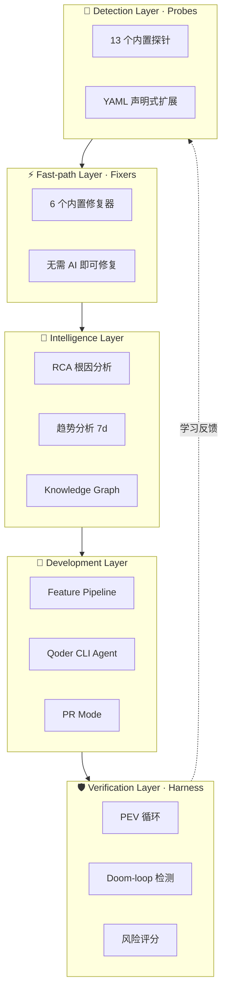
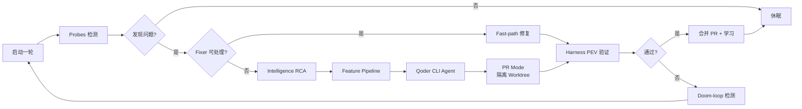

# 复元·Vivify

> **全场景系统自生长赋能引擎** — 挂载到任何 GitHub 项目，让它自己检测问题、自己修复、自己验证、自己学习。

[](https://www.python.org/)
[](LICENSE)
[]()
[]()

---

## ✨ 核心理念

**外挂赋能三部曲**：

```
🔍 检测  →  🔧 修复  →  ✅ 验证学习
Detect       Fix          Verify & Learn
```

- 🚫 **不侵入项目代码**：通过 PR 模式 + 隔离 Worktree 协作，所有变更可审、可回滚。
- 🎯 **自动分解目标**：从一份 `GOALS.md` 出发，AI 拆解为可执行特性，跟踪到 KPI。
- 📈 **持续改进**：每一次循环都会沉淀知识图谱、趋势数据、根因分析与防过度优化记忆。

> 你不需要重写你的项目。你只需要让 Vivify 站在它旁边，长出来。

---

## 🏗️ 五层架构



| 层 | 职责 | 关键能力 |
|---|---|---|
| **Detection** | 持续观测项目健康度 | 13 个探针，YAML 可扩展 |
| **Fast-path** | 不调用 AI 的瞬时修复 | 6 个修复器，秒级闭环 |
| **Intelligence** | 让系统"看懂"代码与历史 | RCA + 趋势 + 知识图谱 |
| **Development** | 复杂修复与新功能开发 | Qoder CLI Agent + Worktree |
| **Verification** | 验证而非声称 | PEV 三段验证 + 自纠正 |

---

## 🚀 快速开始

```bash
# 1. 安装
pip install vivify-cli

# 2. 进入你的项目目录
cd your-project

# 3. 交互式初始化（推荐 quick 模板，33 行配置即开即用）
vivify init --template quick

# 4. 环境健康检查
vivify doctor

# 5. 单次试运行
vivify run --once

# 6. 启动守护进程，让它自己跑
vivify run
```

### 环境要求

| 工具 | 版本 | 用途 |
|---|---|---|
| Python | ≥ 3.10 | 运行时 |
| git | ≥ 2.30 | 版本控制 + Worktree |
| [gh](https://cli.github.com/) | ≥ 2.0 | PR 创建与合并 |
| [qodercli](https://qoder.com) | latest | AI Agent 引擎 |

---

## 🧩 主要功能模块

| 模块 | 功能描述 |
|---|---|
| 🛡️ **Harness** | PEV 循环验证（传感器 → 反馈 → 自纠正）+ Doom-loop 检测 + 风险评分 |
| 🧠 **Knowledge** | 三阶段知识图谱（结构分析 → 语义丰富 → 规范提取），为 AI 提供精确上下文 |
| 🔬 **Intelligence** | RCA 根因分析 + 7 天趋势分析 + 自动配置器 |
| ⚙️ **Kernel** | 执行内核：探针检测 → 修复 → 特性流水线 → 健康监控 |
| 🔭 **Probes** | 13 个声明式 YAML 探针 + 用户 Python 扩展 |
| ⚡ **Fixers** | 6 个快速修复器（lint fix、dep bump 等）+ 用户扩展 |
| 🌿 **PR Mode** | 隔离 Worktree + 自动 PR + 质量门禁 + 条件自动合并 |
| 🎯 **Goals** | `GOALS.md` 解析 + AI 自动分解 + KPI 追踪 |
| 📊 **Dashboard** | FastAPI Web 仪表盘，实时监控运行状态 |

---

## 🛠️ CLI 命令一览

| 命令 | 作用 |
|---|---|
| `vivify init` | 交互式初始化项目配置（支持 `--template quick`） |
| `vivify run` | 启动守护进程，进入主循环 |
| `vivify run --once` | 单次执行一轮（调试 / CI 友好） |
| `vivify start` / `stop` | 启停后台守护进程 |
| `vivify status` | 查看当前状态与最近一轮结果 |
| `vivify doctor` | 环境与配置健康检查 |
| `vivify goals` | 列出 / 分解 / 追踪目标与 KPI |
| `vivify probes` | 列出 / 测试探针 |
| `vivify fixers` | 列出 / 测试修复器 |
| `vivify features` | 查看特性流水线状态 |
| `vivify logs` | 查看实时日志 |
| `vivify dashboard` | 启动 Web 仪表盘 |
| `vivify config show/validate/explain/diff` | 配置查看与诊断工具 |

---

## ⚙️ 配置系统

### 双模板设计

| 模板 | 行数 | 适用场景 |
|---|---|---|
| `quick` | 33 行 | 95% 项目可直接用，零认知负担 |
| `full` | 95 行带注释 | 需要细粒度控制时使用 |

### 高级配置分离

```
.vivify.yml          # 主配置（精简、人读）
.vivify-advanced.yml # 高级配置（可选，自动合并）
```

### 10 个场景预设

```yaml
preset: web-fullstack   # 或 data-pipeline / microservice / cli-tool / library 等
```

### 环境变量覆盖

```bash
VIVIFY__KERNEL__INTERVAL=300 vivify run
VIVIFY__PR_MODE__AUTO_MERGE=true vivify run
```

### 配置工具

```bash
vivify config show         # 当前生效配置
vivify config validate     # 校验合法性
vivify config explain      # 解释每一项来源（默认值/文件/环境变量）
vivify config diff         # 与默认值对比
```

---

## 🔌 扩展指南

### 自定义探针 — YAML 声明式（推荐）

```yaml
# .vivify/probes/my_probe.yml
id: my_probe
name: 我的检查
type: command
command: "npm run lint"
expect_exit_code: 0
severity: warning
```

### 自定义探针 — Python 类

```python
# .vivify/probes/my_probe.py
from vivify.interfaces.probe import Probe, ProbeResult

class MyProbe(Probe):
    id = "my_probe"
    def run(self) -> ProbeResult:
        # 你的检测逻辑
        return ProbeResult(ok=True, message="all good")
```

### 自定义修复器

```python
# .vivify/fixers/my_fixer.py
from vivify.interfaces.fixer import Fixer

class MyFixer(Fixer):
    handles = ["my_probe"]
    def fix(self, ctx):
        # 你的修复逻辑
        ...
```

> 📁 自动发现路径：`.vivify/probes/` 和 `.vivify/fixers/`

---

## 🔄 工作原理（单轮流程）



---

## 📂 项目结构

```
vivify/
├── cli/            # 命令行入口（11+ 子命令）
├── kernel/         # 主循环、特性流水线、健康监控
├── probes/         # 探针注册与内置探针
├── fixers/         # 修复器注册与内置修复器
├── intelligence/   # RCA、趋势、AI 分析、Wiki 生成
├── knowledge/      # 三阶段知识图谱构建
├── harness/        # PEV 循环 + Doom-loop + 风险评分
├── agents/         # Qoder CLI Agent + 历史 + Slot 管理
├── pr_mode/        # Worktree + PR 创建/合并
├── goals/          # GOALS.md 解析与分解
├── dashboard/      # FastAPI Web 仪表盘
├── config/         # 加载、校验、预设、模板
├── deployers/      # 部署适配器（SSH / Webhook / Command）
├── storage/        # SQLite 状态持久化
└── verifier/       # 验证器接口
```

---

## 🧪 开发

```bash
# 安装开发依赖
pip install -e ".[dev]"

# 运行单元测试
pytest

# 代码风格检查
ruff check vivify/

# 仅跑某个模块的测试
pytest tests/unit/test_feature_pipeline.py -v
```

---

## 🗺️ 路线图

- ✅ 核心引擎（探针 / 修复器 / Agent / PR 模式）
- ✅ 知识图谱系统（结构 + 语义 + 规范三阶段）
- ✅ Harness PEV 循环 + 风险评分 + Doom-loop 检测
- ✅ Init 配置优化（quick 模板 + 场景预设 + 高级分离）
- 🚧 Web Dashboard 完善（实时日志流、特性看板）
- 📋 多 Agent 支持（Claude Code、Codex）
- 📋 GitHub Actions 原生集成
- 📋 团队协作 / 多仓库视图

---

## 📄 License

[MIT](LICENSE) © 复元·Vivify

---

<p align="center">
  <em>不要重写你的项目，让它自己长出来。</em>
</p>
